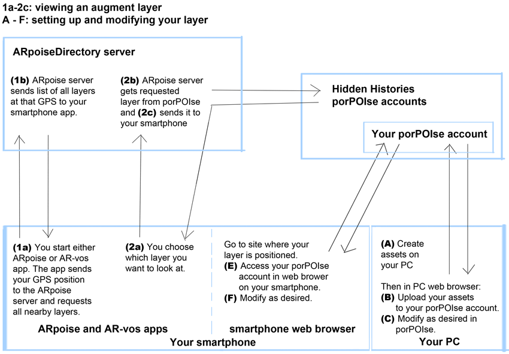

#  Hidden Histories Admins: 

# Getting Started with ARpoise 

## Overview   

The **ARpoise** (**A**ugmented **R**eality **p**oint **o**f **i**nterest **s**ervice **e**nvironment) is an open-source Augmented Reality service environment that allows AR content designers to create and distribute AR experiences, and users to view location-based or image trigger AR content that is created in Unity. The goal of ARpoise is to provide an open-source, community-supported AR app for artists and other people who might not be able to develop their own apps, and as an alternative to commercial AR platforms that may go out of business at any time without warning.

The ARpoise system consists of:
- An **ARpoiseDirectory server front end**, maintained by Peter Graf and Tamiko Thiel in Germany.
- An **ARpoiseDirectory server back end**, on the Hidden Histories server.
- The **porPOIse back end user interface**, where artists set up their AR layers in their individual accounts
- The **ARpoise app**, which works on all iOS and Android smartphones, but only does geolocative AR.
- The **AR-vos app**, which does both geolocative and image trigger AR, and will be extended to do SLAM AR as well. However, this only runs on iOS devices that can run ARKit, and Android devices that can run ARCore. When most all smartphones can run ARKit or ARCore, the two app will be merged.

The following diagram is a VERY simplified description of how the various components work together (the ARPoise server front end and back end are simply referred to as the ARpoise server).

This folder contains tutorials for administrators to set up **porPOIse accounts** and **layers** for **Hidden Histories** artists and helpers. 

The ARpoise [Overview Document](https://github.com/ARPOISE/ARpoise/blob/master/README.md) gives an overview of the functionality of the entire ARpoise platform. Some of the information is only of interest if you are setting up an ARpoise and porPOIse system of your own, but it gives a good overview of how the system's components fit together. (**Note** the ARpoise administrators are managing the ARpoise Directory Front End component.)

The Hidden Histories admin will manage the following two components, which are already set up on the Hidden Histories web server hiddenhistoriesjtown.org.

- **Hidden Histories porPOIse back end user interface**
This is an online web interface that each artist (or helper) uses to set up and edit their own layers, whether geolocative or image trigger, for viewing on the ARpoise or the AR-vos client apps. The admin needs to set up separate copies of the porPOIse back end user interface for each and every artist and helper.

- **Hidden Histories ArpoiseDirectory Back End**
Once the porPOIse account has been set up, the layers have to be registered in the Hidden Histories ArpoiseDirectory, which is managed only by the admin. This registry keeps track of all layers and makes them available within a general GPS defined area. Due to the coronavirus, this will be initially at the artist's home, and then moved to the proper location in San Jose Japantown once the artwork is developed. When a user is standing at the location of their artwork and starts the ARpoise or AR-vos apps, the ArpoiseDirectory reads their GPS location and then displays all layers available at that location in a list on their screen.

**NOTE** Intially, please use the **ARpoise geolocative app**, as we know it will work on pretty much all smartphones. This makes it easier to do the initial testing and get everyone up and running while having to do everything remotely. The procedure mentioned below also applies to AR-vos geolocative AND image trigger layers.

. 
## Admin workflow for each new artist (or helper):

This workflow MUST be following in order to set up a porPOIse account correctly. The tutorials link to each other in the proper order, but here is an overview so you understand the steps in the process:

### With the artist, agree on:
- A porPOIse **user name and password**. Ideally the same one as their FTP access to the hiddenhistories server, to make it easier for them to remember.
- A **short form of their name** as unique, internal identifier for their layer name(s) for their artwork(s).
- Per artist we will set up one **example layer** to be used for testing, and one **artist layer** that can be used for setting up the artwork itself, e.g. "artistnameExampleLayer"and "artistnameArtistLayer".
- **We need to also discuss backups! Is the hiddenhistories server backed up daily? Sue is investigating...**

### Create a new porPOIse account for each artist or helper.
- We have set up an **ExampleArtist folder template** that can be quickly duplicated to create a new artist account.
- Then **configure** various files for the artist, for instance their login name and password, etc.
- Rename the ExampleLayer and create an ArtistLayer to include the artist's name.
- Note: If the artist needs more layers in the future, the admin has to create them according to the same procedure, and also add them to the directory in the procedure described below.
- Please follow the [**step by step admin SetupArtistPorpoise tutorial**](SetupArtistPorpoise.md). (It will also link to the ArpoiseDirectory tutorial mentioned below.)

### In the ArpoiseDirectory Back End registry, configure the new layers.
- In order to be viewable in the ARpoise (or AR-vos) app, the layers need to be **geolocated** at a specific GPS location. Right now this should be at the artist's home so they can play around with them without leaving their house. This can be changed later for testing and final placement in Japantown.
- The 2 layers should then be fully functional, with assets (brightly colored primitive shapes, some with porPOIse animations) that give the artist an immediate check whether their account is working, and allow them to follow the artist's tutorials to learn how to use porPOIe to set up their augments.
- Please follow the [**step by step admin SetupArtistArpoiseDirectory tutorial**](SetupArtistArpoiseDirectory.md)

. 

## Next Steps

### Admin tutorials: Next steps
Complete the following steps:

1. **Getting Started: ARpoise Admins**
2. [Setup Artist Porpoise](SetupArtistPorpoise.md).
3. [Setup Artist ArpoiseDirectory](SetupArtistArpoiseDirectory.md).
