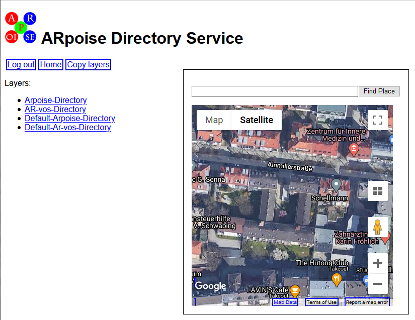
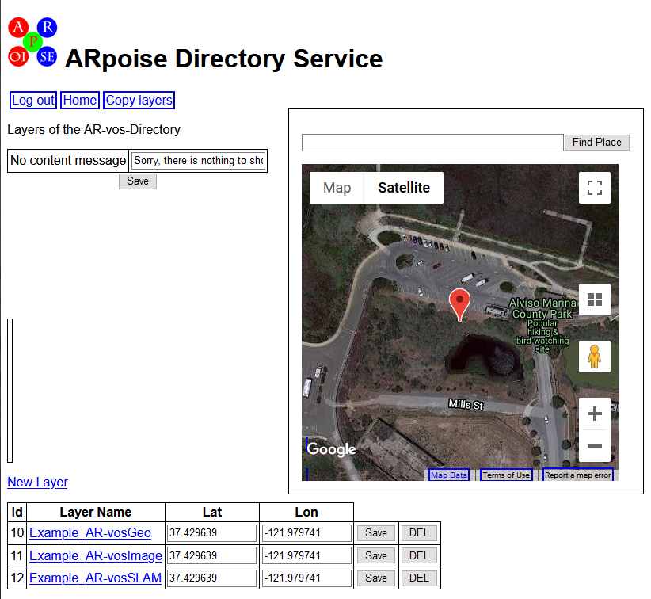
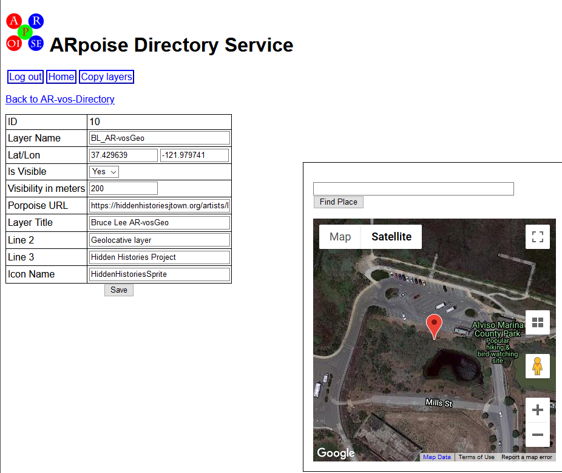
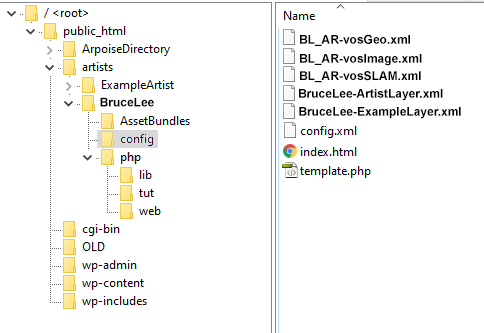
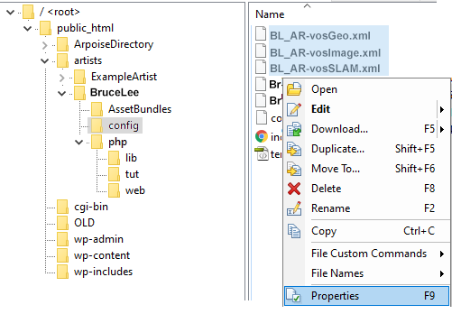
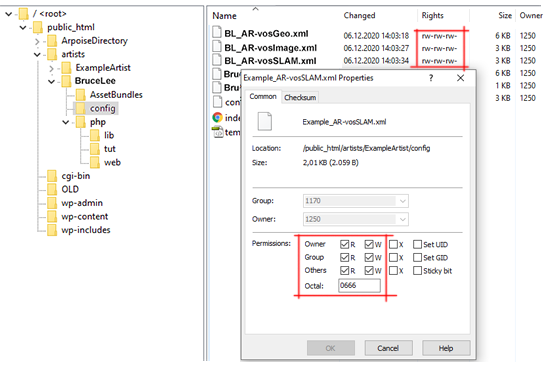
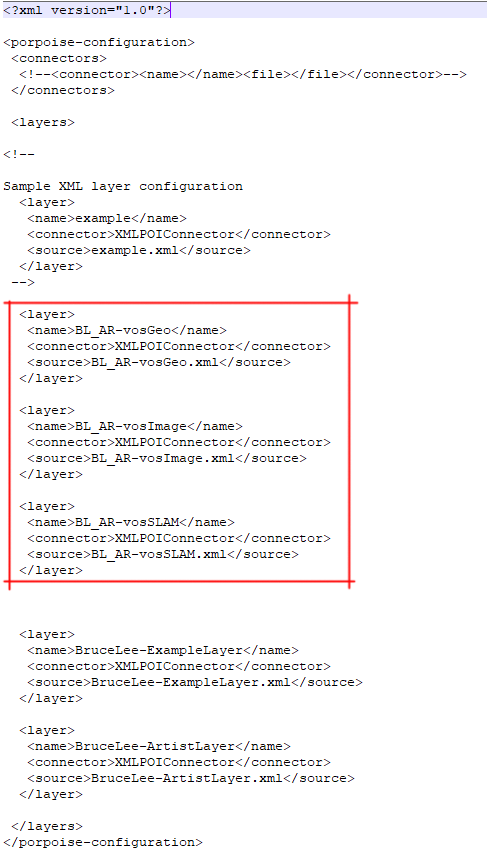

# Hidden Histories
## Setup Artist Layers for AR-vos

### Overview

This document assumes you already know how to **set up layers for artists to use the ARpoise app (for geolocative AR only) and ARpoise porPOIse back end,** as described on the Hidden Histories Administration website under [Setup Artist in ArpoiseDirectory](https://github.com/Hidden-Histories/Public-Resources/blob/master/administration/SetupArtistArpoiseDirectory.md).

It also assumes you are familiar with how to use the **AR-vos app** to view **geolocative, image trigger and SLAM AR** as described on the Hidden Histories Administration website under (https://github.com/Hidden-Histories/Public-Resources/blob/master/documentation/UsingAR-vosApp.md#-hidden-histories)

The setup for artists to use the AR-vos app is very similar to the setup for the ARpoise app. It uses the same **Hidden Histories ArpoiseDirectory Back End Directory Service** located here, accessible only to the admin: https://hiddenhistoriesjtown.org/ArpoiseDirectory/php/web/dashboard/index.php

- This ArpoiseDirectory on the Hidden Histories server contains two **metalayers** that are registries for artists' geofenced layers within the Hidden Histories area of San Jose Japantown.
- The app can only see the layers that are listed in the corresponding directory.
  - **Arpoise-Directory** for the **ARpoise app.** We assume you have already registered ARpoise layers here.
  - **AR-vos-Directory** for the **AR-vos app.** This document covers registering layers for AR-vos.
  - A metalayer is a registry entry composed of a list of all the individual layers that are accessible through that particular app. The listing for a layer includes an approximate GPS location and area where it is visible, which allows the app to quickly find which layers are relevant given the location of a user who has called up the app.
  
- In addition, there are two metalayers registering layers that should be visible everywhere in that area, regardless of the viewers' GPS location: Default-Arpoise-Directory and Default-AR-vos-Directory. We will discuss them some time in the future.

. 
### Arpoise Directory Service - metalayers list

You have already worked with the Arpoise-Directory metalayer. 

Now click on the **AR-vos-Directory metalayer**:

### Image - ARpoise Directory Service: all directory registries

.
### AR-vos-Directory within the ARpoise Directory Service - layers list

The AR-vos-Directory will initially contain only the example layers we have set up as templates, positioned at our default location on the Bay. We have set up **three example AR-vos layers** which you can use as a template to copy and paste into the artists' accounts, for them to modify and change into layers with their own content. 
- Example_AR-vosGeo
- Example_AR-vosImage
- Example_AR-vosSLAM

**Download all 3 Example AR-vos .xml files from here:**
https://hiddenhistoriesjtown.org/artists/ExampleArtist/config/AR-vosTemplates.zip

Notes:
- We have given them all names that include "AR-vos," so the artists know which layers can be viewed in which apps. 
- There is no difference between the .xml for an ARpoise geolocative layer and that for an AR-vos geolocative layer. We have literally copied and pasted the ARpoise .xml file from the Arpoise-Directory folder into the AR-vos-Directory folder. 
- In fact, there is no difference between the porPOIse web form to create an AR-vos geolocative, image trigger or SLAM layer! The difference is mainly one single field in the artist's POI configuration - as we will describe in the artist tutorial for setting up an AR-vos layer. But we decided to give the layers distinct names for clarity.

.
**NOW: Use the New Layer link** above the layer list to **add 3 new entries for each artist.** The layers will be added at the end of the list.

### Image - AR-vos-Directory metalayers list

.

### Add and rename 3 new registry entries for each artist

Click on each of the 3 new layers to change the following values:

### Image - Settings for layer entry

- **Layer Name:** Please replace "Example" with the artist's initials as in the image above, e.g. **Bruce Lee** would be:
  - BL_AR-vosGeo
  - BL_AR-vosImage
  - BL_AR-vosSLAM

- **Lat/Lon:** the home base GPS coordinates for the artist

- **IsVisible:** Yes

- **Visibility in meters:** 200 meters, since they will be in the densely AR populated San Jose Japantown.

- **Porpoise URL:** The same link as in the Arpoise-Director to the **artist's folder**, so it knows where to look for the .xml file: replace "ExampleArtist" here with the artist's name: https://hiddenhistoriesjtown.org/artists/ExampleArtist/php/web/porpoise.php?

- **Layer Title:** This title should have the artist's name, as it is shown **in the AR-vos app list of available layers.**

**Don't forget to click the Save button!** ;-)

.

### FTP: upload, rename .xml files in artist's config folder

Download the 3 Example_AR-vos .xml files:
https://hiddenhistoriesjtown.org/artists/ExampleArtist/config/AR-vosTemplates.zip

- **Upload them via FTP** to the artist's config folder.
  - **Careful:** there is a config.php file php/config.php, but you are going to change the **config/config.xml file!**
- **Rename the files** with the artist's initials.
- When you're finished, there should be 3 AR-vos files in additional to the 2 Arpoise files:

#### Image - now 5 .xml layer files in config Folder

.
### Change permissions to 666 / rw-rw-rw- for all new .xml files

You need to change the permissions on the new .xml layer files, otherwise the artist will not be able to edit them in the porPOIse Back End interface.
- Select the files.
- Right click / Properties

#### Image - Select right click / Properties menu for all new .xml layer files

- Change the Permissions / Octal value to 666. This sets Ower/Group/Others to R=read and W=write.

You should now have set read/write permission for all the .xml files.

#### Image - correct permissions for new .xml files

### Enter the new layers into the **config/config.xml** file:

- **Duplicate the whole <layer> block.**
- **Change both the "name" tag AND the "source" tag** - making sure to preserve the **".xml" on the source tag!**
- You should then have 5 layers in the config file: 3 AR-vos layers and the existing 2 ARpoise layers.

#### Image - Edit artist's config.xml File

.  
. 
### Next Steps

#### Admin tutorials: what you have done:
You should now have completed the following steps:

1. [Getting Started: ARpoise Admins](GettingStarted-ARpoiseAdmins.md).
2. [Setup Artist Porpoise](SetupArtistPorpoise.md).
3. **SetupArtistArpoiseDirectory**

#### Artist tutorials
Please see the overview link page for all the tutorials on using porPOIse to set up and modify layers, creating Unity asset bundles with your own content, etc.
http://hiddenhistoriesjtown.org/documentation

<!--
- To learn what you can do in porPOIse, including animations, play around with your existing test layer using the tutorial on the ARpoise porPOISe Back End:
https://github.com/Hidden-Histories/Public-Resources/blob/master/documentation/UsingPorPOIse.md

- To create a new AR experience for your layer, you need to set up the assets in Unity (2D and 3D objects, sounds) and then export them into asset bundles. Learning to use Unity goes beyond the scope of our tutorials, but here is our tutorial for turning Unity assets into AssetBundles:
https://github.com/Hidden-Histories/Public-Resources/blob/master/documentation/CreatingAssetBundles.md
-->
.

