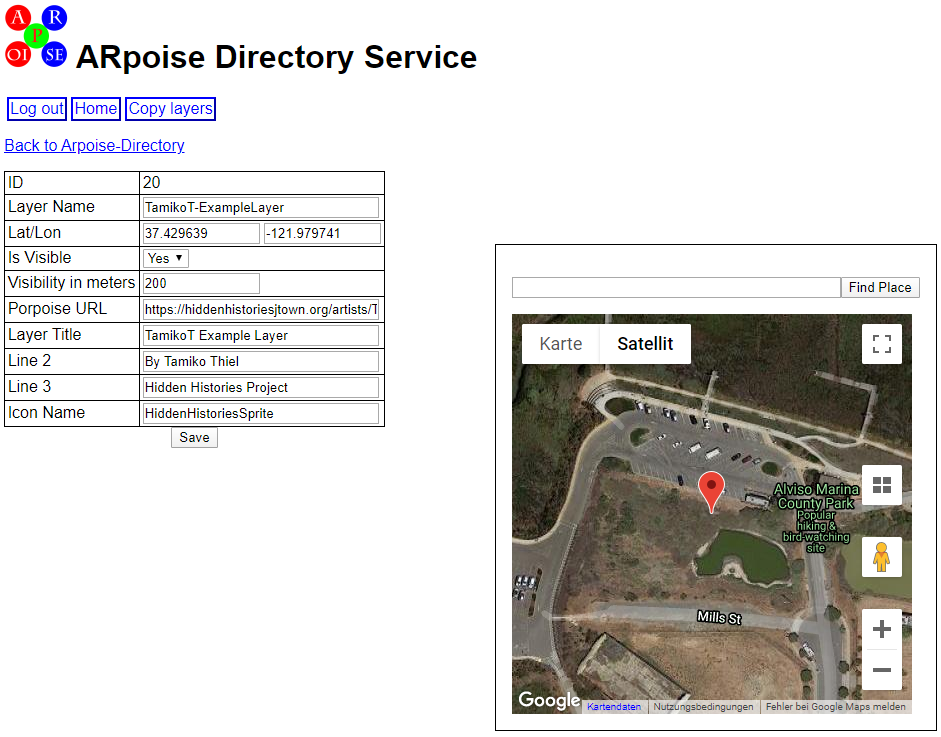
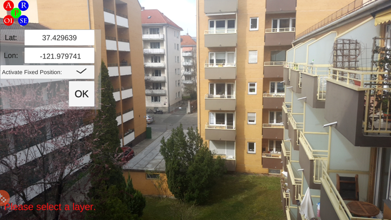
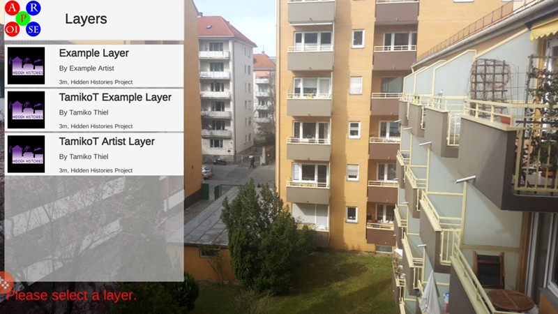
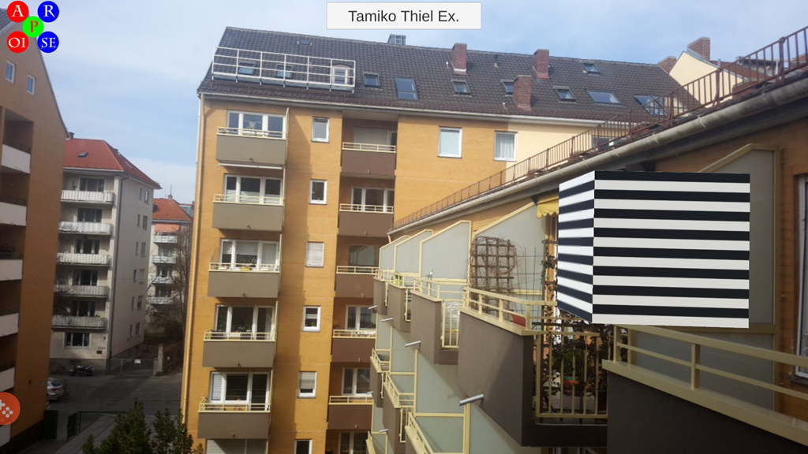

# Hidden Histories
## Setup Artist in AR-vos Directory

### Overview

This document assumes you already know how to **set up layers for artists to use the ARpoise app (for geolocative AR only) and ARpoise porPOIse back end,** as described on the Hidden Histories Administration website under [Setup Artist in ArpoiseDirectory](https://github.com/Hidden-Histories/Public-Resources/blob/master/administration/SetupArtistArpoiseDirectory.md).

It also assumes you are familiar with how to use the **AR-vos app** to view **geolocative, image trigger and SLAM AR** as described on the Hidden Histories Administration website under (https://github.com/Hidden-Histories/Public-Resources/blob/master/documentation/UsingAR-vosApp.md#-hidden-histories)

The setup for artists to use the AR-vos app is very similar to the setup for the ARpoise app. It uses the same **Hidden Histories ArpoiseDirectory Back End Directory Service** located here, accessible only to the admin: https://hiddenhistoriesjtown.org/ArpoiseDirectory/php/web/dashboard/index.php

- This ArpoiseDirectory on the Hidden Histories server contains two **metalayers** that are registries for artists' geofenced layers within the Hidden Histories area of San Jose Japantown:
  - **Arpoise-Directory** for the **ARpoise app.** We assume you have already set up layers here.
  - **AR-vos-Directory** for the **AR-vos app.** This document covers entering new layers here.
  - A metalayer is made up of a list of all the individual layers that are accessible through that particular app. The listing for a layer includes an approximate GPS location and area where it is visible, which allows the app to quickly find which layers are relevant given the location of a user who has called up the app.
  
- In addition, there are two metalayers for layers that should be visible everywhere in that area, regardless of the viewers' GPS location: Default-Arpoise-Directory and Default-AR-vos-Directory. We will discuss them some time in the future.

. 
### Arpoise Directory Service - metalayers list

You have already worked with the Arpoise-Directory metalayer. 

Now click on the **AR-vos-Directory metalayer**:

.
### Arpoise Directory Service - layers list

Click on the Arpoise-Directory link to view the metalayer list of all layers serviced by the Hidden Histories ARpoise app. This currently includes:

- Tamiko Thiel's Brush the Sky layers in San Jose Japantown.
- The ExampleLayer template (please do NOT change or delete!)
- Tamiko Thiel's Example Layer and Artist Layer (please do NOT change or delete!)
- Any new layers will then appear below.

#### Explanation:

We have set up three example AR-vos layers which you can copy and paste into the artists' accounts, for them to modify and change into layers with their own content. 
- We have given them all names that include "AR-vos," so the artists know which layers can be viewed in which apps. The app can only see the layers that are listed in the corresponding directory.
- There is no difference between the .xml for an ARpoise geolocative layer and that for an AR-vos geolocative layer. We have literally copied and pasted the ARpoise .xml file from the Arpoise-Directory folder into the AR-vos-Directory folder. 
- In fact, there is no difference between the porPOIse web form to create an AR-vos geolocative, image trigger or SLAM layer! 

. 

**Now click on the new layer name "no title" to configure the new layer**

Enter the properties according to the example and the information below.

. 
### ARpoise Directory Service - enter layer properties following this example

#### Explanation:

Internal properties:

* **Layer Name:** This name is shown in the directory layers list on the preceding page and **MUST** be the same as the **artist's .xml file** that defines the layer and the **artist's config/config.xml entry** that registers their layers. See the tutorial [SetupArtistPorpoise](SetupArtistPorpoise.md#customize-the-layer-files-for-the-artist) on how to do this.

* **Lat Lon:** The base GPS location of the layer in decimal form. If you already know the GPS coordinates you need [(read here how to find them)](https://www.businessinsider.de/international/how-to-find-coordinates-on-google-maps/), type them directly into the latitude and longitude fields. You can also use the buttons on the **Google map** to zoom in or out, and click and drag the marker against the boundary of the maps window to drag it to your location. **As you move the marker, the lat/lon values in the properties box will change.** (Note that if the same augment should be visible in different locations around the world, a duplicate copy of that layer needs to be created and placed at each of the desired GPS locations.)

* **IsVisible:** Yes for on, No to hide it, if it is not being used.

* **Visibility in meter:** This is the radius in which the layer should be visible around its Lat/Lon. Given the inaccuracy of GPS, we have found that **200m~250m**, which is about 1/2 a block, is a good value. If it is too large, it is misleading as it can be seen far away from the site for which it is intended, but if it is too small it might not be visible at the actual site, as the smartphone GPS thinks you are several blocks away.

* **Porpoise URL:** Required link to the **artist's folder**, so it knows where to look for the .xml file: replace "ExampleArtist" here with the artist's name: https://hiddenhistoriesjtown.org/artists/ExampleArtist/php/web/porpoise.php?

External properties:

* **Layer Title:** This name is shown on the **layer listing in the ARpoise app** (see screenshot of ARpoise app above). Please give this a unique name to make it easier for the public to identify which artist and artwork it is!
* **Line 2:** The second, smaller line in the layer entry in the ARpoise app (see screenshot of ARpoise app above).
* **Line 3:** The third, very small line in the layer entry in the ARpoise app (see screenshot of ARpoise app above), along with the (often *very* inaccurate!) distance to the base location of the layer.
* **Icon Name:** Please enter **HiddenHistoriesSprite**. This is the icon shown in the layer's entry in the ARpoise app (see screenshot above). This has to be set by the ARpoise adminstrators. We have set it to be the square version of the Hidden Histories logo that we made ourselves--please contact us at public@arpoise.com if you want to change it.

**Don't forget to click the Save button!** ;-)

. 
### Testing the New Artist's Layers

Assuming you set the positions of the new artist's layers at their house, and you do not live near them, when you start the ARpoise app you will be too far away to see their new layers.

Therefore, ARpoise has a **Fixed Location** feature that allows you to test many features remotely.

- Note the **GPS latitude and longitude where you placed the layer** (in ArpoiseDirectory layer list, or the layer properties).

- If you input exactly that number, you will be right in the middle of the layer. If you want to be slight to one side, select a different position in google maps (see how to do this in the properties explanation above) and enter those values instead. Just remember the augments might be **behind** you!

- Start the ARpoise app.

- Double click on the **ARpoise logo menu button**.

- Tap the Lat and Lon fields and enter the decimal values you want.

- Click **Activate Fixed Position**.

- Click **OK**.

. 
The layers should then appear in the list of nearby augment layers.

Select one of the layers ...

. 
**... and look all around you, they are also above and below you!**

. 
#### Troubleshooting:

If the layers still do not appear:

- Is the GPS position you entered in the Fixed Position menu in the ARpoise app correct?
- Is the property **IsVisible** set to **Yes** in the layer properties?
- Is the **Layer Name** in the layer properties the same as the file name of the **.xml** in the artist's config folder, and the same as the **config/config.xml entry**? See the tutorial [SetupArtistPorpoise](SetupArtistPorpoise.md#customize-the-layer-files-for-the-artist).

.
### Next Steps

#### Admin tutorials: what you have done:
You should now have completed the following steps:

1. [Getting Started: ARpoise Admins](GettingStarted-ARpoiseAdmins.md).
2. [Setup Artist Porpoise](SetupArtistPorpoise.md).
3. **SetupArtistArpoiseDirectory**

#### Artist tutorials
Please see the overview link page for all the tutorials on using porPOIse to set up and modify layers, creating Unity asset bundles with your own content, etc.
http://hiddenhistoriesjtown.org/documentation

<!--
- To learn what you can do in porPOIse, including animations, play around with your existing test layer using the tutorial on the ARpoise porPOISe Back End:
https://github.com/Hidden-Histories/Public-Resources/blob/master/documentation/UsingPorPOIse.md

- To create a new AR experience for your layer, you need to set up the assets in Unity (2D and 3D objects, sounds) and then export them into asset bundles. Learning to use Unity goes beyond the scope of our tutorials, but here is our tutorial for turning Unity assets into AssetBundles:
https://github.com/Hidden-Histories/Public-Resources/blob/master/documentation/CreatingAssetBundles.md
-->
.

