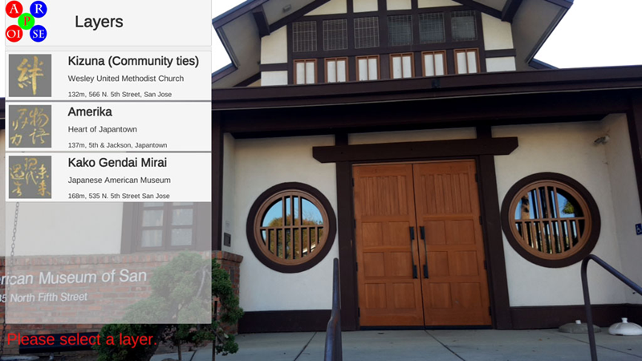
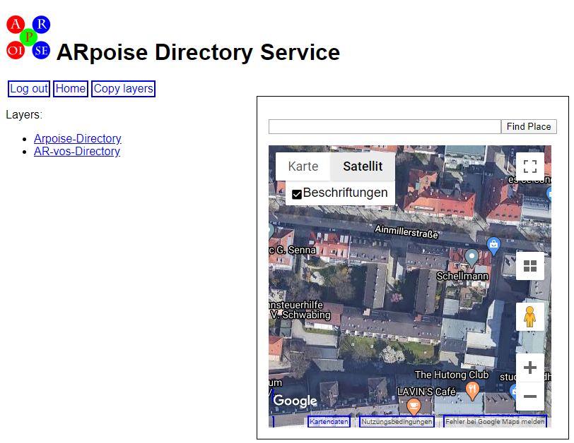
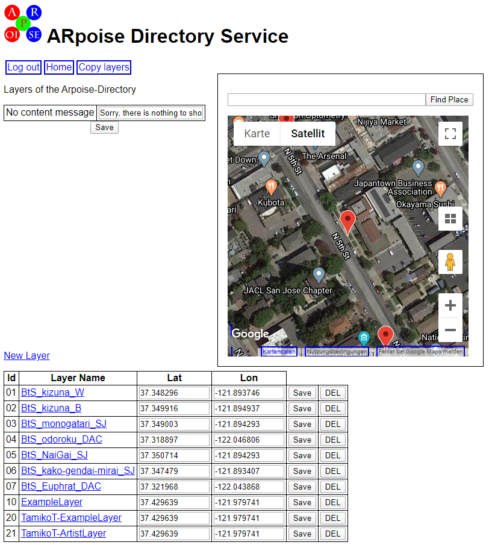
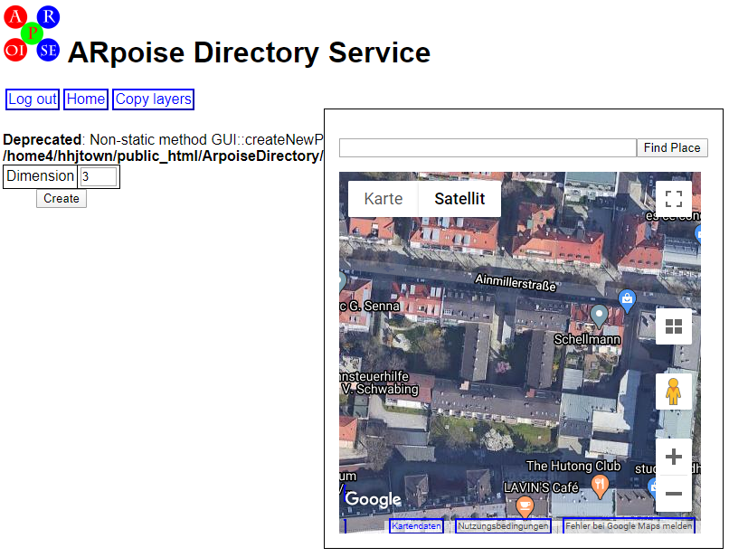
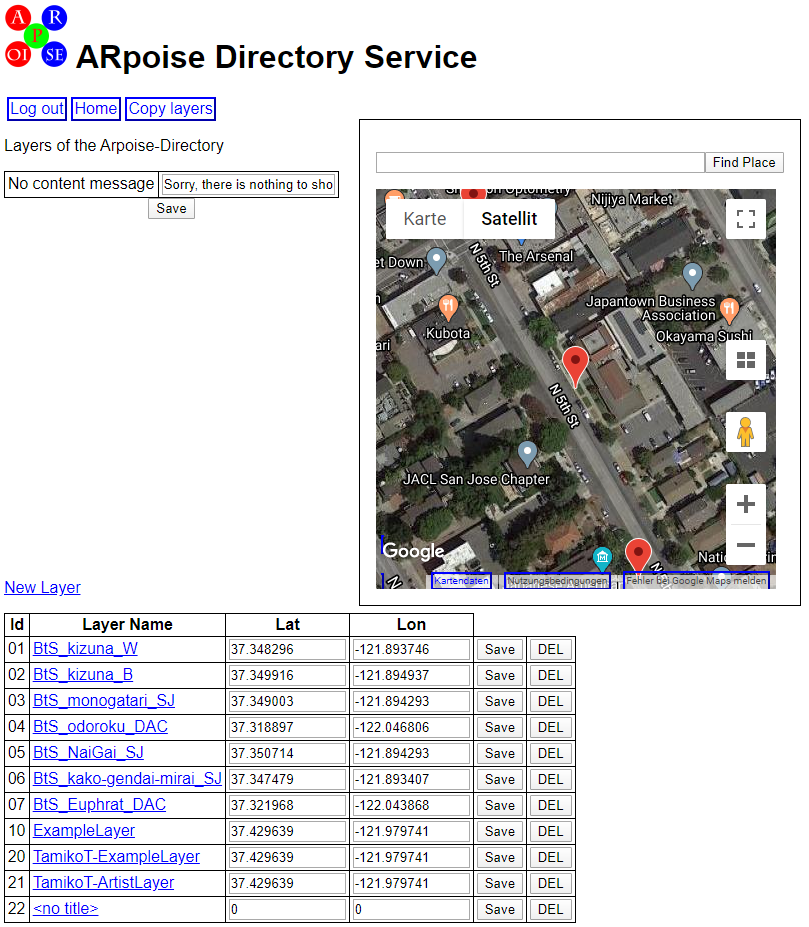
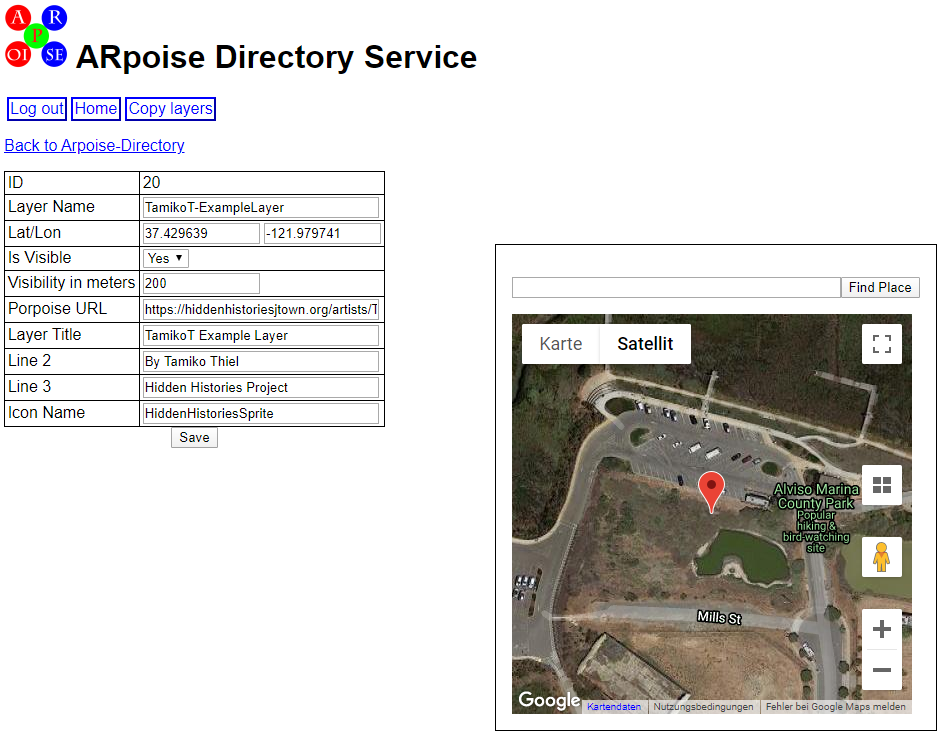
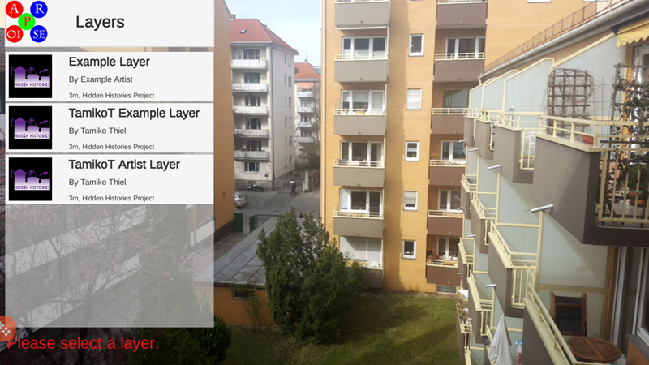
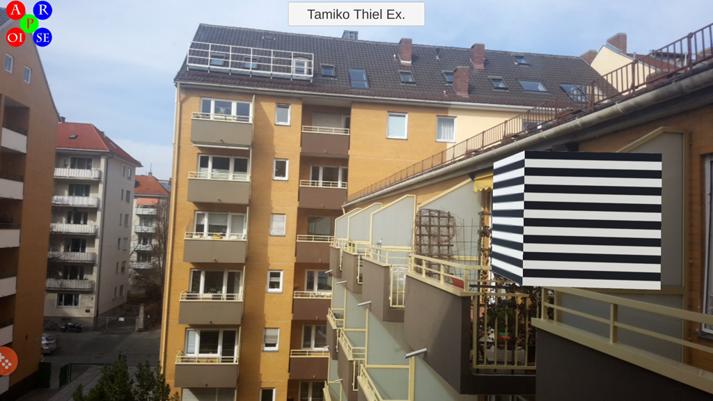

# Hidden Histories
## Setup Artist in ArpoiseDirectory

### Overview

**ARpoise porPOIse** requires a directory back end as registry for all the AR projects ("layers") that it services. The directory keeps track of which layers exist, and where in the world they can be viewed.

The **Hidden Histories ARpoiseDirectory Back End Directory Service** is located here, accessible only to the admin: https://hiddenhistoriesjtown.org/ArpoiseDirectory/php/web/dashboard/index.php

- The ArpoiseDirectory contains two **metalayers**, one for the ARpoise app and one for the AR-vos app, each of which contain all layers around the world that are serviced by that respective app. For now, we will discuss only the ARpoise metalayer in this document, but the AR-vos metalayer is similar.

- A metalayer is made up of a list of all the individual layers that are accessible through that particular app. The listing for a layer includes an approximate GPS location and area where it is visible, which allows the app to quickly find which layers are relevant given the location of a user who has called up the app.

### Functionality

When the [ARpoise Directory Front End](https://github.com/ARPOISE/ARpoise/tree/master/ArpoiseDirectory#arpoisedirectory) receives a request from a client ARpoise or AR-vos app, it contacts the ARpoise Directory Back End web service with the client's GPS location as parameter, e.g. where the viewer who just opened the app is standing in the world.

- The **ARpoiseDirectory Back End service** then returns a list of all layers within a specified range of the client's GPS location, and displays them in the app.

- If there are no layers within range of the client's location, an empty list of layer definitions is returned.

If the same augment should be visible in different locations around the world, you need to create duplicate copies of that layer  and place one each at all the desired GPS locations.

. 
### Documentation:

. 
### Arpoise Directory Service - metalayers list

If you log in to the ARpoiseDirectory Back End, you will see one link to the geolocative layers serviced by the **ARpoiseapp**, and another link to the layers (both geolocative and image trigger) serviced by the **AR-vos app**. The older ARpoise appruns on all iOS and Android smartphones, whereas the newer AR-vos app only runs on recent smartphones that support theAR functionality of [Android ARCore](https://developers.google.com/ar/discover/supported-devices) or [Apple ARKit](https://developer.apple.com/library/archive/documentation/DeviceInformation/Reference/iOSDeviceCompatibility/DeviceCompatibilityMatrix/DeviceCompatibilityMatrix.html). 

For now, we will discuss only the ARpoise metalayer in this document, but the AR-vos metalayer is similar.
We expect to merge the two apps in the future when the newer smartphone hardware is widespread.

.
### Arpoise Directory Service - layers list

Click on the Arpoise-Directory link to view the metalayer list of all layers serviced by the Hidden Histories ARpoise app. This currently includes:

- Tamiko Thiel's Brush the Sky layers in San Jose Japantown.
- The ExampleLayer template (please do NOT change or delete!)
- Tamiko Thiel's Example Layer and Artist Layer (please do NOT change or delete!)
- Any new layers will then appear below.

#### Explanation:

For each layer, the registry specifies a GPS position that defines a base location around which the layer is visible. See the section below for a description of the properties.

(The Google map only shows the GPS location of the very first layer in the list.)

. 
### Arpoise Directory Service - add a new layer

Go Back to the Arpoise-Directory level.

- Add a new layer by clicking on the **New Layer** link above the layer list.

- In the next screen ignore the warning message and just click on "Create" ...

... and a new empty layer will be added to the directory:

. 

**Now click on the new layer name "no title" to configure the new layer**

Enter the properties according to the example and the information below.

. 
### ARpoise Directory Service - enter layer properties following this example

#### Explanation:

Internal properties:

* **Layer Name:** This name is shown in the directory layers list on the preceding page and **MUST** be the same as the **artist's .xml file** that defines the layer and the **artist's config/config.xml entry** that registers their layers. See the tutorial [SetupArtistPorpoise](SetupArtistPorpoise.md#customize-the-layer-files-for-the-artist) on how to do this.

* **Lat Lon:** The base GPS location of the layer in decimal form. If you already know the GPS coordinates you need [(read here how to find them)](https://www.businessinsider.de/international/how-to-find-coordinates-on-google-maps/), type them directly into the latitude and longitude fields. You can also use the buttons on the **Google map** to zoom in or out, and click and drag the marker against the boundary of the maps window to drag it to your location. **As you move the marker, the lat/lon values in the properties box will change.** (Note that if the same augment should be visible in different locations around the world, a duplicate copy of that layer needs to be created and placed at each of the desired GPS locations.)

* **IsVisible:** Yes for on, No to hide it, if it is not being used.

* **Visibility in meter:** This is the radius in which the layer should be visible around its Lat/Lon. Given the inaccuracy of GPS, we have found that **200m~250m**, which is about 1/2 a block, is a good value. If it is too large, it is misleading as it can be seen far away from the site for which it is intended, but if it is too small it might not be visible at the actual site, as the smartphone GPS thinks you are several blocks away.

* **Porpoise URL:** Required link to the **artist's folder**, so it knows where to look for the .xml file: replace "ExampleArtist" here with the artist's name: https://hiddenhistoriesjtown.org/artists/ExampleArtist/php/web/porpoise.php?

External properties:

* **Layer Title:** This name is shown on the **layer listing in the ARpoise app** (see screenshot of ARpoise app above). Please give this a unique name to make it easier for the public to identify which artist and artwork it is!
* **Line 2:** The second, smaller line in the layer entry in the ARpoise app (see screenshot of ARpoise app above).
* **Line 3:** The third, very small line in the layer entry in the ARpoise app (see screenshot of ARpoise app above), along with the (often *very* inaccurate!) distance to the base location of the layer.
* **Icon Name:** Please enter **HiddenHistoriesSprite**. This is the icon shown in the layer's entry in the ARpoise app (see screenshot above). This has to be set by the ARpoise adminstrators. We have set it to be the square version of the Hidden Histories logo that we made ourselves--please contact us at public@arpoise.com if you want to change it.

**Don't forget to click the Save button!** ;-)

. 
### Testing the New Artist's Layers

Assuming you set the positions of the new artist's layers at their house, and you do not live near them, when you start the ARpoise app you will be too far away to see their new layers.

Therefore, ARpoise has a **Fixed Location** feature that allows you to test many features remotely.

- Note the **GPS latitude and longitude where you placed the layer** (in ArpoiseDirectory layer list, or the layer properties).

- If you input exactly that number, you will be right in the middle of the layer. If you want to be slight to one side, select a different position in google maps (see how to do this in the properties explanation above) and enter those values instead. Just remember the augments might be **behind** you!

- Start the ARpoise app.

- Double click on the **ARpoise logo menu button**.

- Tap the Lat and Lon fields and enter the decimal values you want.

- Click **Activate Fixed Position**.

- Click **OK**.

. 
The layers should then appear in the list of nearby augment layers.

Select one of the layers ...

. 
**... and look all around you, they are also above and below you!**

. 
#### Troubleshooting:

If the layers still do not appear:

- Is the GPS position you entered in the Fixed Position menu in the ARpoise app correct?
- Is the property **IsVisible** set to **Yes** in the layer properties?
- Is the **Layer Name** in the layer properties the same as the file name of the **.xml** in the artist's config folder, and the same as the **config/config.xml entry**? See the tutorial [SetupArtistPorpoise](SetupArtistPorpoise.md#customize-the-layer-files-for-the-artist).

.
### Next Steps

#### Admin tutorials: what you have done:
You should now have completed the following steps:

1. [Getting Started: ARpoise Admins](GettingStarted-ARpoiseAdmins.md).
2. [Setup Artist Porpoise](SetupArtistPorpoise.md).
3. **SetupArtistArpoiseDirectory**

#### Next steps: artist tutorials
- To learn what you can do in porPOIse, including animations, play around with your existing test layer using the tutorial on the ARpoise porPOISe Back End:
https://github.com/Hidden-Histories/Public-Resources/blob/master/documentation/UsingPorPOIse.md

- To create a new AR experience for your layer, you need to set up the assets in Unity (2D and 3D objects, sounds) and then export them into asset bundles. Learning to use Unity goes beyond the scope of our tutorials, but here is our tutorial for turning Unity assets into AssetBundles:
https://github.com/Hidden-Histories/Public-Resources/blob/master/documentation/CreatingAssetBundles.md

.

