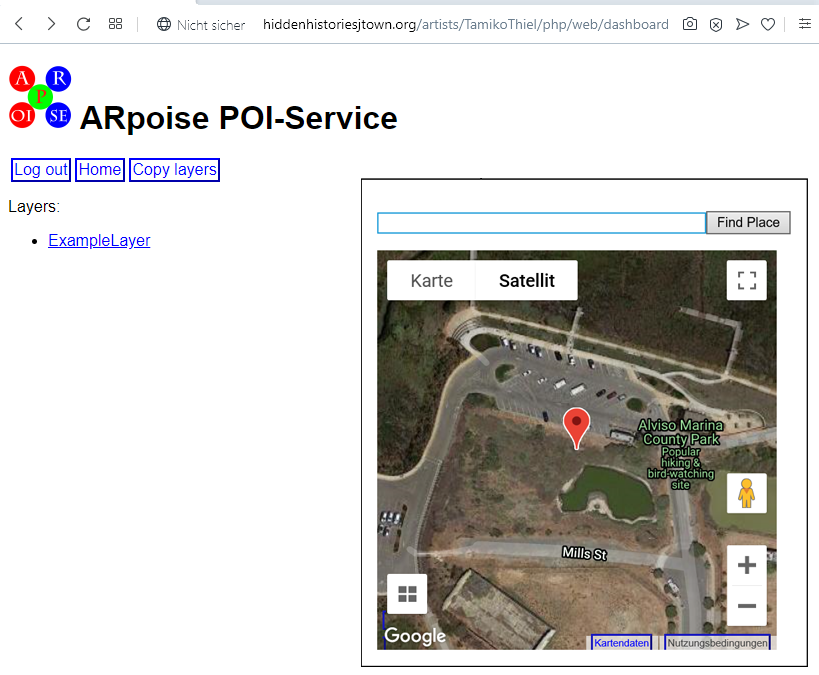

# Hidden Histories
# -- Setup Artist Porpoise --
## Overview

**NOTE:** This tutorial is meant ONLY for the Hidden Histories admin who sets up accounts for the artists!!!

The **porPOIse Back End user interface** is an open source project we had used since 2010 with the defunct AR platform LAYAR, and then in 2018 created this modified **ARpoise porPOIse** version for use with ARpoise. We have set up a porPOIse service for Hidden Histories, and describe how to configure it here. (If you need to set up a version of porPOIse for yourself, see the [**Original porPOIse Documentation**](#original-porpoise-documentation) linked below at the end of this page.)

**Each artist (and helper) needs their own copy of the porPOIse back end user interface** for managing their own layers for both 
**ARpoise** and **AR-vos**. There are two steps to set up a new artist with porPOIse:
1. This tutorial shows how to create and configure a **porPOIse account** for each artist.
2. Afterwards, the admin has to register and configure the artist's layers in the **ArpoiseDirectory**. See link to that tutorial in the [**Next Steps**](#next-steps) section at the bottom of this page.

We created a **template folder** for an example artist named ‘ExampleArtist’. In order to set up a real artist please follow the steps below. In the tutorial we used screenshots of Tamiko Thiel's porPOIse as an example. When you set up for another artist, use the artist's real name whereever it says "Tamiko Thiel" below. Please use only 'normal' letters and no white space characters for 
artist's names.

## Folder Structure
You need ftp/sftp access to the hiddenhistoriesjtown.org server. We use the WinSCP FTP client on a Windows 10 machine to upload 
files to the Hidden Histories server, but the setup using a different FTP client on a Mac, e.g. Cyberduck, should work the same.

Under **public_html** we created two folders, **ArpoiseDirectory** and **artists**. As mentioned above, this tutorial covers setting up a new artist in the **artists** folder. For the the **ArpoiseDirectory** tutorial, please see the 
documentation linked from the section [**Next Steps**](#next-steps) below.

In **artists** we created a template folder called **ExampleArtist**. It contains three subfolders:
- **AssetBundles** for the asset bundles, i.e. the artist's artwork that makes up the total augment.
- **config** for the configuration of the layers of the artist.
- **php** for the interface that enables the artist to configure their layers

### Image - Folders:


.
## Create Artist Folder
Duplicate the entire contents of the **ExampleArtist** folder and rename it with the artist's name. In this example, we called it "TamikoThiel." 

Please do NOT use blanks or other special characters in the artist’s name.

### Image - Artist Folder:


.
## Edit the artist's config.php file
Edit the artist's config file (in our example here /public_html/artists/TamikoThiel/php/config.php).

Make sure the second to last line contains the **file system location of the config directory** created in the step above. 

And as always, make sure you don't delete the closing bracket '}' ;-)
```
“/home4/hhjtown/public_html/artists/TamikoThiel/config”
```
### Image - config.php:


.
## Edit the artist's porpoise.php file:
Edit the artist's porpoise.php file, in our example here: /public_html/artists/TamikoThiel/php/web/porpoise.php 

Make sure the line with the **chdir** command contains the file system location of the php directory created in the step above.
```
chdir("/home4/hhjtown/public_html/artists/TamikoThiel/php");
```
### Image - porpoise.php:


.
## Check web access to the artist's porPOIse service
The artist's new porPOIse service should be accessible on the web now via a login page. In a web browser, enter the following url, (replacing "TamikoThiel" with the artist's name). 
https://hiddenhistoriesjtown.org/artists/TamikoThiel/php/web/dashboard/

You should get the following login screen:
. 
### Image - Web Access:


.
## Create a password for the artist
Use the following URL to create a password for the artist, replacing "TamikoThiel" with their name and "gigeldigik" with their chosen password:

https://hiddenhistoriesjtown.org/artists/TamikoThiel/php/web/dashboard/crypt.php?TamikoThiel=gigeldigik

Please use a different password for every user!

It will generate an encoded password such as the following:
```
$_access["TamikoThiel"] = '$1$i15qMjc5$ZoKrbjTHXlhpAeJfZg.Xt1';
```
Copy that entire line into the artist's users.inc.php file, in our example here: /public_html/artists/TamikoThiel/php/web/dashboard/users.inc.php

### Image - Add Password:


.
## Login as the Artist
Replace "TamikoThiel" in this URL with the name of the new artist, and then login using the name and password you created above:
https://hiddenhistoriesjtown.org/artists/TamikoThiel/php/web/dashboard/

If you get a page similar to that below, CONGRATULATIONS! The porPOIse interface is now set up. :-) Now you need to customize the layar files with the artist's name.

### Image - Artist's default porPOIse Home page


. 
## Customize the Layer Files for the Artist

Go back to your FTP client and open up the **config folder.** 

**Careful: there is a config.php file php/config.php, but now you are going to change the config/config.xml file!**

### Image - config Folder


Rename the ExampleLayar file and make a duplicate copy as ArtistLayar:
- First, **rename ExampleLayer.xml** using the artist's name to make it unique, e.g. SueYuenExampleLayer.xml or SYExampleLayer.xml. This will be the artist's test file where they can play around and try out new things.
- Then, **duplicate that file** and rename it to something like SueYuenArtistLayer.xml. This will be the file that the artist uses to build up working versions of their artworks.

NOTE: to avoid having all the artist layers pile up in the same place in Japantown, the default GPS location of the layer is in Alviso Marina County Park! We will change this, but first we need to rename the artist's layer files, so it is clear which layer belongs to whom, and make a duplicate file so the artist will have one test file and one file for the final artwork.

1. First the admin has to change the GPS location in the ArpoiseDirectory. See link to that tutorial in the [Next Steps](#next-steps) section at the bottom of this page.
2. Then the artist has to change the GPS location in their own layers (see tutorial on creating augments with porPOIse): https://github.com/ARPOISE/ARpoise/blob/master/php/porpoise/README.md

.
## Next Steps

2. The **admin** must now **register and configure the new artist's layers in the ArpoiseDirectory.** For that tutorial, please see this document on the ARpoise github site but:
- **Replace references to the ARpoise server with the appropriate URLs for the Hidden Histories server!**
- We recommend using the artist initials or some such unique tag to make the layer names unique and easily identifiable, e.g. sueyuen1, SYtest1 etc.
- https://github.com/ARPOISE/ARpoise/tree/master/php/dir#arpoisedirectory-back-end

3. Once the admin has registered the artist's layers in the directory, the artist can use their test layer to go through the porPOIse tutorial. In porPOIse, you can change the relative placement and scale of the objects, and add simple animations. For that tutorial, please see this document on the ARpoise github site: https://github.com/ARPOISE/ARpoise/blob/master/php/porpoise/README.md

4. When the artist is comfortable using porPOIse, they can add their own assets. This requires using various programs to create 3D objects, textures, more complex 2D and 3D animations, sound etc. They then have to be put together into an AR experience in Unity, exported in a Unity AssetBundle. After uploading this AssetBundle to their online server, they can link the AssetBundle in their porPOIse and set up the assets for a new AR experience. For that tutorial, please see this document on the ARpoise github site: https://github.com/ARPOISE/ARpoise/blob/master/documentation/CreatingAssetBundles.md

.
## Original porPOIse Documentation

### Only needed if you set up your own porPOIse service

The **porPOIse Back End user interface** is an open source project originally developed in 2009 by Jens de Smit for use with the AR platform LAYAR. Layar is now defunct, but porPOIse continues to work well.

===PorPOISe for Layar===
Portable Point-of-Interest Server for LAYAR AR app (www.layar.com, now defunct)

===Administrative contact===
Jens de Smit, jens@layar.com (email might be out of date, as LAYAR when out of business in 2019)

===Introduction===
PorPOISe is a server for Layar clients. It converts your data sets of POIs
(Points of Interest) into responses to the Layar client. Things like JSON
formatting and distance calculation are all done for you. PorPOISe supports
XML files as data stores.

===Getting started===
Read INSTALL for installation instructions. Once properly installed, you can
use the dashboard to create your first POIs. The interface is pretty spartan
but this will generate correct output format. Study the format if you intend to
generate your own XML files.

From here on you're on your own. Build a better interface for the dashboard or
expand PorPOISe to have more features if you need more.

===History===
PorPOISe originated at SURFnet in 2009 as a spin-off from a small layer-
building experiment. Over 2010 functionality expanded and feature support
grew with Layar's feature support. In 2011, PorPOISe's primary author moved
from SURFnet to Layar and took the project with him.

===More information===
  * http://www.surfnet.nl/en The home of the creator of PorPOISe
  * http://teknograd.wordpress.com/2009/10/19/augmented-reality-create-your-own-layar-layer/ An explanation on how to build the most minimal of Layar servers. Very useful to get started
  * http://layar.com/ wa the target platform for this project was developed (defunct since 2019)
