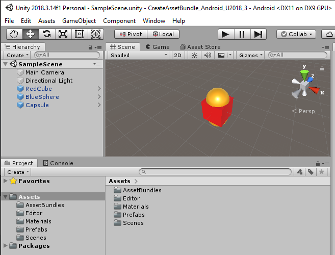

# Hidden Histories
# -- Creating porPOIse Asset Bundles in Unity --

## Overview

This is a step by step tutorial using our **custom Unity3D project templates** to create an **asset bundle** that can be used by the **ARpoise** or **AR-vos** AR apps. (Assets include 3D models, sounds, images etc. that make up your AR experience or "layer.")
- The tutorial shows how to create an asset bundle for Android, on a Windows 10 PC.
- The process for creating an iOS asset bundle on a Mac is similar.

**Unity Editor Interface tutorials:**

Our tutorial does NOT teach you to use Unity or create assets in Unity. If you are unfamiliar with Unity, here are tutorials on the Unity interface, which will help to understand this tutorial:
- Unity Manual: https://docs.unity3d.com/Manual/UsingTheEditor.html
- Unity video tutorial: https://learn.unity.com/tutorial/using-the-unity-interface#     (note: for AR we will be making very simple things, nothing as complicated as the games they show!)

**Important Notes**: 
- You can do all your testing on one platform, but need to have a copy of your AssetBundle created for the other platform as well.
- The **iOS asset bundle must be made on a Mac, and tested on an iOS device.** 
- The **Android asset bundle must be made on a Windows PC and tested on an Android device.** 
- If you only have one type of PC, you will need to send your assets to the admin or team up with another artist to get the other asset bundle.

. 
## Unity Install

Download the free Unity Editor version:
- First download and install the [Unity Hub](https://unity3d.com/get-unity/download) on your PC.
- Then go to the [Unity download archive](https://unity3d.com/get-unity/download/archive) and install Unity3D Editor version **2018.3.14.f1**:
  - Click on the **Unity 2018x** tab.
  - Scroll down to Unity **2018.4.13 (22 Nov, 2019)** and click on **Unity Hub.**
- NOTE: We do NOT guarantee that ARpoise or AR-vos will work with any other version of the Unity Editor!

### Unity Modules:

Install Unity with the following modules:
- Build Support
  - Android if you are working on a Windows PC
  - iOS if you are working on a Mac.
- Vuforia Augmented Reality Support.

This will also install Microsoft Visual Studio automatically. The free version is good enough. 

(If you are on a Mac, you will need xCode.)

. 


. 
## Download CreateAssetBundle Unity Project Template

Download the Unity Project template onto your hard drive:
- For [Android](http://hiddenhistoriesjtown.org/documentation/templates/AndrCreateAssetBundleU2018_3.zip)
- For [iOS](http://hiddenhistoriesjtown.org/documentation/templates/iOSCreateAssetBundleU2018_3.zip)
- Unzip the file on your hard drive.

**Aways use the Unity Hub to open a project!**
- Start the Unity Hub
- Click **ADD**
- Select the **project folder** of your unzipped template from your hard drive.
- It will appear in the projects list. Click to open.

. 


. 
In the template, we have created the following:
- Hierarchy window: 

. 


## Build Settings

Change the build platform:

- Click: **File / Build Settings…**
- Select the **Android** Platform on Windows, or **iOS** on a Mac.
- Click **Switch Platform**.

This will take a while, afterwards you can simply close the Build Settings view by clicking on the X in the upper right corner.

. 


. 

. 
## 3D Assets
Create two game objects in the SampleScene, for instance a red cube and a blue sphere. (Sorry, this is not a Unity tutorial for creating 3D assets. Please refer to Unity's own tutorials.) 
### Image - Game Objects:


## 3D Prefabs
Turn the two objects into prefabs by dragging them one by one from the **SampleScene** panel to the **Prefabs** folder created above.
### Image - Prefabs:


Make sure both prefabs have zero transforms, e.g.:
### Image - Transform:


## CreateAssetBundles Script
Right click on the **Editor** folder, from the context menu select **Create / C# Script**.
Call the script **CreateAssetBundles**. Repeat the step and call the second script **CreateiOSAssetBundles**.
### Image - Scripts:


Double click on the **CreateAssetBundles** script. Visual Studio or your favorite C# editor should open.

Delete the entire contents of the file, copy the following lines into the file and save it.
```
using System.IO;
using UnityEditor;

public class CreateAssetBundles
{
    [MenuItem("Assets/Build AssetBundles")]
    static void BuildAllAssetBundles()
    {
        string assetBundleDirectory = "Assets/AssetBundles";
        if (!Directory.Exists(assetBundleDirectory))
        {
            Directory.CreateDirectory(assetBundleDirectory);
        }
        BuildPipeline.BuildAssetBundles(assetBundleDirectory, BuildAssetBundleOptions.None, BuildTarget.Android);
    }
}
```
Copy the following lines into **CreateiOSAssetBundles** and save it.
```
using System.IO;
using UnityEditor;

public class CreateiOSAssetBundles
{
    [MenuItem("Assets/Build iOSAssetBundles")]
    static void BuildAllAssetBundles()
    {
        string assetBundleDirectory = "Assets/AssetBundles";
        if (!Directory.Exists(assetBundleDirectory))
        {
            Directory.CreateDirectory(assetBundleDirectory);
        }
        BuildPipeline.BuildAssetBundles(assetBundleDirectory, BuildAssetBundleOptions.None, BuildTarget.iOS);
    }
}
```

## Prefab - Context Menu Entries
Now, when you right click on the **BlueSphere** prefab in the Prefabs folder you should see a context menu with the two entries
**Build AssetBundles** and **Build iOSAssetBundles** at the bottom.
### Image - Menu Options:


## Create an Asset Bundle
Select the **BlueSphere** prefab.

On the bottom right of the Unity window you should see the label **AssetBundle** with **None** selected.
Click on **None** and select **New** from the context menu. Enter the name of the new asset bundle,
for the tutorial that is **exampleassetbundle**.
### Image - Select Asset Bundle:


Select the **RedCube** prefab and also select the **exampleassetbundle** for it.

Select either of your prefabs, do a right click and select the **Build AssetBundles** option from the bottom of the context menu.

### The asset bundle should be created!!!!!!!!

Select the **AssetBundles** folder created earlier. You should see four entries.
### Image - Asset Bundles:


The first **exampleassetbundle** file is the actual asset bundle that needs to be made available on the web.
The second file (with lines in the icon) is a manifest file describing what is in the bundle. If you double click on the file to open it, it should contain something like:
```
ManifestFileVersion: 0
CRC: 1652422628
Hashes:
  AssetFileHash:
    serializedVersion: 2
    Hash: 912661529e9af10c64a43b680d62010f
  TypeTreeHash:
    serializedVersion: 2
    Hash: 6597594720de07d06673fc08865c772c
HashAppended: 0
ClassTypes:
- Class: 1
  Script: {instanceID: 0}
- Class: 4
  Script: {instanceID: 0}
- Class: 21
  Script: {instanceID: 0}
- Class: 23
  Script: {instanceID: 0}
- Class: 33
  Script: {instanceID: 0}
- Class: 43
  Script: {instanceID: 0}
- Class: 48
  Script: {instanceID: 0}
- Class: 65
  Script: {instanceID: 0}
- Class: 135
  Script: {instanceID: 0}
Assets:
- Assets/Prefabs/BlueSphere.prefab
- Assets/Prefabs/RedCube.prefab
Dependencies: []
```
The two lines near the bottom listing your two assets, are important - you will need to enter these exact names (here BlueSphere and RedCube) into the porPOIse setup form in order to call them up as augments. Therefore always copy the manifest file to wherever you copy the asset bundle file, so you can find out what is in the bundle.

Upload the asset bundle file and manifest file to the web in a folder that can be accessed via http.
You will need to enter the URL of the asset bundle file into the porPOIse web form for the layer showing the red cube or the blue sphere as augments (or POIs, Points Of Interest). This is covered in a different tutorial. (LINK!!!)

## iOS Asset Bundles
In order to build an iOS asset bundle, you need to include the iOS Build Support module in your Unity project (see the second image from the top, "Image - Unity Modules:"). Then use right click / Build iOSAssetBundles to create the asset bundles for iOS.

**Important Notes**: 

- In order for the assets to work in **ARpoise** and **AR-vos** you MUST create and upload BOTH
the **Android** and the **iOS** asset bundle to a web folder accessible via **http**.

- You MUST use the following naming convention:
If the name of the Android asset bundle is **exampleassetbundle**,
the name of the iOS asset bundle needs to be **exampleassetbundlei**.
(The same name followed by a lower case letter ‘**i**’.)
