# Hidden Histories
# Creating porPOIse Asset Bundles in Unity

## Overview

This is a step by step tutorial using our **custom Unity3D project templates** to create an **asset bundle** that can be used by the **ARpoise** or **AR-vos** AR apps. (Assets include 3D models, sounds, images etc. that make up your AR experience or "layer.")
- The tutorial shows how to create an asset bundle for Android, on a Windows 10 PC.
- The process for creating an iOS asset bundle on a Mac is similar.

**Unity Editor Interface tutorials:**

Our tutorial does NOT teach you to use Unity or create assets in Unity. Those will be linked from the [documentation link page](README.md).

If you are unfamiliar with Unity, here are tutorials on the Unity interface, which will help to understand this tutorial:
- Unity Manual: https://docs.unity3d.com/Manual/UsingTheEditor.html
- Unity video tutorial: https://learn.unity.com/tutorial/using-the-unity-interface#     (note: for AR we will be making very simple things, nothing as complicated as the games they show!)

**Important Notes**: 
- You can do all your testing on one platform, but need to have a copy of your AssetBundle created for the other platform as well.
- The **iOS asset bundle must be made on a Mac, and tested on an iOS device.** 
- The **Android asset bundle must be made on a Windows PC and tested on an Android device.** 
- If you only have one type of PC, you will need to send your assets to the admin or team up with another artist to get the other asset bundle.

. 
## Unity Hub & Unity Editor Install

Download the free Unity Editor version:

- First download and install the [Unity Hub](https://unity3d.com/get-unity/download) on your PC.

- Then go to the [Unity download archive](https://unity3d.com/get-unity/download/archive) and install Unity3D Editor version **2018.3.14.f1**:
  - Click on the **Unity 2018x** tab.
  - Scroll down to Unity **2018.4.13 (22 Nov, 2019)** and click on **Unity Hub.**
  - NOTE: We do NOT guarantee that ARpoise or AR-vos will work with other versions!

- Install Unity with the following modules:
  - Build Support
    - Android if you are working on a Windows PC
    - iOS if you are working on a Mac.
  - Vuforia Augmented Reality Support.
  - NOTE: This will also install Microsoft Visual Studio automatically, on both Windows and Mac. The free version is fine. 

. 
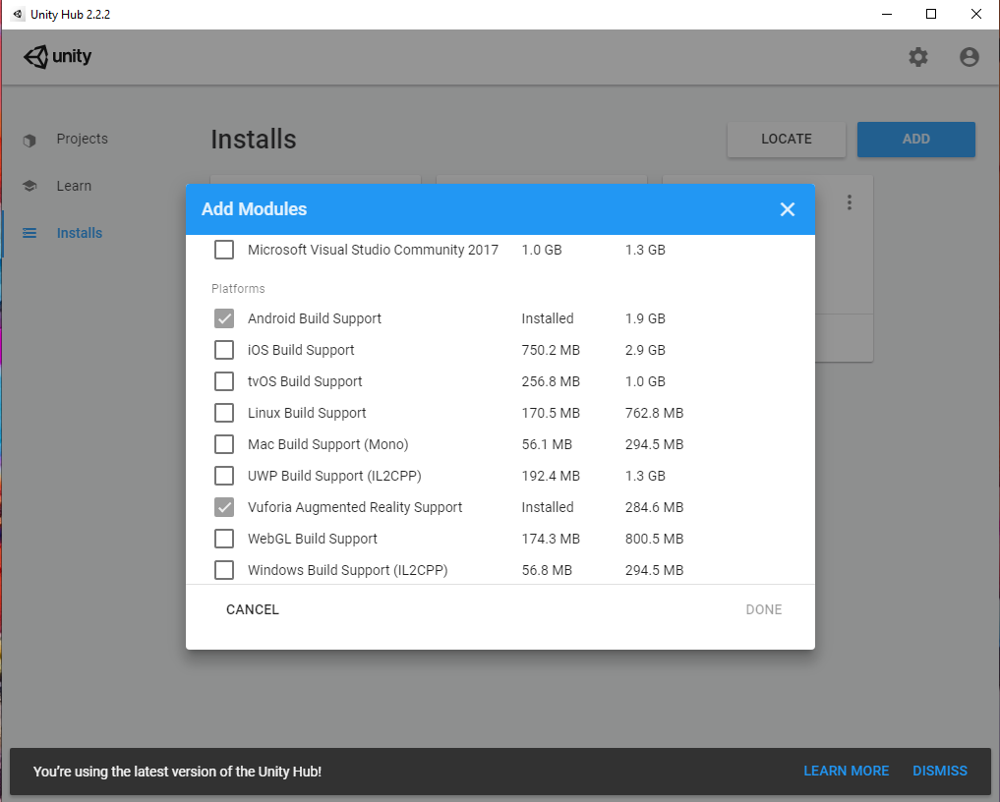

. 
## Download CreateAssetBundle Project Template

Download the Unity Project template onto your hard drive:
- For [Android](http://hiddenhistoriesjtown.org/documentation/templates/AndrCreateAssetBundleU2018_3.zip)
- For [iOS](http://hiddenhistoriesjtown.org/documentation/templates/iOSCreateAssetBundleU2018_3.zip)
- Unzip the file on your hard drive.

**Best Practices: aways use the Unity Hub to open a project.** Different versions are often incompatible. If we need to use a different version in the future, the Hub lets you decide which version to use to open which project.
- Start the Unity Hub
- Click **ADD**
- Select the **project folder** of your template from your hard drive.
- It will appear in the projects list. Click to open.

. 

. 
## Personalizing Your Template

In the template, we have created the following structure for you:

In the **Hierarchy window,** an **ExampleArtistScene**.
- This includes a default camera and light, and three GameObject assets. 
- The three GameObjects are all on top of each other at the origin 0,0,0, so the BlueSphere is hidden inside the other two!

In the **Project window,**
- An **AssetBundles** folder to contain your asset bundle(s). Please do not change, move or delete!
- An **Editor folder** with the scripts to make the asset bundles. Please do not change, move or delete!
- An **ExampleArtist folder** with subfolders for your Materials, Prefabs and Scene. 

We will duplicate and rename the ExampleArtist folder, personalizing it with your own name. This will help prevent confusion if you share assets with other people.

. 
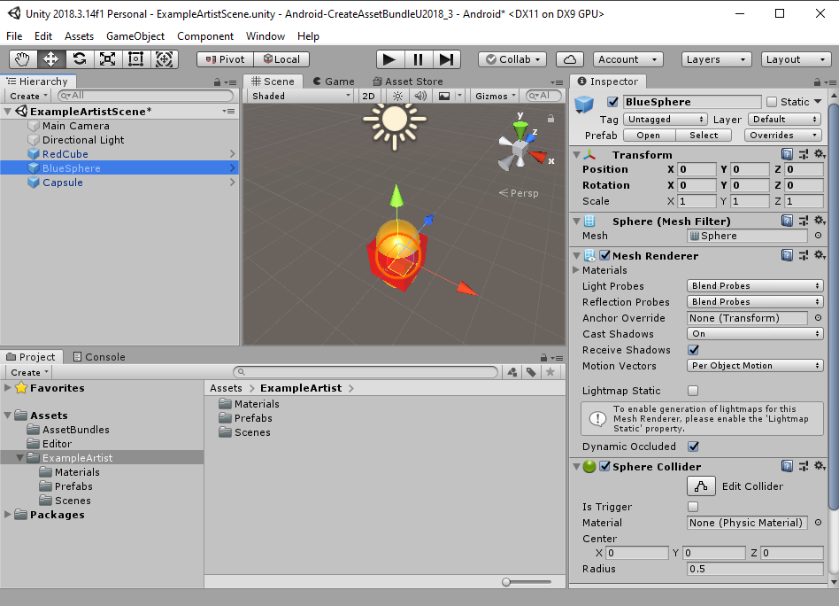

### Duplicate and Rename the *ExampleArtist* folder and *ExampleArtistScene*

Select the **ExampleArtist folder**: 
- Press **Control D** to make a copy (**Command D on a Mac**). (Some things in Unity you can duplicate with right click / Duplicate, other things do not have this option but can be duplicated with Control D.)
- Click into the name and rename it with your own porPOIse account name (or right click/Rename). 

. 
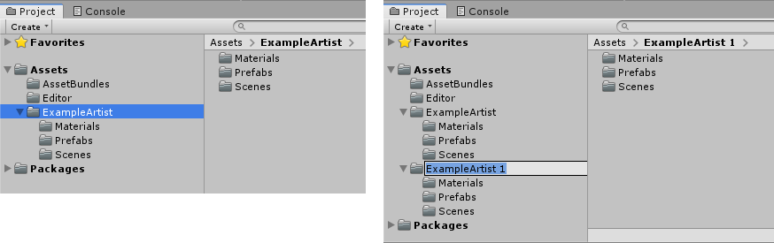

- Now open the **Scenes folder**, click on **ExampleArtistScene** and rename it with the same name.
- Double click on the new scene name to open it. The name of the scene then appears in the Hierarchy window.

. 
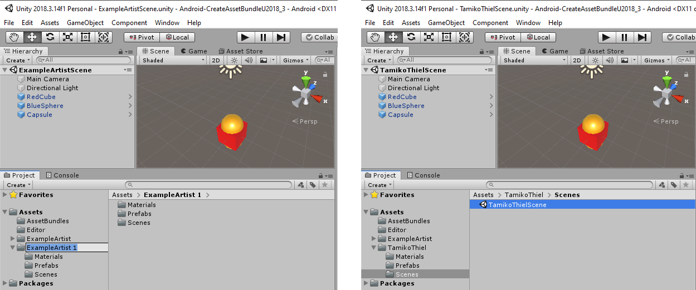

### Delete *ExampleArtist* folder and Recreate Prefabs

**Now DELETE the ExampleArtist folder.** This will avoid confusion between the assets.
- BUT the GameObjects all turn fuschia!
- Open the Prefabs folder and select one of them - the image of the prefab in the Inspector window is also fuschia.
- This is Unity's warning that a Material cannot be found.

. 
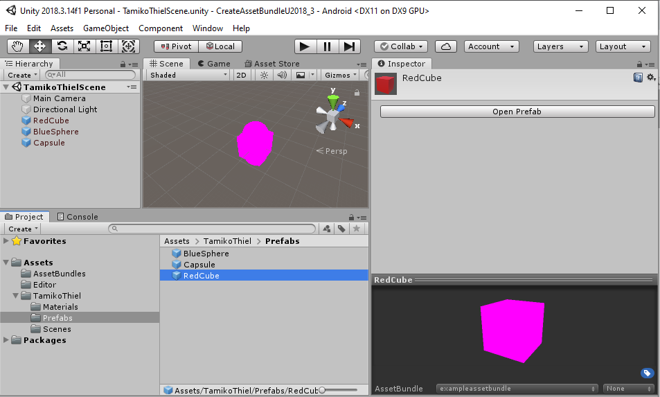

. 
#### Link your materials to the GameObjects
The materials still exist in your folder, but your GameObjects in your folder were linked not to them, but to the materials in the ExampleArtist folder which is now gone.

Open the Materials folder:
- Drag the materials one by one onto the names of the corresponding GameObjects in the Hierarchy window. 
- The colors should appear on the respective GameObjects in the Scene window. 
- Notice however that the colors of the Prefabs in the Inspector window are still fuschia. The prefabs are no longer "prefabrications" of the GameObjects. 
- Since the asset bundle will consist only of prefabs, we have to replace them all with the new versions.

**Replace all the Prefabs:**
- Open the Prefabs folder
- **Delete all the prefabs.**
- Now drag each of your GameObjects into the Prefabs folder one by one to recreate all the prefabs. (You can't drag them all at once.)

. 
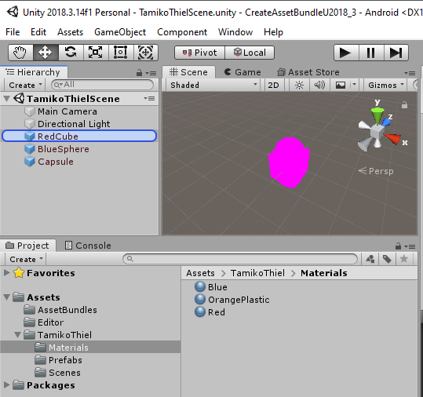

. 
### SAVE your changes!!! Often!!!

If you make a lot of changes, Unity is bound to crash, wiping them all out. If you save often, it is less likely to crash (because it realizes it is not as fun to crash if you only lose a little bit of your work). 

**SO SAVE!!! OFTEN!!!**

. 
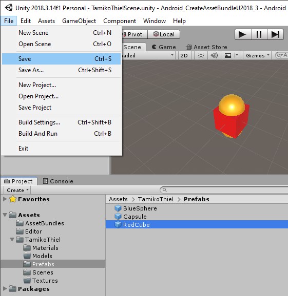

. 
### Asset Bundle Structure

Now click on the **AssetBundles** folder in the Project window:
- The two files called **AssetBundles** are autogenerated and are necessary for the bundles to build correctly.
- There are two files called **exampleassetbundle.** 
  - The second one has an icon with lines on it - this is the **manifest file** containing a human readable description of the contents of the asset bundle. 
  - Click on it and you see its contents in the **Inspector window.**
  - Towards the bottom of the file under **Assets** is a list of the three prefabs in this bundle.
  - **These are the name that you reference in the POI configuration in porPOIse** (if and only if you link the POI to this asset bundle in the [**URL for asset bundle**](UsingPorPOIse_REF-Layer-POI-Properties.md#porpoise-poi-configuration) property!)
  - Since we deleted the original prefabs, however, our current prefabs are not in this asset bundle anymore. 
  - Select both **exampleassetbundle** files and delete them from the AssetBundles folder. 
- DON'T DELETE THE TWO **AssetBundles** FILES!

- **SAVE!!!**

. 
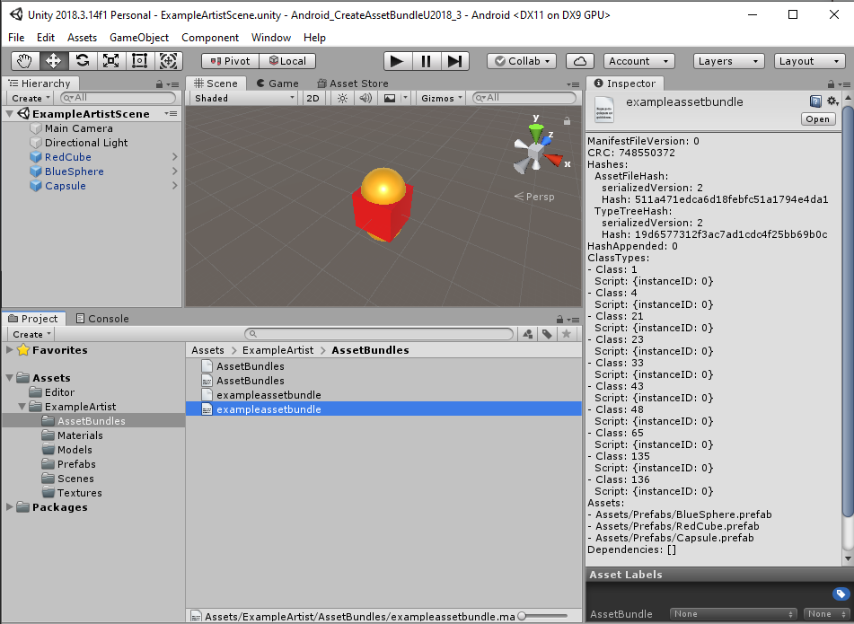

### Setting up your own asset bundle

In the **Prefabs** folder:
- Click on the BlueSphere prefab.
- At the bottom of the Inspector window, you see a depiction of the selected prefab.
- Underneath is the line **AssetBundle** and a field with **None**. This is because we deleted the prefabs that were linked to the exampleassetbundle.
- Click on the little arrow after the name, and the dropdown menu for the AssetBundle name will open.
- Click **Remove Unused Names**. The name "exampleassetbundle" will disappear from the list, as there are no prefabs using it anymore.
- Now select **New ...**
    
. 
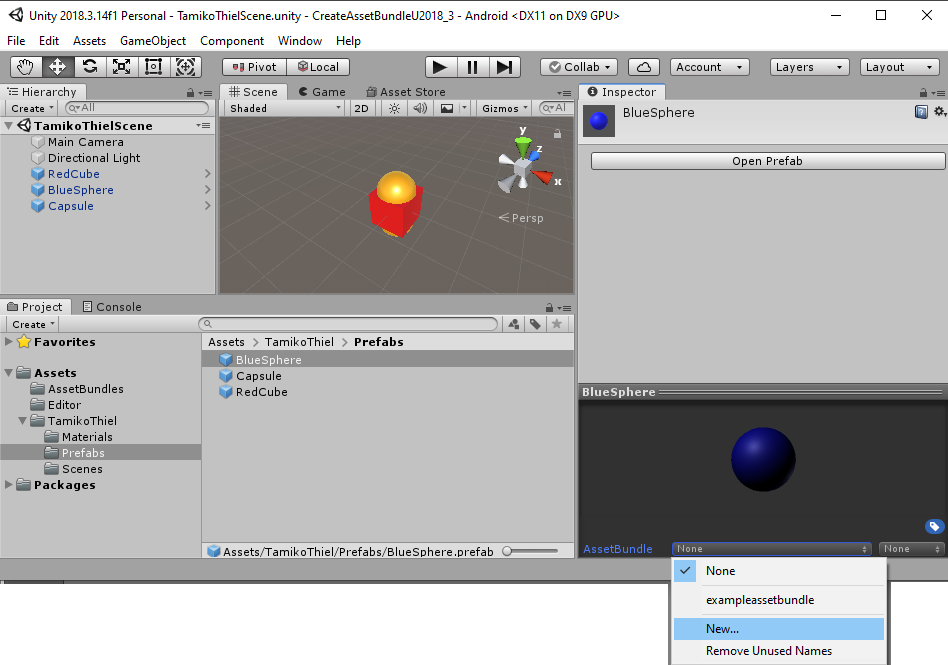

Type in a new name, using **your name or nickname** to identify it as your own asset bundle.
- If you are on Mac, the name must end in a lower case "i":
    - If you are on Windows, the asset bundle name has the form **mynameassetbundle**.
    - If you are on a Mac, the asset bundle name has the form **mynameassetbundlei** (with an "i" at the end).
- The name must be lower case, and please use ONLY dash "-" or underscore "_" as special characters.

This name will now appear as an option in the drop down window.
- Select the **Capsule** and add it to your new asset bundle too.
- **Leave the RedCube at "None":** there is already a RedCube in the hh_exampleassets bundle we used in the porPOIse tutorial, so this is how we can leave it out of our asset bundle.

- **SAVE!!!**

. 
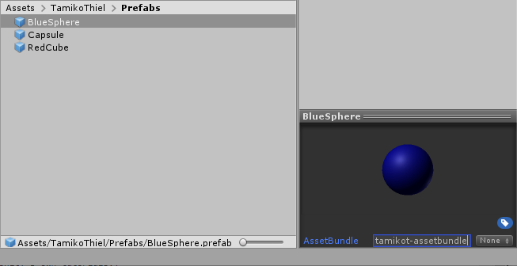

. 
## Build Your New Asset Bundle

First let's make sure your build settings are correct.

### Build Settings

Click: **File / Build Settings…**:
- **Scenes In Build**: Your scene should be listed and **checked.** If not, click **Add Open Scenes.**
- **Platform**
  - If you are working on Windows this should be **Android.** 
  - If you are working on a Mac, this should be **iOS.** 
  - If you need to switch, select the correct platform and click **Switch Platform**. (This will take a while!)
- Close the Build Settings view by clicking on the X in the upper right corner.

. 
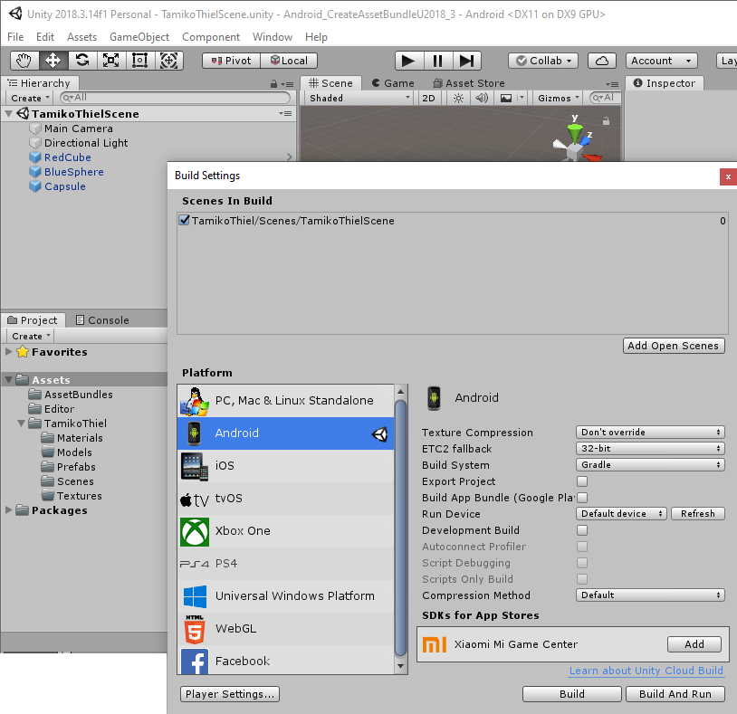

### Call "Build Asset Bundle" command

Now bring up the pop up context menu with a **right click on either of the prefabs** we want to include in the asset bundle (i.e. NOT the RedCube!)
- Select **Build AssetBundles** (or on a Mac, **Build iOS AssetBundles**) from the pop up menu.
- Wait a bit - a window should pop up at least briefly as the bundle is built, saying "Building asset bundle ..."
- Open up the **AssetBundles folder**: 
  - You should see two new files with the name of your asset bundle.
  - IF NOT: **SAVE and close the entire project,** 
- Then open it again
  - Are the files there now?
  - If not, try building the asset bundle again, and it should show up this time.
- Click on your [**manifest file**](CreatingAssetBundles.md#asset-bundle-structure): it should now only show *two* prefabs, Blue Sphere and Capsule.

- **SAVE!!!**
- And close Unity. We now need to work directly with your hard drive and the Hidden Histories server.
  
. 
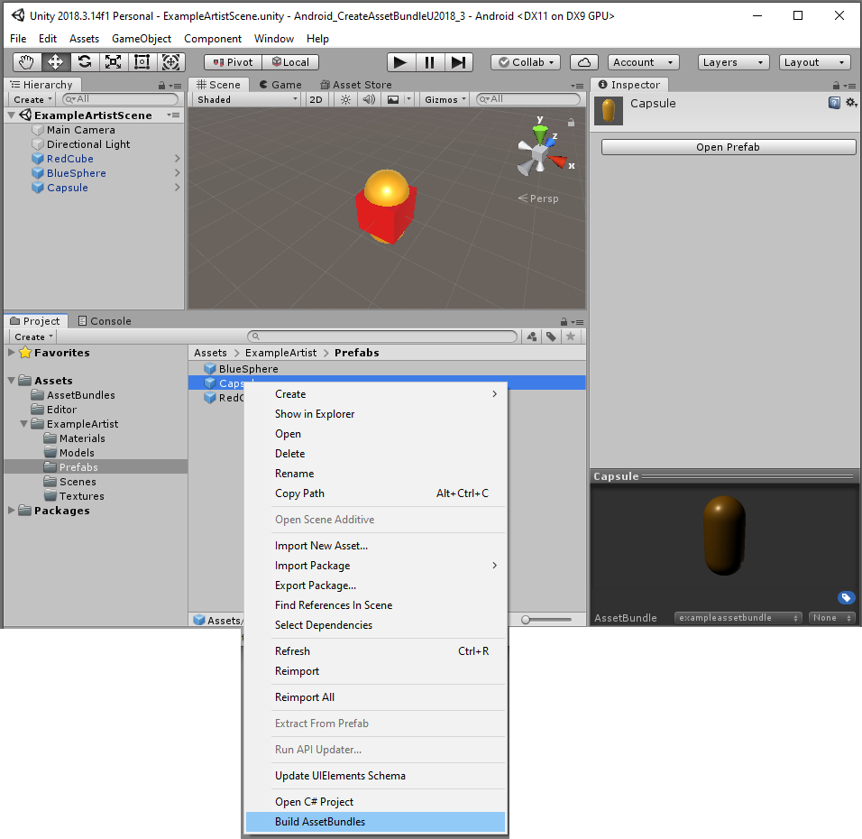

. 
# Uploading Your Asset Bundle

This requires accessing your Unity project folder on your hard drive, and your porPOIse account on the Hidden Histories server.

## Add .ace File Ending to Your Asset Bbundle File

Look at your **hard drive** and find your **Unity project folder.**
- Go to the folder **Assets/AssetBundles.**
- Find your asset bundle file, e.g. tamikot-assetbundle (NOT the manifest file, and NOT any of the meta files!) and add the ending **.ace** so it can be found by the ARpoise server. (On Mac e.g. tamikot-assetbundle**i**.ace)

. 
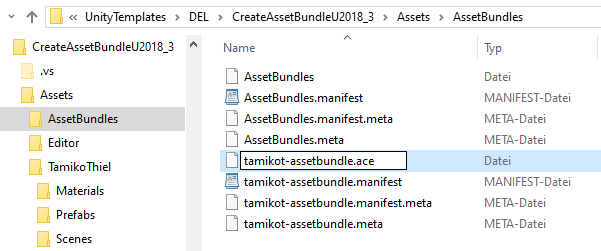

. 
## Upload Your Asset Bundle files with FTP

You should already have an **FTP** (File Transfer Protocol) login for your porPOIse account on **https://hiddenhistoriesjtown.org/**. 
- If you do not have this information, please contact the Hidden Histories admin.
- **Login with FTP to your https://hiddenhistoriesjtown.org/ account**
  - In WinSCP, your hard drive is on the left and the hiddenhistories server on the right.
  - Other FTP apps might look rather different from the image below.
- Notice that in your porPOIse account on the server, you have 4 files for hh_examples, the asset bundle we used for the porPOIse tutorial. Two of them are Android, and the two ending in "i" are for iOS.

Now in your AssetBundles folder **on your hard drive:**
  - Select and upload **both your asset bundle file AND the manifest files.**
  - Overwrite the ones that are already there.
  - You do NOT need to upload any of the meta files.
- Afterwards, open your manifest file on the server and **make sure it has the Capsule and the BlueSphere** in the prefab list.

. 
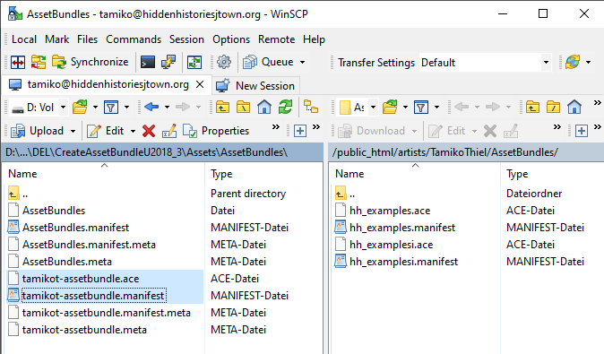

## TEST Capsule or BlueSphere prefabs in your porPOIse ExampleLayer

Now test your new asset bundle in your ExampleLayer:
- **In your porPOIse account, create a new POI.**
  - If you don't remember how to do this, look at the [**Using PorPOIse tutorial**](UsingPorPOIse.md) again
  - Or check the [porPOIse POI configuration reference](UsingPorPOIse_REF-Layer-POI-Properties.md#porpoise-poi-configuration).
  
- **You MUST set the following:**
  - **Lat/Lon:** These should be the same as your other POIs, or very close by, otherwise ARpoise can't find it. 
    - BUT EITHER: Give it a **Relative location** that is offset a bit from 0,0,0 ...
    - ... OR: leave Relative location blank, in order to use absolute location, but make sure the POI's GPS is a bit away from the base GPS of the layer.
    - Otherwise, the Capsule or BlueSphere will be exactly on top of you, and since you are inside it, you won't see anything!
    - The example below has no Relative location entered. It therefore is using the absolute GPS position of the Lat/Lon, which I moved slightly away from its original position at the layer base GPS. 
  - **URL for asset bundle:** This MUST be in this form (i.e. without "http://www.") **hiddenhistoriesjtown.org/artists/ExampleArtist/AssetBundles/exampleassetbundle.ace** where "ExampleArtist" is the name of your porPOIse account.
  - **Prefab name:** Use one of the prefabs named in your **exampleassetbundle.manifest** file. NOTE: the spelling must be EXACTLY the same, including capital/lower case, etc., but without the .prefab ending.
  
- If you now open the **ARpoise app,** you should see the capsule floating around you as well as the other POIs.

. 
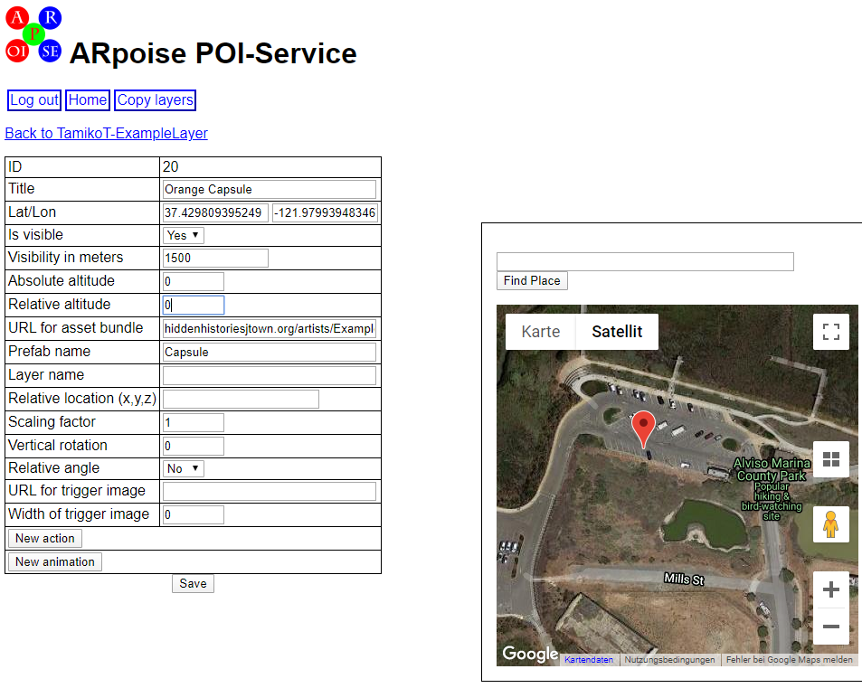

. 
### NOTE on multiple asset bundles in one layer:
- You have seen that you can use various asset bundles in the same layer, each in a different POI. In this way you can easily share assets with other artists.
- However, the asset bundles are downloaded to the smartphone right before you view them in the ARpoise app. Even if you do not use all the assets in a given asset bundle, they all have to be downloaded. 
- This might make for a long loading time for your layer, and a big hit on the viewer's data package.
- **It is therefore best practice to put all assets you want to use in one single package, and leave out assets that are not used in your layer.**

In the next step we will export your assets as a Unity package, so you can send it to someone who can make the asset bundle for the PC type that you do not have yourself.
. 
# Export Assets as Unity Package

Remember that in order for ARpoise assets to be visible for both Android *and* iOS users, we need two separate asset bundles, one for iOS and one for Android.
- Whether you have both Windows and Mac PCs and can create both bundles yourself, or whether the admin or a colleague needs to create this for you, you will have to **export all your prefabs in a Unity package.**
- This package needs to be **imported** into the Unity project on the other type of PC, and then built as an asset bundle on that PC.

. 
## Selecting the Assets for Export

You could just select your personalized assets folder, but I want you to see practice selecting the assets to be exported.
- Select the Assets folder ...
. 
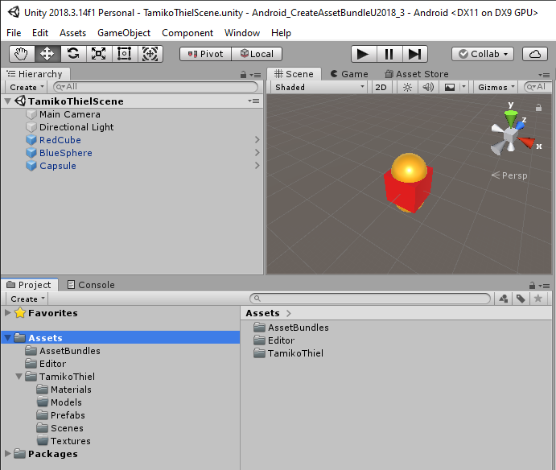

.
- Then select Assets / Export Package ...

. 
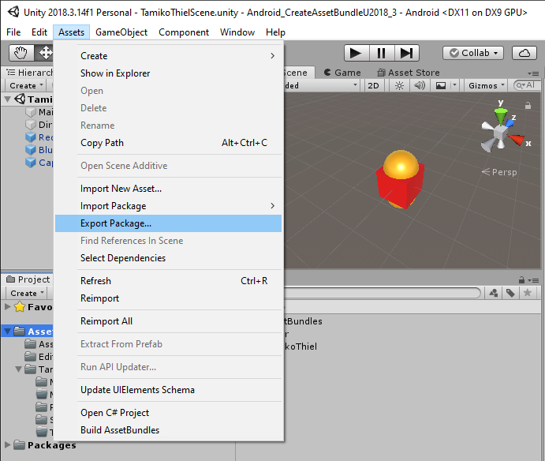

. 
### You only need to export your personalized assets folder. 

- Deselect everything else, i.e. the AssetBundles folder and the Editor folder. (The Unity template for the other platform requires other versions of the files in these folders anyway.)
- The Models and Textures folders are not selected because they are empty.
- **Include dependencies** should be checked!
- Click **Export ...** and save the unitypackage file to somewhere convenient **outside of your Unity project folder.**
- Send it to whomever will do the conversion for you.

. 
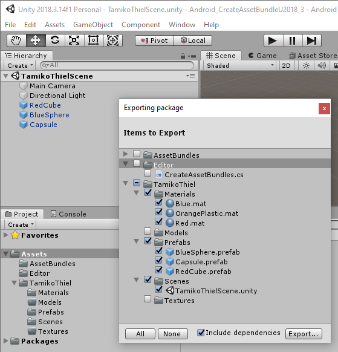

. 
## Create the Unity Package for the Other Platform

The person doing the conversion uses *their platform's version* of the **Unity template CreateAssetBundleU2018_3.**

- Open the Unity template CreateAssetBundleU2018_3.
- From the main menu, select **Assets / Import Package / Custom Package ...**

. 
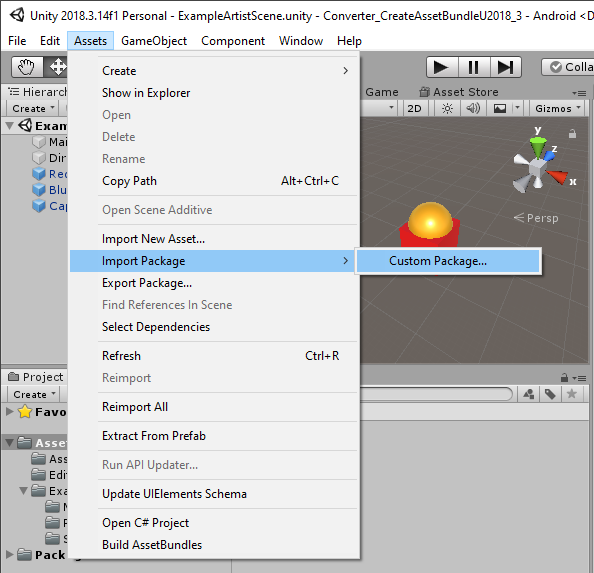

. 
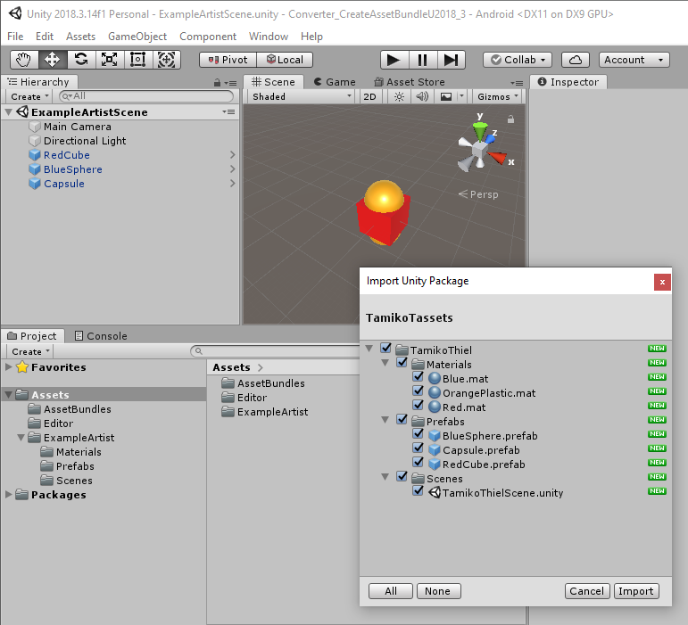
