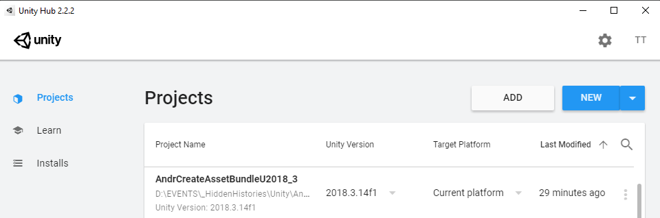

# Hidden Histories
# Creating porPOIse Asset Bundles in Unity

## Overview

This is a step by step tutorial using our **custom Unity3D project templates** to create an **asset bundle** that can be used by the **ARpoise** or **AR-vos** AR apps. (Assets include 3D models, sounds, images etc. that make up your AR experience or "layer.")
- The tutorial shows how to create an asset bundle for Android, on a Windows 10 PC.
- The process for creating an iOS asset bundle on a Mac is similar.

**Unity Editor Interface tutorials:**

Our tutorial does NOT teach you to use Unity or create assets in Unity. Those will be linked from the [documentation link page](README.md).

If you are unfamiliar with Unity, here are tutorials on the Unity interface, which will help to understand this tutorial:
- Unity Manual: https://docs.unity3d.com/Manual/UsingTheEditor.html
- Unity video tutorial: https://learn.unity.com/tutorial/using-the-unity-interface#     (note: for AR we will be making very simple things, nothing as complicated as the games they show!)

**Important Notes**: 
- You can do all your testing on one platform, but need to have a copy of your AssetBundle created for the other platform as well.
- The **iOS asset bundle must be made on a Mac, and tested on an iOS device.** 
- The **Android asset bundle must be made on a Windows PC and tested on an Android device.** 
- If you only have one type of PC, you will need to send your assets to the admin or team up with another artist to get the other asset bundle.

. 
## Unity Hub & Unity Editor Install

Download the free Unity Editor version:

- First download and install the [Unity Hub](https://unity3d.com/get-unity/download) on your PC.

- Then go to the [Unity download archive](https://unity3d.com/get-unity/download/archive) and install Unity3D Editor version **2018.3.14.f1**:
  - Click on the **Unity 2018x** tab.
  - Scroll down to Unity **2018.4.13 (22 Nov, 2019)** and click on **Unity Hub.**
  - NOTE: We do NOT guarantee that ARpoise or AR-vos will work with other versions!

- Install Unity with the following modules:
  - Build Support
    - Android if you are working on a Windows PC
    - iOS if you are working on a Mac.
  - Vuforia Augmented Reality Support.
  - NOTE: This will also install Microsoft Visual Studio automatically, on both Windows and Mac. The free version is fine. 

. 


. 
## Download CreateAssetBundle Project Template

Download the Unity Project template onto your hard drive:
- For [Android](http://hiddenhistoriesjtown.org/documentation/templates/AndrCreateAssetBundleU2018_3.zip)
- For [iOS](http://hiddenhistoriesjtown.org/documentation/templates/iOSCreateAssetBundleU2018_3.zip)
- Unzip the file on your hard drive.

**Aways use the Unity Hub to open a project,** so you can make sure the proper Unity Version is used to open it. 
- Start the Unity Hub
- Click **ADD**
- Select the **project folder** of your template from your hard drive.
- It will appear in the projects list. Click to open.

. 


. 
## Template Structure

In the template, we have created the following for you:
- In the **Hierarchy window,** an **ExampleArtistScene**.
  - This includes a default camera and light, and three GameObjects. 
  - They are all on top of each other at the origin 0,0,0, so the BlueSphere is hidden inside the other two!
- In the **Project window,**
  - An **AssetBundles** folder to contain your asset bundle(s). Please do not change, move or delete!
  - An **Editor folder** with the scripts to make the asset bundles.
  - An **ExampleArtist folder** with subfolders for your Materials, Models, Prefabs, Scenes and Textures.

### Asset Bundle Structure

Now click on the **AssetBundles** folder in the Project window:
- The two files called **AssetBundles** are autogenerated and are necessary for the bundles to build correctly.
- There are two files called **exampleassetbundle.** 
  - The second one has an icon with lines on it - this is the **manifest file** containing a human readable description of the contents of the asset bundle. 
  - Click on it and you see its contents in the **Inspector window.**
  - Towards the bottom of the file under **Assets** is a list of the three prefabs in this bundle.
  - **These are the name that you reference in the POI configuration in porPOIse** (if and only if you link the POI to this asset bundle in the [**URL for asset bundle**](UsingPorPOIse_REF-Layer-POI-Properties.md#porpoise-poi-configuration) property!)
  - Notice that these are the same as the 3 GameObjects with blue cube icons listed in the **Hierarchy/ExampleArtistScene** window.

. 


### Prefabs

Now click on the **ExampleArtist/Prefabs** folder:
- You see the same GameObjects listed here as are listed in the **Hierarchy/ExampleArtistScene window** above.
- The **blue cube icons** next to the names show that they are **prefabs,** i.e. "prefabricated" GameObjects that are ready to be used as assets in your porPOIse layer.

Click on the RedCube prefab in the Assets/Prefabs subwindow:
- At the bottom of the Inspector window, you see a depiction of the selected prefab.
- Underneath is the line **AssetBundle exampleassetbundle**, with a small arrow icon on the right.
- Click on the arrow icon to open the dropdown menu for the AssetBundle name.
- The name **exampleassetbundle** should be selected. 

. 


#### Remove the RedCube prefab from exampleassetbundle

Since there is already a RedCube in the [**hh_examples** asset bundle we are using in porPOIse](UsingPorPOIse_REF-Layer-POI-Properties.md#porpoise-poi-configuration), this is redundant. 

- Click on **None** to exclude it from all asset bundles.
- Click on the other two prefabs and make sure they all have the name **exampleassetbundle** selected. These are new assets so we want to include them in our asset bundle.
- Note the other options:
  - **New** allows you to create a new name for a new asset bundle. We will do this later.
  - **Remove Unused Names** allows you to delete names you do not want to use anymore.

. 


## Build exampleassetbundle

First let's make sure your build settings are correct:

### Build Settings

- Click: **File / Build Settings…**
- If you are working on Windows the **Platform** should be **Android.** 
- If you are working on a Mac, the **Platform** should be **iOS.** 
- If you need to switch, select the correct platform and click **Switch Platform**. (This will take a while!)
- Close the Build Settings view by clicking on the X in the upper right corner.


### Call "Build Asset Bundle" command from the context window

Now right click on either of the prefabs we want to include in exampleassetbundle (i.e. NOT the RedCube!)
- Select **Build AssetBundles** from the context menu. (If you are on a Mac, select the iOS AssetBundles command.)
- Wait a bit - a window should pop up at least briefly as the bundle is built.
- Open up the **AssetBundles folder** and click on the exampleassetbundle [**manifest file**](CreatingAssetBundles.md#asset-bundle-structure): it should now only show *two* prefabs, Blue Sphere and Capsule.

. 


## Add .ace file ending to your exampleassetbundle file

Now look at your **hard drive** and find your **Unity project folder.**
- Go to the folder **Assets/AssetBundles.**
- Find the **exampleassetbundle** (NOT the manifest file, and NOT any of the meta files!) and add the ending **.ace** so it can be found by the ARpoise server.

. 


. 
## Upload exampleassetbundle files to your porPOIse account

You should already have an FTP (File Transfer Protocol) login for your porPOIse account on **https://hiddenhistoriesjtown.org/**. 
- If you do not know this information any more, please contact the Hidden Histories admin.
- **Login with FTP to your https://hiddenhistoriesjtown.org/ account** (it might look rather different from the image below).
- In your **AssetBundles folder**
  - Upload the **exampleassetbundle.ace** file AND the **exampleassetbundle.manifest** files.
  - Overwrite the ones that are already there.
  - Afterwards, open the exampleassetbundle.manifest file and make sure it now only has the Capsule and the BlueSphere.

. 


. 
## Personalize ExampleArtist folder name and Scene name:
- In the **Project window,** click on the **Assets folder** 
- Then in the subwindow click on the **ExampleArtist folder name** (or right click/Rename) and enter your own porPOIse account name (e.g. in the format "BruceLee" with no spaces).
- Then click on your Scenes folder, and in the subwindow click on the ExampleArtistScene to rename it with your name, e.g. "BruceLeeScene."

. 


. 
 

. 
## 3D Assets
Create two game objects in the SampleScene, for instance a red cube and a blue sphere. (Sorry, this is not a Unity tutorial for creating 3D assets. Please refer to Unity's own tutorials.) 
### Image - Game Objects:


## 3D Prefabs
Turn the two objects into prefabs by dragging them one by one from the **SampleScene** panel to the **Prefabs** folder created above.
### Image - Prefabs:


Make sure both prefabs have zero transforms, e.g.:
### Image - Transform:


## Prefab - Context Menu Entries
Now, when you right click on the **BlueSphere** prefab in the Prefabs folder you should see a context menu with the two entries
**Build AssetBundles** and **Build iOSAssetBundles** at the bottom.
### Image - Menu Options:


## Create an Asset Bundle
Select the **BlueSphere** prefab.

On the bottom right of the Unity window you should see the label **AssetBundle** with **None** selected.
Click on **None** and select **New** from the context menu. Enter the name of the new asset bundle,
for the tutorial that is **exampleassetbundle**.
### Image - Select Asset Bundle:


Select the **RedCube** prefab and also select the **exampleassetbundle** for it.

Select either of your prefabs, do a right click and select the **Build AssetBundles** option from the bottom of the context menu.

### The asset bundle should be created!!!!!!!!

Select the **AssetBundles** folder created earlier. You should see four entries.
### Image - Asset Bundles:


The first **exampleassetbundle** file is the actual asset bundle that needs to be made available on the web.
The second file (with lines in the icon) is a manifest file describing what is in the bundle. If you double click on the file to open it, it should contain something like:
```
ManifestFileVersion: 0
CRC: 1652422628
Hashes:
  AssetFileHash:
    serializedVersion: 2
    Hash: 912661529e9af10c64a43b680d62010f
  TypeTreeHash:
    serializedVersion: 2
    Hash: 6597594720de07d06673fc08865c772c
HashAppended: 0
ClassTypes:
- Class: 1
  Script: {instanceID: 0}
- Class: 4
  Script: {instanceID: 0}
- Class: 21
  Script: {instanceID: 0}
- Class: 23
  Script: {instanceID: 0}
- Class: 33
  Script: {instanceID: 0}
- Class: 43
  Script: {instanceID: 0}
- Class: 48
  Script: {instanceID: 0}
- Class: 65
  Script: {instanceID: 0}
- Class: 135
  Script: {instanceID: 0}
Assets:
- Assets/Prefabs/BlueSphere.prefab
- Assets/Prefabs/RedCube.prefab
Dependencies: []
```
The two lines near the bottom listing your two assets, are important - you will need to enter these exact names (here BlueSphere and RedCube) into the porPOIse setup form in order to call them up as augments. Therefore always copy the manifest file to wherever you copy the asset bundle file, so you can find out what is in the bundle.

Upload the asset bundle file and manifest file to the web in a folder that can be accessed via http.
You will need to enter the URL of the asset bundle file into the porPOIse web form for the layer showing the red cube or the blue sphere as augments (or POIs, Points Of Interest). This is covered in a different tutorial. (LINK!!!)

## iOS Asset Bundles
In order to build an iOS asset bundle, you need to include the iOS Build Support module in your Unity project (see the second image from the top, "Image - Unity Modules:"). Then use right click / Build iOSAssetBundles to create the asset bundles for iOS.

**Important Notes**: 

- In order for the assets to work in **ARpoise** and **AR-vos** you MUST create and upload BOTH
the **Android** and the **iOS** asset bundle to a web folder accessible via **http**.

- You MUST use the following naming convention:
If the name of the Android asset bundle is **exampleassetbundle**,
the name of the iOS asset bundle needs to be **exampleassetbundlei**.
(The same name followed by a lower case letter ‘**i**’.)
