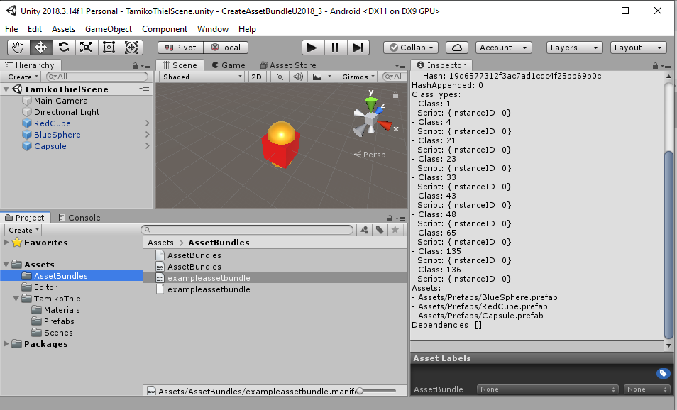
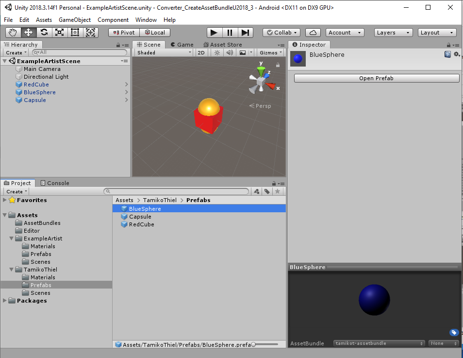

#  Hidden Histories

# Creating porPOIse Asset Bundles in Unity
<< Go back to [Hidden Histories Artist Documentation Overview](http://hiddenhistoriesjtown.org/documentation).

.

## Overview

This is a step by step tutorial using our **custom Unity3D project templates** to create an **asset bundle** that can be used by the **ARpoise** or **AR-vos** AR apps. (Assets include 3D models, sounds, images etc. that make up your AR experience or "layer.")
- The tutorial shows how to create an asset bundle for **Android, on a Windows 10 PC.**
- The process for creating an **iOS asset bundle on a Mac** is similar, and we indicate the differences.
- **You will need both versions in order for your layer to work successfully on both Android and iOS.** If you can't create both versions yourself, please ask Hidden Histories for help.

**You might be able to build both versions on a Mac:**
- On Macs, testers have been able to create asset bundles for Android as well. Windows PCs however do not consistently create asset bundles for iOS. 
- If you want try to create both bundles on a Mac, please follow this procedure:
  - Build your iOS asset bundle on a Mac and upload it to your porPOIse account.
  - Successfully get it to work in the ARpoise app on an iPhone or iPad. 
  - Then build the Android asset bundle, upload it to your porPOIse account and try it out on an Android smartphone. 
- If you want the script or more technical details behind the asset bundle feature, see the [ARpoise version of this tutorial](https://github.com/ARPOISE/ARpoise/blob/master/documentation/CreatingAssetBundles.md).

**Please ask Hidden Histories for help if:**
- You have successfully gotten your asset bundle to work on one platform, but need a version created for the other platform as well.
- If you have a Mac+Android, or a WindowsPC+iPhone, or are using a Linux PC, 

. 

**NOTE: This tutorial assumes you are familiar with the Unity Editor and can already create assets in Unity!**

If you are unfamiliar with Unity, please go to the:
- [Hidden Histories documentation page](http://hiddenhistoriesjtown.org/documentation) **"How to create your own AR artworks"** section and go through Professor Rhonda's slide deck and Corinne's videos first.
- See also the [Unity Manual for version 2018.3.14](https://docs.unity3d.com/2018.3/Documentation/Manual/UsingTheEditor.html)

. 
## Unity Hub & Unity Editor Install

Download the free Unity Editor version:

- First download and install the [Unity Hub](https://unity3d.com/get-unity/download) on your PC.

- Then go to the [Unity download archive](https://unity3d.com/get-unity/download/archive) and install Unity3D Editor version **2018.3.14.f1**:
  - Click on the **Unity 2018x** tab.
  - Scroll down to Unity **2018.3.14 (22 Nov, 2019)** and click on **Unity Hub.**
  - NOTE: The asset bundles can ONLY be created with this version!

- Install Unity with the following modules:
  - Build Support
    - Android if you are working on a Windows PC
    - iOS and Mac build support if you are working on a Mac.
    - All the above if you have a Mac and want to try making both versions yourself.
  - Vuforia Augmented Reality Support.
  - NOTE: This will also install Microsoft Visual Studio automatically, on both Windows and Mac. The free version is fine. 

. 

. 
## Download CreateAssetBundle Project Template

Download and unzip the Unity Project template onto your hard drive:
- For [Android](http://hiddenhistoriesjtown.org/documentation/templates/Android-CreateAssetBundleU2018_3.zip) if you are working on a Windows PC.
- For [iOS](http://hiddenhistoriesjtown.org/documentation/templates/iOsCreateAssetBundleU2018_3.zip) if you are working on a Mac.
- Here is an [iOSAndroid template](hiddenhistoriesjtown.org/documentation/templates/iOSAndroid_CreateAssetBundle_U2018_3.zip) from Prof Rhonda, if you have a Mac and want to try to make both asset bundles.
  - Create and fully test the iOS asset bundle first, so you know it works, before creating the Android bundle. 
  - If you do not have both iOS and Android devices, ask someone to test your layer on the device you do not own.

**Best Practices: aways use the Unity Hub to open a project.** Different versions are often incompatible, but the Hub allows you to see which version you are using when you open a project. If we need to use a different version in the future, the Hub lets you select which version to use.
- Start the Unity Hub
- Click **ADD**
- Select the **project folder** of your template from your hard drive.
- It will appear in the projects list. Click to open.

. 

. 
## Personalizing Your Template

In the template, we have created the following structure for you:

In the **Hierarchy window,** an **ExampleArtistScene**.
- This includes a default camera and light, and three GameObject assets. 
- The three GameObjects are all on top of each other at the origin 0,0,0, so the BlueSphere is hidden inside the other two!

In the **Project window,**
- An **AssetBundles** folder to contain your asset bundle(s). Please do not change, move or delete!
- An **Editor folder** with the scripts to make the asset bundles. Please do not change, move or delete!
- An **ExampleArtist folder** with subfolders for your Materials, Prefabs and Scene. 

We will duplicate and rename the ExampleArtist folder, personalizing it with your own name. This will help prevent confusion if you share assets with other people.

. 

### Duplicate and Rename the *ExampleArtist* folder and *ExampleArtistScene*

Select the **ExampleArtist folder**: 
- Press **Control D** to make a copy (**Command D on a Mac**). (Some things in Unity you can duplicate with right click / Duplicate, other things do not have this option but can be duplicated with Control D.)
- Click into the name and rename it with your own porPOIse account name (or right click/Rename). 

. 

- Now open the **Scenes folder**, click on **ExampleArtistScene** and rename it with the same name.
- Double click on the new scene name to open it. The name of the scene then appears in the Hierarchy window.

. 

### Delete *ExampleArtist* folder and Recreate Prefabs

**Now DELETE the ExampleArtist folder.** This will avoid confusion between the assets.
- BUT the GameObjects all turn fuschia!
- Open the Prefabs folder and select one of them - the image of the prefab in the Inspector window is also fuschia.
- This is Unity's warning that a Material cannot be found.

. 

. 
#### Link your materials to the GameObjects
The materials still exist in your folder, but your GameObjects in your folder were linked not to them, but to the materials in the ExampleArtist folder which is now gone.

Open the Materials folder:
- Drag the materials one by one onto the names of the corresponding GameObjects in the Hierarchy window. 
- The colors should appear on the respective GameObjects in the Scene window. 
- Notice however that the colors of the Prefabs in the Inspector window are still fuschia. The prefabs are no longer "prefabrications" of the GameObjects. 
- Since the asset bundle will consist only of prefabs, we have to replace them all with the new versions.

**Replace all the Prefabs:**
- Open the Prefabs folder
- **Delete all the prefabs.**
- Now drag each of your GameObjects into the Prefabs folder one by one to recreate all the prefabs. (You can't drag them all at once.)

. 

. 
### SAVE your changes!!! Often!!!

If you make a lot of changes, Unity is bound to crash, wiping them all out. If you save often, it is less likely to crash (because it realizes it is not as fun to crash if you only lose a little bit of your work). 

**SO SAVE!!! OFTEN!!!**

. 

. 
### Asset Bundle Structure

Now click on the **AssetBundles** folder in the Project window:
- The two files called **AssetBundles** are autogenerated and are necessary for the bundles to build correctly.
- There are two files called **exampleassetbundle.** 
  - The second one has an icon with lines on it - this is the **manifest file** containing a human readable description of the contents of the asset bundle. 
  - Click on it and you see its contents in the **Inspector window.**
  - Towards the bottom of the file under **Assets** is a list of the three prefabs (with the file extension ".prefab" in this bundle.
  - **These are the names that you reference in the POI configuration in porPOIse** (if and only if you link the POI to this asset bundle in the [**URL for asset bundle**](UsingPorPOIse_REF-Layer-POI-Properties.md#porpoise-poi-configuration) property!)
  - Since we deleted the original prefabs, however, our current prefabs are not in this asset bundle anymore. 
  - Select both **exampleassetbundle** files and delete them from the AssetBundles folder. 
- DON'T DELETE THE TWO **AssetBundles** FILES! They are needed for ARpoise - if you delete them, you'll have to unzip the template file again and start all over again.

- **SAVE!!!**

. 

### Setting up your own asset bundle

In the **Prefabs** folder:
- Click on the BlueSphere prefab.
- At the bottom of the Inspector window, you see a depiction of the selected prefab.
- Underneath is the line **AssetBundle** and a field with **None**. This is because we deleted the prefabs that were linked to the exampleassetbundle.
- Click on the little arrow after the name, and the dropdown menu for the AssetBundle name will open.
- Click **Remove Unused Names**. The name "exampleassetbundle" will disappear from the list, as there are no prefabs using it anymore.
- Now select **New ...**
    
. 

Type in a new name, using **your name or nickname** to identify it as your own asset bundle.
- If you are creating the asset bundle for Android, its name has the form **mynameassetbundle**. This is the version you will type into porPOIse.
- If you are creating the asset bundle for iOS, its name has the form **mynameassetbundlei** (with an **"i"** at the end). ARpoise will automatically look for the "i" when called by an iOS device.
- **The name must be lower case, and please use ONLY dash "-" or underscore "_" as special characters.**

.

This name will now appear as an option in the drop down window.
- Select the **Capsule** and add it to your new asset bundle too.
- **Leave the RedCube at "None":** there is already a RedCube in the hh_exampleassets bundle we used in the porPOIse tutorial, so this is how we can leave it out of our asset bundle.

- **SAVE!!!**

. 

. 
## Build Your New Asset Bundle

First let's make sure your build settings are correct.

### Build Settings

Click: **File / Build Settings…**:
- **Scenes In Build**: Your scene should be listed and **checked.** If not, click **Add Open Scenes.**
- **Platform**
  - If you are working on Windows creating an asset bundle for Android, this should be **Android.** 
  - If you are working on a Mac, this should be **iOS** if you are creating the iOS bundle, and **Android** if you are creating an Android bundle. 
  - If you need to switch, select the correct platform and click **Switch Platform**. (This will take a while!)
- Close the Build Settings view by clicking on the X in the upper right corner.

. 

### Call "Build Asset Bundle" command

Now bring up the pop up context menu with a **right click on either of the prefabs** we want to include in the asset bundle (i.e. NOT the RedCube!)
- From the pop up menu, select **Build AssetBundles** for an Android asset bundle, or **Build iOS AssetBundles** for an iOS asset bundle.
- Wait a bit - a window should pop up at least briefly as the bundle is built, saying "Building asset bundle ..."
- Open up the **AssetBundles folder**: 
  - You should see two new files with the name of your asset bundle.
  - IF NOT: **SAVE and close the entire project,** 
- ... then open the project again:
  - Are the files there now?
  - If not, try building the asset bundle again, and it should show up this time.
- Click on your [**manifest file**](CreatingAssetBundles.md#asset-bundle-structure): it should now only show *two* prefabs, BlueSphere.prefab and Capsule.prefab.

- **SAVE!!!**
- Then close Unity. We now need to work directly with your hard drive and the Hidden Histories server.
  
. 

. 
# Uploading Your Asset Bundle

This requires accessing your Unity project folder on your hard drive, and your porPOIse account on the Hidden Histories server.

## Add .ace File Ending to Your Asset Bundle File

Look at your **hard drive** and find your **Unity project folder.**
- Go to the folder **Assets/AssetBundles.**
- You should see:
  - Your new asset bundle file, e.g. tamikot-assetbundle or tamikot-assetbundlei, but **without** any file type. 
  - A file of the same name, but file type .manifest.
  - The meta files for both the asset bundle file and the manifest file.
  - If you have already created an asset bundle of this name before:
    - You will also see the old file, of typ ace.
    - **Delete** this old .ace file!
- Now add the file ending **.ace** to your new asset bundle file so it can be found by the ARpoise server. (For iOS remember you should have added an "i" at the end of the file name in Unity! If you forgot to do this it won't work!)

On Windows for Android:

. 
## Upload Your Asset Bundle files with FTP

You should already have an **FTP** (File Transfer Protocol) login for your porPOIse account on **https://hiddenhistoriesjtown.org/**. 
- If you do not have this information, please contact the Hidden Histories admin.
- **Login with FTP to your https://hiddenhistoriesjtown.org/ account**
  - In WinSCP, your hard drive is on the left and the hiddenhistories server on the right.
  - Other FTP apps might look rather different from the image below.
- Notice that in your porPOIse account on the server, you have 4 files for hh_examples, the asset bundle we used for the porPOIse tutorial. Two of them are Android, and the two ending in "i" are for iOS.

Now in your AssetBundles folder **on your hard drive:**
  - Select and upload **both your asset bundle file AND the manifest file.**
  - Overwrite the ones that are already there.
  - You do NOT need to upload any of the meta files.
- Afterwards, open your manifest file on the server and **make sure it has the Capsule.prefab and the BlueSphere.prefab** in the prefab list.

. 

## TEST Capsule or BlueSphere prefabs in your porPOIse ExampleLayer

Now test your new asset bundle in your ExampleLayer:
- **In your porPOIse account, create a new POI.**
  - If you don't remember how to do this, look at the [**Using PorPOIse tutorial**](UsingPorPOIse.md) again
  - Or check the [porPOIse POI configuration reference](UsingPorPOIse_REF-Layer-POI-Properties.md#porpoise-poi-configuration).
  
- **You MUST set the following:**
  - **Lat/Lon:** These should be the same as your other POIs, or very close by, otherwise ARpoise can't find it. 
    - BUT EITHER: Give it a **Relative location** that is offset a bit from 0,0,0 ...
    - ... OR: leave Relative location blank, in order to use absolute location, but make sure the POI's GPS is a bit away from the base GPS of the layer.
    - Otherwise, the Capsule or BlueSphere will be exactly on top of you, and since you are inside it, you won't see anything!
    - The example below has no Relative location entered. It therefore is using the absolute GPS position of the Lat/Lon, which I moved slightly away from its original position at the layer base GPS. 
  - **URL for asset bundle:** This MUST be in this form (i.e. without "http://www.") **hiddenhistoriesjtown.org/artists/ExampleArtist/AssetBundles/exampleassetbundle.ace** where "ExampleArtist" is the name of your porPOIse account.
  - **Prefab name:** Use one of the prefabs named in your **exampleassetbundle.manifest** file. NOTE: the spelling must be EXACTLY the same, including capital/lower case, etc., but without the .prefab ending.
  
- If you now open the **ARpoise app,** you should see the capsule floating around you as well as the other POIs.

. 

. 
### NOTE on multiple asset bundles in one layer:
- You have seen that you can use various asset bundles in the same layer, each in a different POI. In this way you can easily share assets with other artists.
- However, the asset bundles are downloaded to the smartphone right before you view them in the ARpoise app. Even if you do not use all the assets in a given asset bundle, they all have to be downloaded. This might make for a long loading time for your layer, and a big hit on the viewer's data package.
- **Also, if the same name appears in more than one asset bundle, only one of them will be found.**
- It is therefore best practice to put **all assets you want to use in one single package, and leave out assets that are not used in your layer.**

In the next step we will export your assets as a Unity package, so you can send it to someone who can make the asset bundle for the PC type that you do not have yourself.
. 
# Export Assets as Unity Package

Remember that in order for ARpoise assets to be visible for both Android *and* iOS users, we need two separate asset bundles, one for iOS and one for Android.
- If you can't create both bundles yourself, and therefore need to send your assets to the admin or a colleague, you will have to **export all your prefabs in a Unity package.**
- Your helper will **import** your Unity package into their Unity project, and then built the asset bundle for you.

. 
## Selecting the Assets for Export

You could just select your personalized assets folder, but I want you to see practice selecting the assets to be exported.
- Select the Assets folder ...
. 

.
- Then select Assets / Export Package ...

. 

. 
### You only need to export your personalized assets folder. 

- Deselect everything else, i.e. the AssetBundles folder and the Editor folder. (The Unity template for the other platform requires other versions of the files in these folders anyway.)
- The Models and Textures folders are not selected because they are empty.
- **Include dependencies** should be checked!
- Click **Export ...** and save the unitypackage file to somewhere convenient **outside of your Unity project folder.**
- Send it to whomever will do the conversion for you.

. 

. 
## Create the Unity Package for the Other Platform

The person doing the conversion uses *their platform's version* of the **Unity template CreateAssetBundleU2018_3.**

- Open the Unity template CreateAssetBundleU2018_3.
- From the main menu, select **Assets / Import Package / Custom Package ...**

. 

### Import Unity Package List

Notice that the import list designates all the assets in our unitypackage as being "new" in the little green labels to the right.
- This means Unity sees our assets as being completely different from the ones in the ExampleArtist folder, even though we started with that as a template. Our folder will be added parallel and in addition to the ExampleArtist folder. 
- If we had simply renamed the ExampleArtist folder, even though we exported our folder with a completely different name, Unity would not recognize our assets as being different, and would either not import them, or overwrite them if we had made changes.

. 

. 
### Ready For Asset Bundle Build

Check your prefabs to make sure they are properly included in your asset bundle. 

. 

. 
Then [as you did above:](CreatingAssetBundles.md#build-your-new-asset-bundle)
- Set up the name for the asset bundle, remembering that the iOS needs an "i" on the end, but the Android asset bundle should NOT have the "i".
- Check File / Build Settings - but this time of course select the other platform.
- Right click on one of your prefabs, and select Build AssetBundles for the other platform.
- Check the Project window folder Assets / AssetBundles to make sure your asset bundle files have been created.
- Check the manifest file to see that the your assets are listed as prefabs.
- Upload the new asset bundle and its manifest file to your porPOIse account with FTP.
- Add the new asset bundle URL and Prefab name to a POI and adjust the location.
- Test on the ARpoise app!

# Next Steps - Artists Overview Documentation Link Page

If you need to refresh any of the tutorials, they are all linked from: http://hiddenhistoriesjtown.org/documentation/

- We will be adding to the Unity3D tutorials over time.
- Further tutorials will be added on how to create different types of assets. This usually requires learning new applications, such as:
  - 3D modeling and animation software (Blender, Maya, AutoCAD)
  - Audio recording and editing (Audacity, GoldWave)
  - 2D animation and greenscreening software (AfterEffects)
  - Video editing and greenscreening to get cut-out animated videos (Premiere, AfterEffects)
  - Photogrammetry / 3D scanning to make 3D models of real objects.
  - etc. etc. etc. 

