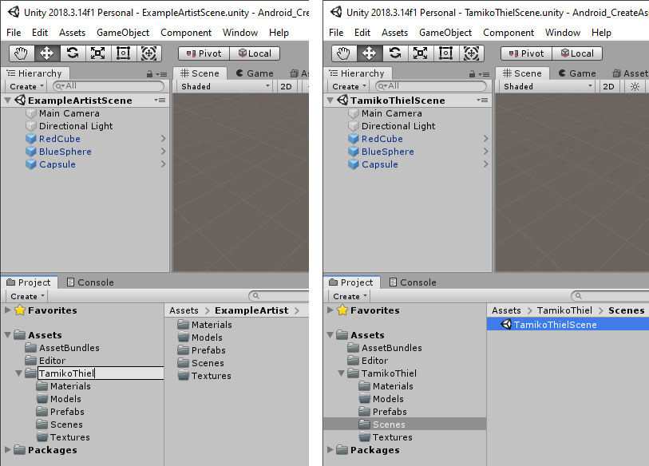

# Hidden Histories
# Creating porPOIse Asset Bundles in Unity

## Overview

This is a step by step tutorial using our **custom Unity3D project templates** to create an **asset bundle** that can be used by the **ARpoise** or **AR-vos** AR apps. (Assets include 3D models, sounds, images etc. that make up your AR experience or "layer.")
- The tutorial shows how to create an asset bundle for Android, on a Windows 10 PC.
- The process for creating an iOS asset bundle on a Mac is similar.

**Unity Editor Interface tutorials:**

Our tutorial does NOT teach you to use Unity or create assets in Unity. Those will be linked from the [documentation link page](README.md).

If you are unfamiliar with Unity, here are tutorials on the Unity interface, which will help to understand this tutorial:
- Unity Manual: https://docs.unity3d.com/Manual/UsingTheEditor.html
- Unity video tutorial: https://learn.unity.com/tutorial/using-the-unity-interface#     (note: for AR we will be making very simple things, nothing as complicated as the games they show!)

**Important Notes**: 
- You can do all your testing on one platform, but need to have a copy of your AssetBundle created for the other platform as well.
- The **iOS asset bundle must be made on a Mac, and tested on an iOS device.** 
- The **Android asset bundle must be made on a Windows PC and tested on an Android device.** 
- If you only have one type of PC, you will need to send your assets to the admin or team up with another artist to get the other asset bundle.

. 
## Unity Hub & Unity Editor Install

Download the free Unity Editor version:

- First download and install the [Unity Hub](https://unity3d.com/get-unity/download) on your PC.

- Then go to the [Unity download archive](https://unity3d.com/get-unity/download/archive) and install Unity3D Editor version **2018.3.14.f1**:
  - Click on the **Unity 2018x** tab.
  - Scroll down to Unity **2018.4.13 (22 Nov, 2019)** and click on **Unity Hub.**
  - NOTE: We do NOT guarantee that ARpoise or AR-vos will work with other versions!

- Install Unity with the following modules:
  - Build Support
    - Android if you are working on a Windows PC
    - iOS if you are working on a Mac.
  - Vuforia Augmented Reality Support.
  - NOTE: This will also install Microsoft Visual Studio automatically, on both Windows and Mac. The free version is fine. 

. 

. 
## Download CreateAssetBundle Project Template

Download the Unity Project template onto your hard drive:
- For [Android](http://hiddenhistoriesjtown.org/documentation/templates/AndrCreateAssetBundleU2018_3.zip)
- For [iOS](http://hiddenhistoriesjtown.org/documentation/templates/iOSCreateAssetBundleU2018_3.zip)
- Unzip the file on your hard drive.

**Aways use the Unity Hub to open a project,** so you can make sure the proper Unity Version is used to open it. 
- Start the Unity Hub
- Click **ADD**
- Select the **project folder** of your template from your hard drive.
- It will appear in the projects list. Click to open.

. 

. 
## Template Structure

In the template, we have created the following for you:
- In the **Hierarchy window,** an **ExampleArtistScene**.
  - This includes a default camera and light, and three GameObjects. 
  - They are all on top of each other at the origin 0,0,0, so the BlueSphere is hidden inside the other two!
- In the **Project window,**
  - An **AssetBundles** folder to contain your asset bundle(s). Please do not change, move or delete!
  - An **Editor folder** with the scripts to make the asset bundles.
  - An **ExampleArtist folder** with subfolders for your Materials, Models, Prefabs, Scenes and Textures.

### Asset Bundle Structure

Now click on the **AssetBundles** folder in the Project window:
- The two files called **AssetBundles** are autogenerated and are necessary for the bundles to build correctly.
- There are two files called **exampleassetbundle.** 
  - The second one has an icon with lines on it - this is the **manifest file** containing a human readable description of the contents of the asset bundle. 
  - Click on it and you see its contents in the **Inspector window.**
  - Towards the bottom of the file under **Assets** is a list of the three prefabs in this bundle.
  - **These are the name that you reference in the POI configuration in porPOIse** (if and only if you link the POI to this asset bundle in the [**URL for asset bundle**](UsingPorPOIse_REF-Layer-POI-Properties.md#porpoise-poi-configuration) property!)
  - Notice that these are the same as the 3 GameObjects with blue cube icons listed in the **Hierarchy/ExampleArtistScene** window.

. 

### Prefabs

Now click on the **ExampleArtist/Prefabs** folder:
- You see the same GameObjects listed here as are listed in the **Hierarchy/ExampleArtistScene window** above.
- The **blue cube icons** next to the names show that they are **prefabs,** i.e. "prefabricated" GameObjects that are ready to be used as assets in your porPOIse layer.

Click on the RedCube prefab in the Assets/Prefabs subwindow:
- At the bottom of the Inspector window, you see a depiction of the selected prefab.
- Underneath is the line **AssetBundle**
    - If you are on Windows, the asset bundle name is **exampleassetbundle**.
    - If you are on a Mac, the asset bundle name is **exampleassetbundlei** (with an "i" at the end).
- Click on the little arrow after the name, and the dropdown menu for the AssetBundle name will open.
- The name **exampleassetbundle** (or **exampleassetbundlei**) should be selected. 

. 

### Remove the RedCube prefab from exampleassetbundle

Since there is already a RedCube in the [**hh_examples** asset bundle we are using in porPOIse](UsingPorPOIse_REF-Layer-POI-Properties.md#porpoise-poi-configuration), this is redundant and we will remove it.

- Click on **None** to exclude it from all asset bundles.
- Click on the other two prefabs and make sure they all have the name **exampleassetbundle** (or **exampleassetbundlei**) selected. These are new assets so we want to include them in our asset bundle.
- Note the other options:
  - **New** allows you to create a new name for a new asset bundle. We will do this later.
  - **Remove Unused Names** allows you to delete names you do not want to use anymore.

. 

 
### SAVE your changes!!! Often!!!

If you make a lot of changes, Unity is bound to crash, wiping them all out. If you save often, it is less likely to crash (because it realizes it is not as fun to crash if you only lose a little bit of your work). 

**SO SAVE!!! OFTEN!!!**

. 

. 
## Build exampleassetbundle

First let's make sure your build settings are correct:

### Build Settings

Click: **File / Build Settings…**:
- **Scenes In Build**: The ExampleArtistScene should be listed and **checked.** If not, click **Add Open Scenes.**
- **Platform**
  - If you are working on Windows this should be **Android.** 
  - If you are working on a Mac, this should be **iOS.** 
  - If you need to switch, select the correct platform and click **Switch Platform**. (This will take a while!)
- Close the Build Settings view by clicking on the X in the upper right corner.

### Call "Build Asset Bundle" command

Now right click on either of the prefabs we want to include in exampleassetbundle (i.e. NOT the RedCube!)
- Select **Build AssetBundles** (or **Build iOS AssetBundles**) from the pop up menu.
- Wait a bit - a window should pop up at least briefly as the bundle is built, saying "Building asset bundle ..."
- Open up the **AssetBundles folder** and click on the exampleassetbundle (or exampleassetbundlei) [**manifest file**](CreatingAssetBundles.md#asset-bundle-structure): it should now only show *two* prefabs, Blue Sphere and Capsule.
  - (If you're sure you did everything correctly but the RedCube is still showing, it (strangely) might need a minute or two to update the file in the Unity Editor, or closing and reopening the Unity project.)
- **SAVE!!!**
  
. 

. 
## Add .ace file ending to your exampleassetbundle file

Now look at your **hard drive** and find your **Unity project folder.**
- Go to the folder **Assets/AssetBundles.**
- Find the **exampleassetbundle** (NOT the manifest file, and NOT any of the meta files!) and add the ending **.ace** so it can be found by the ARpoise server. (On Mac, exampleassetbundlei.ace)

. 

. 
## Upload exampleassetbundle(i) files to your porPOIse account

You should already have an **FTP** (File Transfer Protocol) login for your porPOIse account on **https://hiddenhistoriesjtown.org/**. 
- If you do not have this information, please contact the Hidden Histories admin.
- **Login with FTP to your https://hiddenhistoriesjtown.org/ account** (it might look rather different from the image below).
- In your **AssetBundles folder**
  - Upload the **exampleassetbundle.ace** file AND the **exampleassetbundle.manifest** files. (Mac files with "i".)
  - Overwrite the ones that are already there.
  - Afterwards, open the exampleassetbundle.manifest (or exampleassetbundlei.manifest) file on the server and **make sure it now only has the Capsule and the BlueSphere.**

. 

## TEST Capsule or BlueSphere prefabs in your porPOIse ExampleLayer

Now test your new asset bundle in your ExampleLayer:
- **In your porPOIse account, create a new POI.**
  - If you don't remember how to do this, look at the [**Using PorPOIse tutorial**](UsingPorPOIse.md) again
  - Or check the [porPOIse POI configuration reference](UsingPorPOIse_REF-Layer-POI-Properties.md#porpoise-poi-configuration).
  
- **You MUST set the following:**
  - **Lat/Lon:** These should be the same as your other POIs, or very close by, otherwise ARpoise can't find it. 
    - BUT EITHER: Give it a **Relative location** that is offset a bit from 0,0,0 ...
    - ... OR: leave Relative location blank, in order to use absolute location, but make sure the POI's GPS is a bit away from the base GPS of the layer.
    - Otherwise, the Capsule or BlueSphere will be exactly on top of you, and since you are inside it, you won't see anything!
  - **URL for asset bundle:** This MUST be in this form (i.e. without "http://www.") **hiddenhistoriesjtown.org/artists/ExampleArtist/AssetBundles/exampleassetbundle.ace** where "ExampleArtist" is the name of your porPOIse account.
  - **Prefab name:** Use one of the prefabs named in your **exampleassetbundle.manifest** file. NOTE: the spelling must be EXACTLY the same, including capital/lower case, etc., but without the .prefab ending.
  
- If you now open the **ARpoise app,** you should see the capsule floating around you as well as the other POIs.

. 

. 
### NOTE on multiple asset bundles in one layer:
- You have seen that you can use various asset bundles in the same layer, each in a different POI. In this way you can easily share assets with other artists.
- However, the asset bundles are downloaded to the smartphone right before you view them in the ARpoise app. Even if you do not use all the assets in a given asset bundle, they all have to be downloaded. 
- This might make for a long loading time for your layer, and a big hit on the viewer's data package.
- **It is therefore best practice to put all assets you want to use in one single package, and leave out assets that are not used in your layer.**

In the next step, we will personalize your Unity project so you can export and share assets to someone who can build the other asset bundle type for you.
  
. 
# Personalize and Export Assets as Unity Package

Remember that in order for ARpoise assets to be visible for both Android *and* iOS users, we need two separate asset bundles, one for iOS and one for Android.
- Whether you have both Windows and Mac PCs and can create both bundles yourself, or whether the admin or a colleague needs to create this for you, you will have to **export all your prefabs in a Unity package.**
- This package needs to be **imported** into the Unity project on the other type of PC, and then built as an asset bundle on that PC.
- During import, if Unity sees assets with the **same path name,** e.g. Asset/ExampleArtist/Prefabs/Capsule, it will simply **overwrite the existing one.** (If you know how to rename assets at the time of import, please tell me!)
- Therefore, you need to **personalize your asset bundle name,** and your **assets folder name.**

## Personalize *ExampleArtist* folder name and *ExampleArtistScene* name:
- In the **Project window,** click on the **Assets/ExampleArtist folder name** and replace it with your porPOIse account name (no spaces!)
- Then click on your Scenes folder, and in the subwindow click on the **ExampleArtistScene** to rename it with your porPOIse account name (no spaces!)
- Notice in the **Hierarchy window** that the name of your scene has changed there as well.
- **SAVE!!!**

. 

. 
## Personalize your asset bundle name

Select one of the prefabs you want to use in your personalized asset bundle.
- Click on the AssetBundle name field and select **New**.
- Type in a new name, using **your name or nickname** to identify it as your own asset bundle.
- The name must be lower case, and please use ONLY dash "-" or underscore "_" as special characters.
- Then select the other prefab(s) and assign them to your personalized asset bundle as well.

Now your assets folder, your scene and your asset bundle name should be personalized with your name.

. 

## Export your assets as a .unitypackage

We will export your scene and assets folder in a **Unity package.** This package can then be imported into a Unity project on the other PC platform, and your asset bundle then exported for the other mobile platform.

### Check your Build Settings

Check your Build Settings to make sure your personalized scene is included.

. 

. 
### Select the Assets Folder

You could just select your personalized assets folder, but I want you to see practice selecting the assets to be exported.

. 

.
- Then select Assets / Export Package ...

. 

. 
- You only need to export your personalized assets folder. Deselect everything else, the AssetBundles folder and the Editor folder. The Unity template for the other platform requires other files in these folders anyway.
- The Models and Textures folders are not selected because they are empty.
- **Include dependencies** should be checked!
- Click **Export ...** and save the unitypackage file to somewhere convenient **outside of your Unity project folder.**

. 

