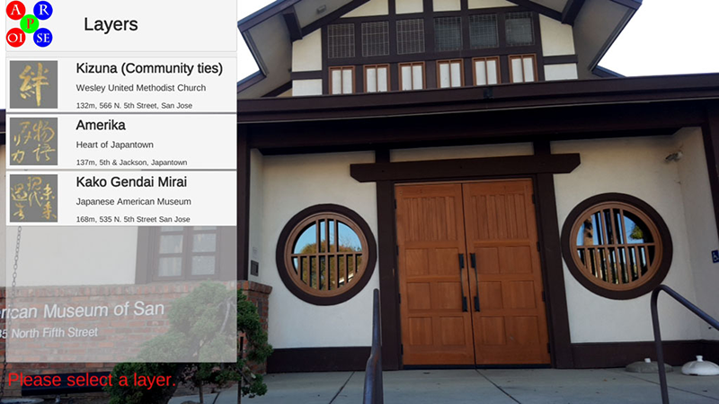
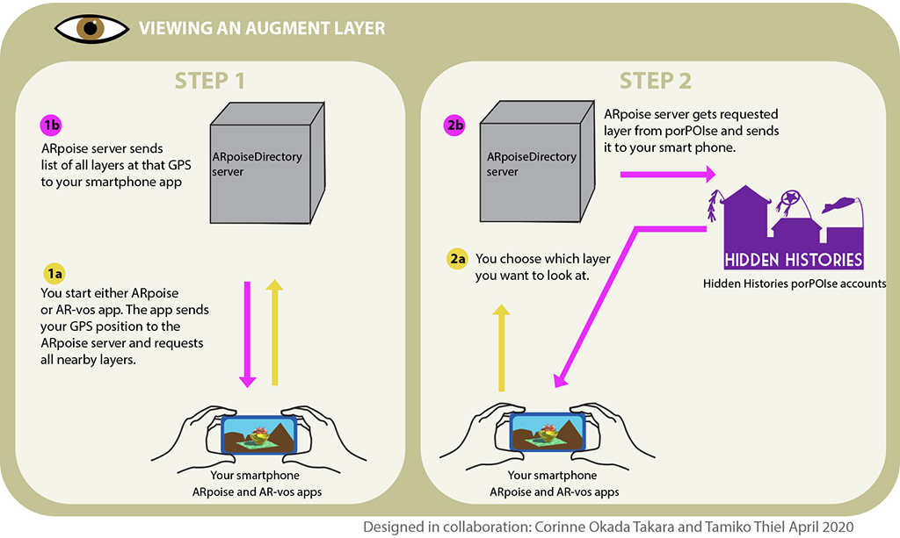
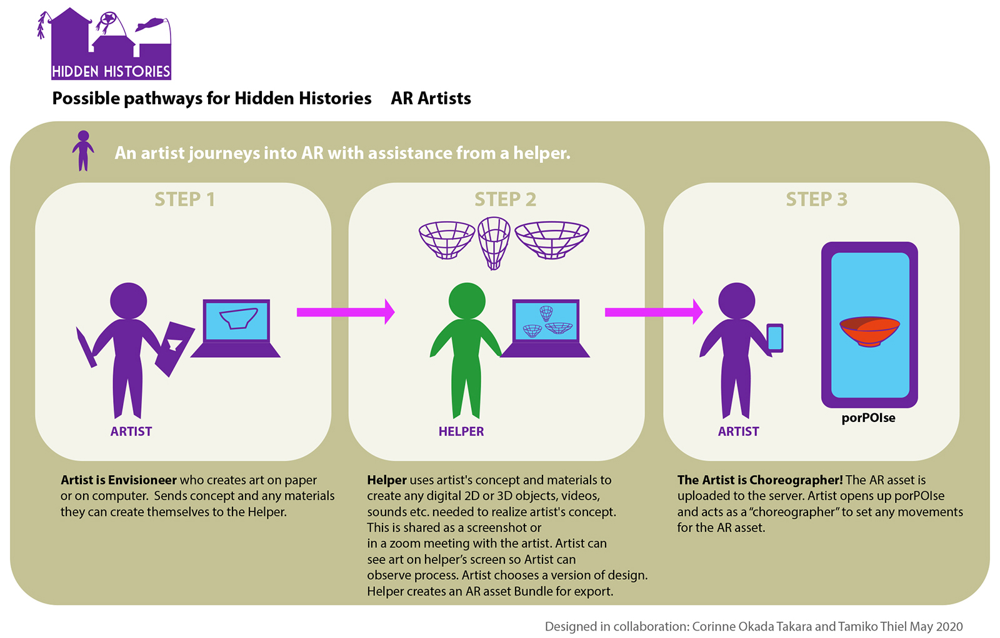
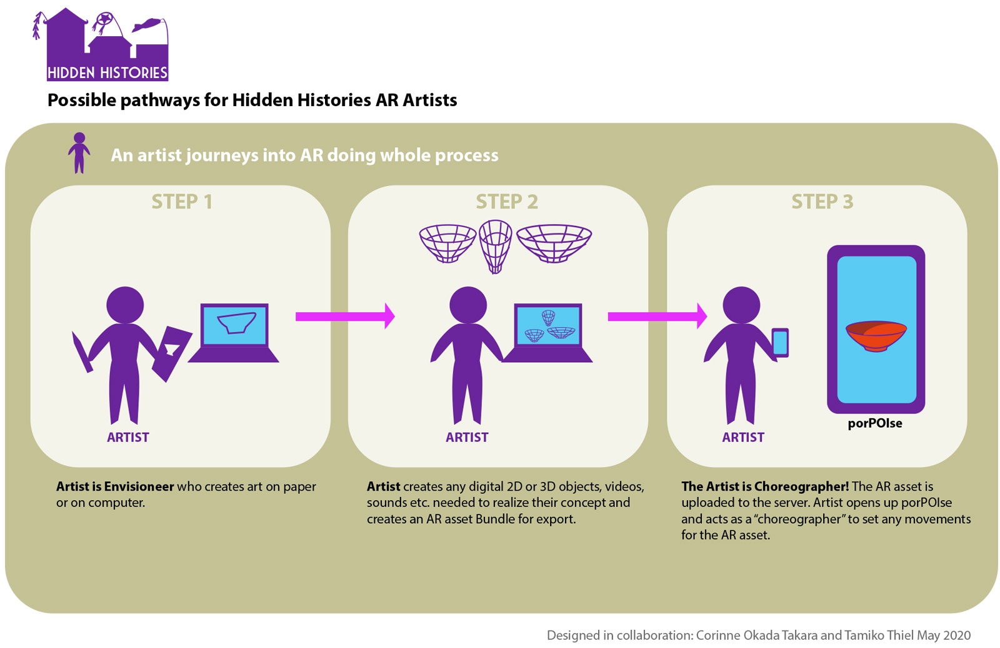

#  Hidden Histories
<< Need an overview? Go to the [Hidden Histories Artist Documentation Overview](http://hiddenhistoriesjtown.org/documentation).

Or puzzled by the lingo? See the [Glossary of Terms >>>](https://github.com/Hidden-Histories/Public-Resources/blob/master/documentation/ARpoiseGlossary.md#-hidden-histories-artists).

.

# Getting Started with ARpoise 

## ARpoise Augmented Reality platform

The [**ARpoise** (**A**ugmented **R**eality **p**oint **o**f **i**nterest **s**ervice **e**nvironment)](http://arpoise.com/) is an open-source Augmented Reality platform. It was developed by [Peter Graf](http://mission-base.com/peter/) and [Tamiko Thiel](http://tamikothiel.com/) in 2018 to provide an open source AR platform that they could keep alive as the underlying technology changes. Since Tamiko began creating AR artworks in 2010, she has used multiple commercial AR platforms that all have gone out of business. She and Peter created ARpoise to provide a long-term alternative that can evolve with the technology. They will keep the platform alive as long as they live, and with the entry of the work [Unexpected Growth](http://tamikothiel.com/unexpectedgrowth/) into the Whitney Museum of American Art collection, they have a top-rank museum partner also dedicated to preserving the platform. 

The goal of [ARpoise](http://arpoise.com/) is to foster it as a community-supported AR app for artists and other people who might not be able to develop their own apps, and as an alternative to commercial AR platforms that may go out of business at any time without warning. 

NOTE: For a list of terms, see the [ARpoise Glossary](ARpoiseGlossary.md#-hidden-histories-artists).

## Components of the ARpoise Augmented Reality platform

An **augment layer** (also called "layer" or "augment" in these tutorials) is a single augmented reality artwork installation. It can be displayed in the ARpoise or AR-vos apps on your smartphone by clicking on the name of the artwork in the list of layers shown when you start the app.

. 

### The ARpoise system consists of:

- **ARpoiseDirector server** that keeps track of what AR layers are where.
- **porPOIse** interface where you set up your augment layers
- **ARpoise app** (for geolocative AR, runs on most all iOS and Android devices) and **AR-vos app** (for geolocative, image trigger and SLAM AR, runs only on newer model iOS and Android).

#### Viewing an AR layer: how ARpoiseDirectory, porPOIse and the AR apps work together

**Why TWO apps???** Due to a change in smartphone hardware that is slowing happening right now, there are currently two apps, ARpoise that works on pretty much all phones, and AR-vos that is more restrictive but also has more functionality. These tutorials start with geolocative AR on the ARpoise app, but geolocative AR works exactly the same on the AR-vos app as well.

We expect to merge the two client apps at some time when the older smartphones become defunct. 

- The **ARpoise app** is a geolocative AR app that runs on most available iOS and Android smartphones. 
  - [**Geolocative**](https://github.com/Hidden-Histories/Public-Resources/blob/master/documentation/ARpoiseGlossary.md#geolocative-ar-in-ar-vos-app-and-arpoise-app) augments are placed in the real world using GPS coordinates and seem to float around in space. Any AR artworks developed for this app can also run on the newer AR-vos app. 
  - The **ARpoise app can be downloaded** here from the [Google Play](https://play.google.com/store/apps/details?id=com.arpoise.ARpoise) Store and the Apple [App Store](https://itunes.apple.com/de/app/arpoise/id1451460843).

- The **AR-vos app** provides geolocative, image trigger and SLAM AR functionality. 

  - **Image trigger AR** uses A.I. computer vision technology to recognize images (e.g. posters, postcards, or even photos of an outdoor facade, etc.) and place augments relative to those images.
  
  - **SLAM AR** uses the newest form of A.I. computer vision technology, [Simultaneous localization and mapping](https://en.wikipedia.org/wiki/Simultaneous_localization_and_mapping), to discover planes in the physical space around the user, and then place augments on these planes. The augments will (pretty much) stay in place, and the user can then walk around them in 3D space.

  - The **AR-vos app can be downloaded** here from the [Google Play](https://play.google.com/store/apps/details?id=com.arpoise.ARvos) Store and the Apple [App Store](https://apps.apple.com/us/app/ar-vos/id1483218444).
  
  - **The AR-vos app only works on newer model smartphones. Please check these links to see if your smartphone works with the AR-vos app, and let us know if it does NOT work!** 
    - On iPhones, it only works on the iPhone SE or iPhone **6s** (NOT iPhone 6) and higher. See [ARKit supporting iOS devices](https://developer.apple.com/library/archive/documentation/DeviceInformation/Reference/iOSDeviceCompatibility/DeviceCompatibilityMatrix/DeviceCompatibilityMatrix.html).
    - For Android it is harder to say, please see [ARCore supporting Android devices](https://developers.google.com/ar/discover/supported-devices).

. 

## Artist workflow

If you haven't already, please go through the following tutorials to see how to use the ARpoise and AR-vos apps to view AR artworks:
- [**Using the ARpoise App**](UsingARpoiseApp.md#-hidden-histories-artists-overview) to understand geolocative augmented reality artworks.
- [**Using the AR-vos App**](https://github.com/Hidden-Histories/Public-Resources/blob/master/documentation/UsingAR-vosApp.md) to understand image trigger and SLAM augmented reality artworks. (If your smartphone doesn't work with AR-vos don't worry, just use the ARpoise app.)

### First Steps: make sure you can view your own example layers!

In order to work with your own augments on the ARpoise and AR-vos apps, you should already have the following. If you don't, please contact the Hidden Histories administrator. 

- The Hidden Histories administrator should have set up a **ARpoise porPOIse user account** for you, and you should be able to log in to it in a web browser. This is the user interface for setting up and editing your AR experiences ("layers") so that they can be accessed by the ARpoise and AR-vos apps.

- You should be able to view the **example layer** and the initially identical **artist layer** that the admin set up for you in porPOIse. They should be geolocated at your "home base" (where you are likely to work on them most of the time) so when you are there, you see them immediately when you open up the ARpoise app. When you are at some other location, you can still work on them using the [Fixed Position feature described in the ARpoise app tutorial](UsingARpoiseApp.md#exercise1-remote-viewing-with-arpoises-fixed-position-feature).

### Next Steps: learn how to adjust those layers, and create your own content

The tutorials link to each other in a specific order that should help you go progressively deeper into using ARpoise:

1. [**porPOIse tutorial**](UsingPorPOIse.md#-hidden-histories-artists): Modify your existing layers to learn how to use the porPOIse interface to the ARpoise system. (Due to coronavirus restrictions, we set up your example layers at your own home. Later, we will move them to their proper places in San Jose Japantown.)

2. [**How to create your own AR artworks**](https://hiddenhistoriesjtown.org/documentation): see this topic on the Hidden Histories documentation page. This section contains tutorials that show you how to use the **Unity 3D Editor** to put together your own **assets** (3D models, 2D images, sound files, video files etc.) in **prefabs** - "prefabricated" content that you then link to your porPOIse account to form the content of your AR experience. 

3. [**Create AssetBundles:**](https://github.com/Hidden-Histories/Public-Resources/blob/master/documentation/CreatingAssetBundles.md) Export these prefab assets into a Unity **asset bundle** and upload to your porPOIse account. The link to this online asset bundle in porPOIse is what tells ARpoise what content you want to use.

4. Then set up your final AR experience in porPOIse. Test, modify, repeat! ;-)

### Overviews of the AR art creation process with the ARpoise platform:

If you are not used to working in digital media, please ask the Hidden Histories helpers for assistance. Below we show two pathways your can use: one with assistance from a Hidden Histories helper, and the other if you can create all your own material and go through the entire process by yourself.

. 

. 

. 

[Corinne's quick, illustrated overview (click here for a pdf version)](http://hiddenhistoriesjtown.org/wp-content/uploads/Hidden-Histories-art-asset-process-revised-process_v2.pdf)

