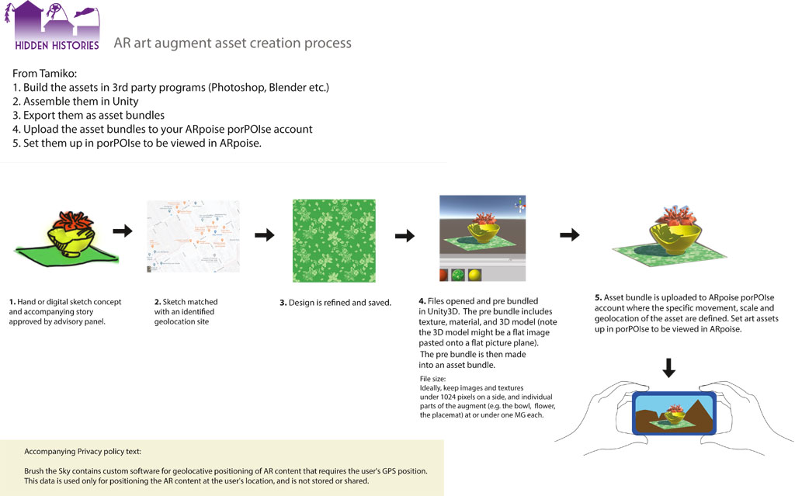

#  Hidden Histories Artists
# Getting Started with ARpoise 

## Overview

### ARpoise Augmented Reality platform

The [**ARpoise** (**A**ugmented **R**eality **p**oint **o**f **i**nterest **s**ervice **e**nvironment)](http://arpoise.com/) is an open-source Augmented Reality platform. It was developed by [Peter Graf](http://mission-base.com/peter/) and [Tamiko Thiel](http://tamikothiel.com/) in 2018 to provide an open source AR platform that they could keep alive as the underlying technology changes. Since Tamiko began creating AR artworks in 2010, she has used multiple commercial AR platforms that all have gone out of business. She and Peter created ARpoise to provide a long-term alternative that can evolve with the technology. They will keep the platform alive as long as they live, and with the entry of the work [Unexpected Growth](http://tamikothiel.com/unexpectedgrowth/) into the Whitney Museum of American Art collection, they have a top-rank museum partner also dedicated to preserving the platform. 

The goal of [ARpoise](http://arpoise.com/) is to foster it as a community-supported AR app for artists and other people who might not be able to develop their own apps, and as an alternative to commercial AR platforms that may go out of business at any time without warning. 

Due to a change in smartphone hardware that is happening right now, there are currently two different client applications implemented for Android and iOS. We expect to merge them in a year or so. 

- The **ARpoise app** is a geolocative AR app that runs on most available iOS and Android smartphones. **Geolocative** augments are placed in the real world using GPS coordinates and seem to float around in space. Any AR artworks developed for this app can also run on the newer AR-vos app. The ARpoise app can be downloaded from the [Google Play](https://play.google.com/store/apps/details?id=com.arpoise.ARpoise) Store and the Apple [App Store](https://itunes.apple.com/de/app/arpoise/id1451460843).

- The **AR-vos app** provides both geolocative and image trigger AR functionality. **Image trigger AR** uses A.I. computer vision technology to recognize images (e.g. posters, postcards, or even photos of an outdoor facade, etc.) and place augments relative to those images. The functionality will be extended to the newer SLAM functionality (Simultaneous Localization and Mapping) that automatically on the fly creates a 3D model of your surroundings in the smartphone and places augments in this space. To do this it must use [ARKit supporting iOS devices](https://developer.apple.com/library/archive/documentation/DeviceInformation/Reference/iOSDeviceCompatibility/DeviceCompatibilityMatrix/DeviceCompatibilityMatrix.html) and [ARCore supporting Android devices](https://developers.google.com/ar/discover/supported-devices), which only run on newer devices (check the links to see if your smartphone works with this app). We expect to merge the two client apps soon, as the older smartphones become defunct. The **AR-vos** app can be downloaded from the [Google Play](https://play.google.com/store/apps/details?id=com.arpoise.ARvos) Store and the Apple [App Store](https://apps.apple.com/us/app/ar-vos/id1483218444). 

## Artist workflow

### First Steps

Please go through the following tutorials to see how to use the ARpoise and AR-vos apps to view AR artworks:
- [**Using the ARpoise App**](UsingARpoiseApp.md#-hidden-histories-artists-overview) to understand geolocative augmented reality artworks.
- [**Using the AR-vos App**](AR-vos-examples.md#-ar-vos-augmented-reality-app) to understand image trigger augmented reality artworks.

In order to work with your own augments on the ARpoise and AR-vos apps, you should already have the following. If you don't, please contact the Hidden Histories administrator. 

- The Hidden Histories administrator should have set up a **ARpoise porPOIse user account** for you, and you should be able to log in to it. This is the user interface for setting up and editing your AR experiences ("layers") so that they can be accessed by the ARpoise and AR-vos apps.

- You should be able to view the **example layer** and the initially identical **artist layer** that the admin set up for you in porPOIse. They should be geolocated at your home so when you are there, you see them immediately when you open up the ARpoise app.

### Next Steps

The tutorials link to each other in a specific order that should help you go progressively deeper into using ARpoise.

1. [**porPOIse tutorial**](UsingPorPOIse.md): Modify your existing layers to learn how to use porPOIse. (Due to coronavirus restrictions, we set up your example layers at your own home. Later, we will move them to their proper places in San Jose Japantown.)

2. **Unity 3D Editor:** Learn to put together your own assets (3D models, images, sound files etc.) in the Unity3D Editor to construct the basics of your AR experience. UNDER CONSTRUCTION

3. [**AssetBundles:**](https://github.com/Hidden-Histories/Public-Resources/blob/master/documentation/CreatingAssetBundles.md) Export the assets in a Unity asset bundle and upload to your porPOIse account.

4. Set up your final AR experience in porPOIse. Test, modify, repeat! ;-)

**[Corinne's quick, illustrated overview (click here for a pdf version)](http://hiddenhistoriesjtown.org/wp-content/uploads/Hidden-Histories-art-asset-process-revised-process_v2.pdf):**

. 

