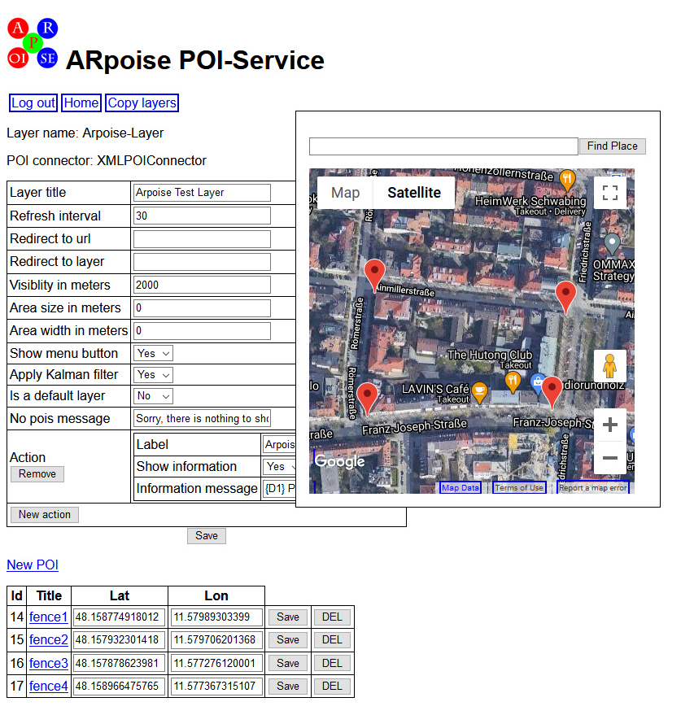

#  Hidden Histories 
<< Need an overview? Go to the [Hidden Histories Artist Documentation Overview](http://hiddenhistoriesjtown.org/documentation).

Or puzzled by the lingo? See the [Glossary of Terms >>>](https://github.com/Hidden-Histories/Public-Resources/blob/master/documentation/ARpoiseGlossary.md#-hidden-histories-artists).

.

# Tutorial: Creating an AR walking tour

## Overview

Several artists have talked about wanting to set up a walk through Japantown, in which the user encounters various artworks as they walk around a block or down the street. I developed this tutorial while talking with Takeshi Moro about his concept of following the fence around Heinleinville, and he graciously allowed me to share it with you all.

Here is how to set up an AR walk at your home base. Once you set it up around your own block, walk around the block and see if it works for you artistically, despite the inaccuracy of the positions and orientations of the POIs.

- This can be done using **Lat/Lon** (Latitude and Longitude) to set the **absolute GPS position of each POI.** (You MUST leave the Relative position x,y,z field blank - otherwise the relative position overrules the absolute positions!)

- Because both **position and orientation can vary from minute to minute,** however, there is a certain amount of randomness in where you will see both the POI whose area you are in at the moment, and the other POIs you have set nearby. That may or may not bother you or your user, depending a bit on what your artwork is about! ;-)

### Assets and prefabs for this example
I created 4 prefabs, each of them being a fenced in area of the same proportions, but with a different number (1, 2, 3, 4) on the fence, so I could tell them apart.

- If you want to use the assets, here is the **unitypackage** (with 4 numbered fence exclosures and one unnumbered, plain fence element).
http://hiddenhistoriesjtown.org/documentation/templates/FenceTest.unitypackage

- If you want to use the prefabs in your own POI, here are links to the **asset bundle and manifest files:**
  - URL for asset bundle: www.arpoise.com/AB/fencetest.ace
  - URL for manifest file: www.arpoise.com/AB/fencetest.manifest

.
## On the layer webpage:

First set the **Lat/Lon for each POI to the GPS position** you want.
  - The easiest way to do this is to **drag the marker for each POI** to the location you want on the googlemap. (Remember to click **Save** for each POI entry after you move it!)
  - I set one POI at each street corner around my block. The narrow side of my block is about 100 meters long, the long side is about 200 meters long. This is actually pretty equivalent to the size of the Heinleinville block, although the orientation is east-west whereas the Heinleinville block is north-side.
  - **Visibility in meters:** at the layer level, make sure this is around 1500, so when the ARpoise app looks for the POIs, it'll find all of them.
  
.

.
## For each POI, set these properties:

  - Check the position of the POI on the googlemap, to make sure it is where you want it to be.
  
  - **Visibility in meters:** IMPORTANT: set this to around 20 meters, so (ideally) it will not interfere with the other POIs!
  
  - Set **Relative altitude** if desired to raise or lower the height of the POI (remember 0 is eye level).

  - **Relative location (x,y,z) MUST BE EMPTY!!!** If you put in a value here, that overrides everything else, and the POI just moves with you when you walk.
  
  - **Scaling factor:** I found that 5 was a good value so that the nearest POI enclosed me when I came near the street corner, but the next farthest away did not.

.

.
## How to test remotely at the scale that you need for Japantown:

Riffing on Takeshi Moro's concept, say I want to enclose the user in a fence on each of the street corners of Heinleinville. I can't get to San Jose Japantown right now, so how do I know that I am creating a test that would accurately simulate the experience on site?

If you look in the lower right corner of googlemaps, you see a scale indicator (that changes as you zoom in and out). Looking at the outline of the Heinleinville block, you see the short side is about 100 meters, and the long side about 250 meters.

.

Now look at your own area, and choose landmarks (a street corner, a store) that are similar distances apart, and place them there!

