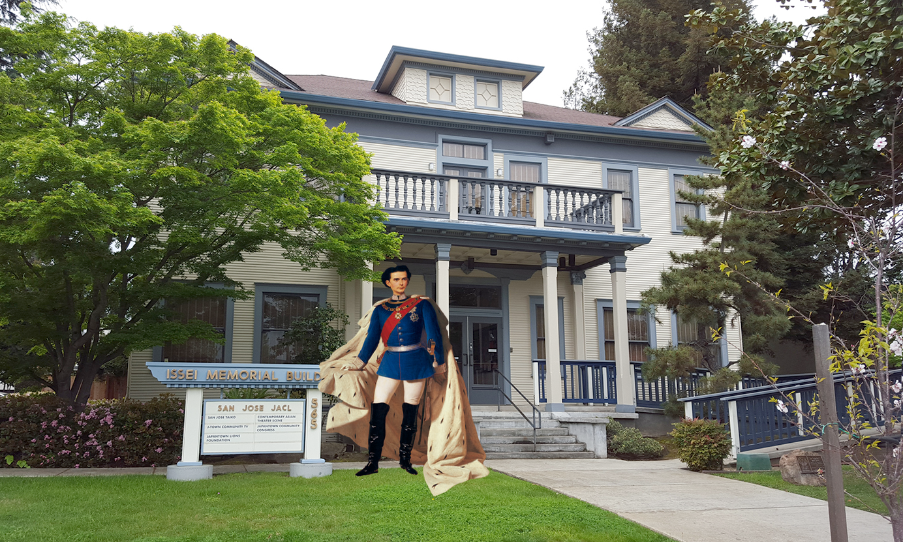
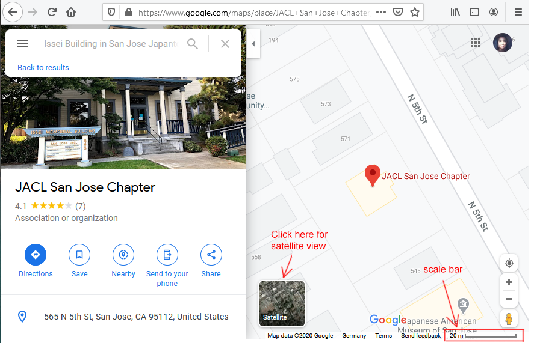
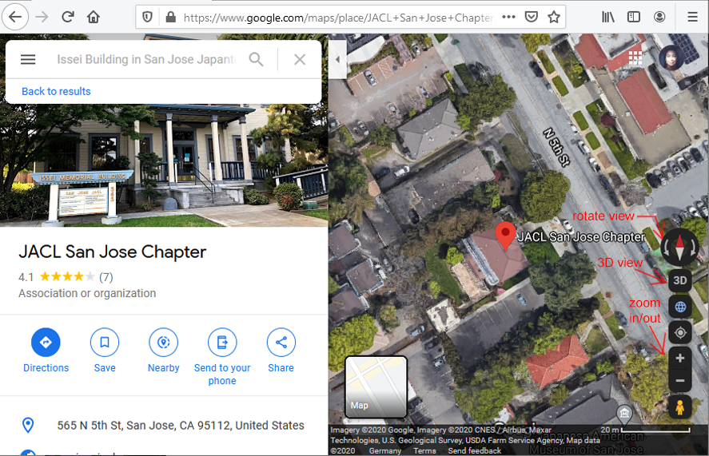
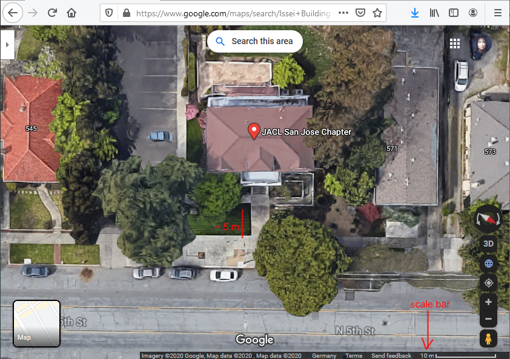
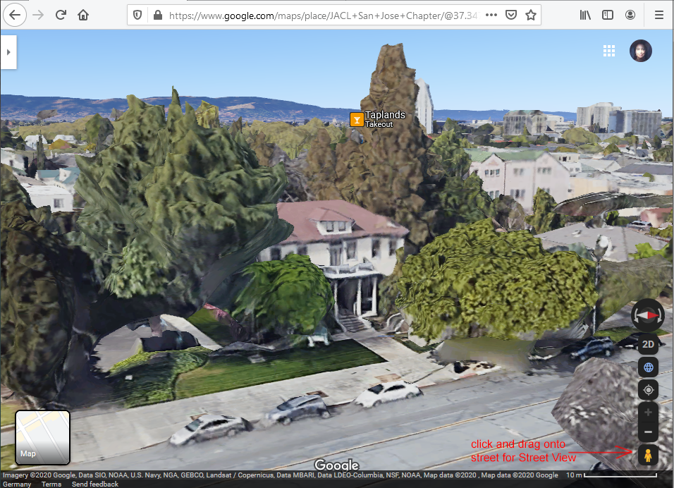
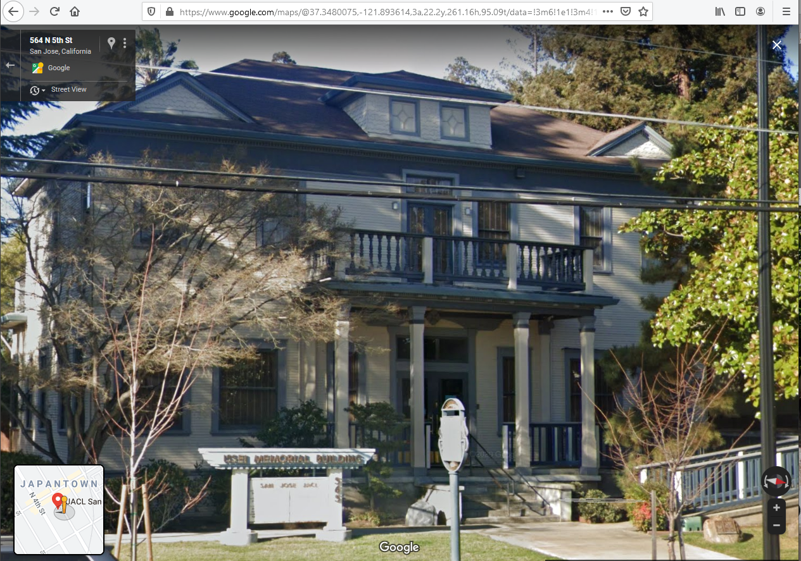

#  Hidden Histories 
<< Need an overview? Go to the [Hidden Histories Artist Documentation Overview](http://hiddenhistoriesjtown.org/documentation).

Or puzzled by the lingo? See the [Glossary of Terms >>>](https://github.com/Hidden-Histories/Public-Resources/blob/master/documentation/ARpoiseGlossary.md#-hidden-histories-artists).

.

# Tutorial: Remote Site Visit

If you are creating an AR layer that is to be viewed at a very specific site, it is important to understand the physical site itself. Even if you think you know and understand the site, **collect images** and look at the **satellite images of the site on google maps** to get some real information on it.

## Create visualizations of your artwork on site in Photoshop

NOTE: I will use the **Issei Building** in San Jose Japantown as an example. I am doing this on my Windows PC, and the commands and behavior of the websites might be different depending on what you are using.

- Collect all the images you have of the site (and ask everybody else if they have good ones too.)
- Go on the Internet, collect all the good-looking images you can find of the site.

### USE IMAGES LIKE THIS TO MAKE PHOTOSHOP MOCKUPS OF YOUR ARTWORK!

Here's an image I stole off the JACL website (no, the Kini never visited there ...):

This is your best way to make a visualization of what your artwork could look like - not just to communicate your idea to other people, but even to communicate with yourself. If your screenshots of your AR layer on site don't look as good as your visualization does, you can use that to figure out how to make the AR layer better! ;-)

### Use these images to plan your AR experience

You need space for your AR. The lawn to the right is pretty full, but the lawn to the left is open.
- There would be space enough on the left lawn to put AR content with SLAM
- Perhaps you could also use the front of the building, with the steps or porch.
- Perhap the sign, or the front porches with their details could be used as image triggers.
- Geolocative would also be fine - if you're OK doing a 360° installation, since some of it will be behind you, whether you like it or not!

## Use Google Maps to measure the site

So how far back is that sign, or the stairs? You can use Google Maps to roughly measure that distance. Later, we'll use that measurement to select a site near you to use for your simulation.

I'll give basic directions on how to use Google Maps, but here is the [Google Maps support page](https://support.google.com/maps/answer/144349).

If I were you, I'd make tons of screenshots as documentation during the process described below!

- Go to [Google Maps](https://www.google.com/maps) in your browser and search for your site.
- Note the **scale bar** - we will need this!
- Click on the **satellite** inset to switch to satellite view.

.

This lets you look at the site in a number of ways. **Zoom in** (with the **+/- buttons**, or with mouse wheel) so you are centered on the building or site of interest, but can still see the sidewalk, street, surrounding buildings etc. 

#### Note the orientation of your site

Look at the red/white compass between the rotation arrows. 
- If it's not pointing straight up, click on it so it is pointing due north.
- Now you can see that 5th street does NOT run N - S (surprise!) It is about at a 30° angle, running NW - SE.

.

Now zoom in, rotate the view so you can see the front lawn of the building.

#### Think about where you and your viewers will likely stand to view the artwork.
- With the Issei Memorial Building, I would say on the sidewalk to the left of the pathway to the building - on the right the tree will turn the sidewalk into a bottleneck, if viewers are standing here and pedestrians need to get past.
- This also gives a nice clear view of the sign and of at least the steps and front doorway. Maybe we can cut out one or both as trigger images for our AR layer?

#### Use that scale bar to measure the distances

- It's roughly 5 meters from sidewalk to the sign, which is at the back edge of the lawn.
- From the sidewalk to the building facade it's about 7m to the steps or the facade.

.
## Find a location similar to your site - but near your home base.

An ideal location would be:
- Right by your house, so you can run in and out to use your laptop, charge your batteries, etc.
- The street running in the same orientation as your site, so you could practice using the same orientation in your AR layer.
- With the building about the same size as your site building, in the case of the Issei Mem. Building, 2 stories.
- With the building the same distance back from the sidewalk as your site building, so you can practice using the same distance between viewer and building - and the same amount of space in between.

Go to your own house in Google Maps:
- Zoom in until the scale bar is the same value as the scale bar in your images of your Japantown site. In the case above, this is 10 meters.
- In my neighborhood the front yards are much smaller, and the streets tend to run NE - SW, instead of the opposite like in Japantown.
- Since I know that with geolocative, I have to build 360° installations anyway, I won't worry about the orientation.
- Well, the buildings here are 5 stories, not two! But I can think about that and just measure it by eye two stories up.
- The depth between viewer standing point and the building facade is more critical, since that affects the relative scaling of my artworks with respect to the building.

Finally I found a building in my neighborhood with a similarly sized front lawn.
- Once I get my AR layer set up with a couple of POIs, I can go there and see how they look - remembering that the orientation is different, and that I have to pretend that the building is only 2 stories instead of 5.
- I'll be much easier for you to find a suitable building, since the building styles will be more similar!

## Use Google Maps 3D and Street View to get more familiar with the site

- Click on the **3D** button to get a bird's eye view of the 3D model of the site.
- Use the **arrows** to the sides of the compass to **rotate** large amounts - or better yet, **Control+Left-Mouse-Drag** (sorry, don't know on a Mac!) to rotate and tilt the view so you can really view the building from all sides.

.

Did you notice the little yellow figure in the lower right hand corner of the above image?
- Click and drag it onto a street on the googlemap to go into Google Street View.
- This gives you a panoramic photographic view of the building.

This is a great way to get photos showing your site! Take screenshots and save for making mockups later.

- Use the +/- buttons on the right hand side to zoom in and out (or on Windows, the mouse wheel)
- NOTE: If you zoom out a lot, you will go back out to 3D satellite map view.

This is a good way to think about 

