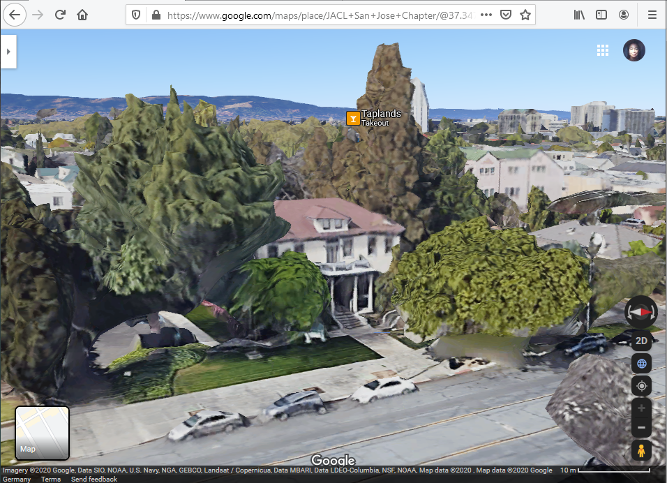

#  Hidden Histories 
<< Need an overview? Go to the [Hidden Histories Artist Documentation Overview](http://hiddenhistoriesjtown.org/documentation).

Or puzzled by the lingo? See the [Glossary of Terms >>>](https://github.com/Hidden-Histories/Public-Resources/blob/master/documentation/ARpoiseGlossary.md#-hidden-histories-artists).

.

# Tutorial: Remote Site Visit

If you are creating an AR layer that is to be viewed at a very specific site, it is important to understand the physical site itself. Even if you think you know and understand the site, **collect images** and look at the **satellite images of the site on google maps** to get some real information on it.

NOTE: I will use the JACL in the Issei Building in San Jose Japantown as an example. I am doing this on my Windows PC, and the commands and behavior of the websites might be different depending on what you are using.

## Use Google Maps to get familiar with the site

I make tons of screenshots at this point!

- Go to [Google Maps](https://www.google.com/maps) in your browser and search for your site.
- Note the **scale bar** - we will need this!
- Click on the **satellite** inset to switch to satellite view.

.

This lets you look at the site in a number of ways. **Zoom in** (with the **+/- buttons**, or with mouse wheel) so you are centered on the building or site of interest, but can still see the sidewalk, street, surrounding buildings etc. 

.
- Click on the **3D** button to get a bird's eye view of the 3D model of the site.
- Use the **arrows** to the sides of the compass to **rotate** large amounts - or better yet, **Control+Left-Mouse-Drag** (sorry, don't know on a Mac!) to rotate and tilt the view so you can really view the building from all sides.

- **Think about where you and your viewers will likely stand to view the artwork.** 
- With the Issei Memorial Building, I would say on the sidewalk to the left of the pathway to the building - on the right the tree will turn the sidewalk into a bottleneck, if viewers are standing here and pedestrians need to get past.

## Use Google Maps Street View to get familiar with the site

## Use Google Maps to get familiar with the site

