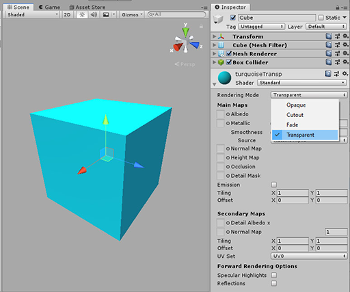

#  Hidden Histories

# Tutorial: Transparent materials in Unity and porPOIse

**NOTE:** More background documentation is linked from the [Hidden Histories Artist Documentation Overview Page](http://hiddenhistoriesjtown.org/documentation).

- For general tutorials on **using Unity,** see the section **"How to create your own AR artworks".**
- For tutorials on **using porPOIse,** see the section **"Editing augments with the ARpoise porPOIse interface".**

.
## Overview

This document covers how to use transparent and semi-transparent Unity Materials in porPOIse:
- How to create a prefab that can use the **fade animation in porPOIse.**
- How to create a 1-sided or 2-sided **cutout image** (for paned windows, floating text, cutout figures of people, etc.)

. 
## Unity Material transparency for fade animation in porPOIse

For the animation Type "fade," the prefab must have its Unity Material Rendering Mode set to Fade or Transparent. 
- This applies to solid materials, semi-transparent materials or material textures with transparent areas or cutouts.
- Read the differences between Fade and Transparent in the Unity Manual section on the [Rendering Mode](https://docs.unity3d.com/Manual/StandardShaderMaterialParameterRenderingMode.html).
- For the Fade animation in porPOIse, see [Animation settings](https://github.com/Hidden-Histories/Public-Resources/blob/master/documentation/UsingPorPOIse_REF-Layer-POI-Properties.md#animation-settings) in the document "PorPOISe Reference: Layer and POI Properties."

