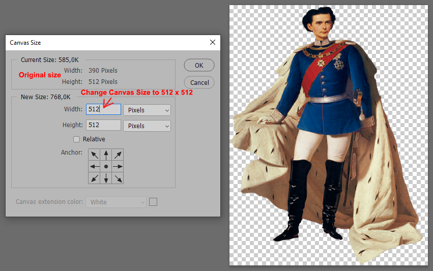
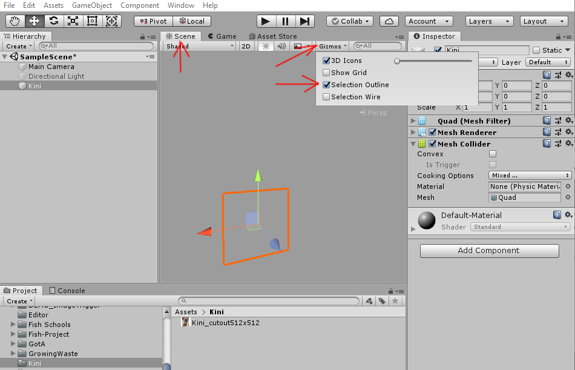
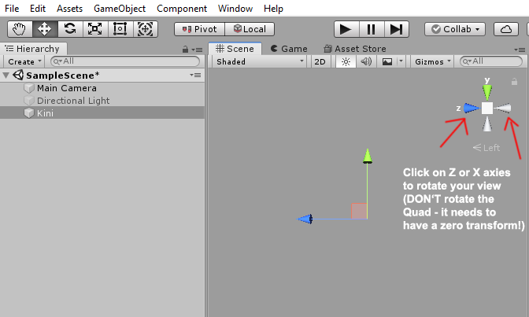

#  Hidden Histories

# Tutorial: Transparent materials in Unity and porPOIse

**NOTE:** More background documentation is linked from the [Hidden Histories Artist Documentation Overview Page](http://hiddenhistoriesjtown.org/documentation).

- For general tutorials on **using Unity,** see the section **"How to create your own AR artworks".**
- For tutorials on **using porPOIse,** see the section **"Editing augments with the ARpoise porPOIse interface".**
- This tutorial assumes you know how to use Photoshop or other image editing programs to create PNG files with partial or cutout transparency.

.
## Overview

This document covers how to set up transparent and semi-transparent Materials in Unity and porPOIse:
- How to create a prefab that can use the **fade animation in porPOIse.**
- How to create a 1-sided or 2-sided **cutout image** (for paned windows, floating text, cutout figures of people, etc.)

. 
## Unity Material transparency for fade animation in porPOIse

For the animation Type "fade," the prefab must have its Unity Material Rendering Mode set to Fade or Transparent. 
- This applies to solid materials, semi-transparent materials or material textures with transparent areas or cutouts.
- Read the differences between Fade and Transparent in the Unity Manual section on [Rendering Mode](https://docs.unity3d.com/Manual/StandardShaderMaterialParameterRenderingMode.html).
- NOTE: If there is still a ghost image when you thought it would be completely invisible:
  - use the Rendering Mode "Fade" instead of "Transparent,"
  - ... or uncheck Forward Rendering Options "Specular Highlights" and Reflections."
- For the Fade animation in porPOIse, see [Animation settings](https://github.com/Hidden-Histories/Public-Resources/blob/master/documentation/UsingPorPOIse_REF-Layer-POI-Properties.md#animation-settings) in the document "PorPOISe Reference: Layer and POI Properties."

(Click on image to see larger version.)

.

## How to create a prefab with a cutout image in Unity, and use it in porPOIse

### Download Kini cutout .png asset:
- We will use the cutout image of King Ludwig II of Bavaria, affectionately called "the Kini" by his subjects.
- You can download the image here: http://www.arpoise.com/images/Kini_cutout390x512.png. In the browser the background will look white, but it is in fact transparent.

### Best practice: Resize the image (in Photoshop or another image editor) to a power of 2:
- The image is 390x512 pixels, but Unity will rerender it to a power of 2, e.g. 256x256, 512x512, 1024x1024, etc. 
- In Unity the image will often be distorted to a square image anyway, such as when you map a texture image to a Quad or cube etc. 
- So it is best practice to only use square images that are a power of 2: change the canvas size in Photoshop to 512 x 512 while preserving the Kini's proportions.

.
### Create Quad with cutout Kini in Unity 

NOTE: If you need to **refresh your Unity skills** see [Prof. Rhonda's "Introduction to Unity3D Editor" slide deck](https://docs.google.com/presentation/d/1CzzGu4zK2a9VsXfM0WVPNGqtQfGEr30u67TTrWYI8qU/edit#slide=id.g7f6e1f9622_0_516), linked from the Hidden Histories documentation page.

- Create a Quad 3D GameObject and name it "KiniQuad." 
- Make sure its transform is **zeroed at 0,0,0 in both Position and Rotation!**
- Can't see KiniQuad - even though it's selected in the Hierarchy window, and all its components appear in the Inspector? 
  - Make sure you are looking at the Scene window.
  - With KiniQuad selected in the Hierarchy window, move your cursor into the Scene window and press "f" on your keyboard to "focus" KiniQuad into the middle of the Scene window.
  - If you still can't see it, make sure the Gizmo/Selection Outline is on, so the KiniQuad has an orange outline, even if you are looking at it from behind.

.
  - STILL can't see it, even though the axes are in the middle of your Scene window? Quads are one-sided, and you're probably looking at the back side! Rotate your view in the Scene window - you can click on the X or Z axes. (DON'T rotate the KiniQuad itself - its transform should stay zeroed.)

.

.

### Set Texture Type to Sprite in Inspector to make background transparent:
- In the Project window, under Assets, create a folder and name it KiniQuad. Drag your Kini texture into the folder.
- Then drag the Kini texture onto the Quad. If you are not allow to drag it onto the Quad, or can't see the texture, you're looking at the back side! Rotate your view until you see the texture - but it's not cutout. :-(
- In the Assets/Kini folder, click on the Kini texture.
- In the Inspector window, change Texture Type to "Sprite", then click the "Apply" button just above the texture image at the bottom of the Inspector window. The background of the Kini texture will be transparent now in the Inspector file window - but not yet in the Scene window. We need to change the Material Shader type.

.
### Change Material properties in Inspector
- When you dragged the texture onto the Quad, Unity automatically created a Materials folder right above your texture in the Kini folder.
- Double click on the Materials folder to open it, and click on the Material there - it has the same name as the texture file.
- Change the Render Mode to Fade

Make sure the Cutout Quad’s Transform is still zeroed, and then duplicate it by selecting it in the Hierarchy window and clicking Ctrl-D (or Apple-D). Cutout (1) will be right on top of the first one, so you can’t see it yet.
Change the y rotation of the duplicate Quad to 180°. Now both sides should look the same, showing the cutout image.
Create an empty GameObject, make sure it is zeroed, rename it CutoutGroup, and drag both Cutout and Cutout (1) into the group.
Create a prefab out of the CutoutGroup, add it to your asset bundle and upload it to your account.
Use the CutoutGroup as a prefab in one of your POIs.
NOTE: you could also just use a single Quad and then check Use Relative angle in porPOIse, but I wanted you to go through the process of creating a 2-sided cutout object, as they are often useful.
