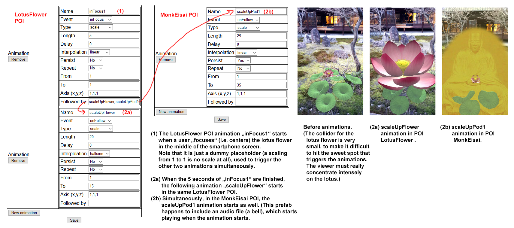
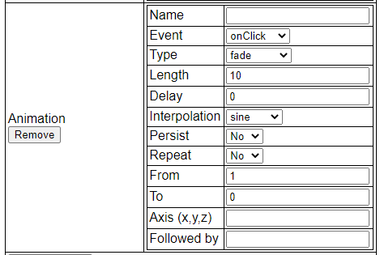

#  Hidden Histories

# Tutorial: Transparent materials in Unity and porPOIse

**NOTE:** The following material is linked from the [Hidden Histories Artist Documentation Overview Page](http://hiddenhistoriesjtown.org/documentation).

- For general tutorials on **using Unity,** see the section **"How to create your own AR artworks".**
- For tutorials on **using porPOIse,** see the section **"Editing augments with the ARpoise porPOIse interface".**

. 
## Unity Material transparency for fade animation in porPOIse

For the animation Type "fade," the prefab must have its Unity Material Rendering Mode set to Fade or Transparent. (See [Animation settings](https://github.com/Hidden-Histories/Public-Resources/blob/master/documentation/UsingPorPOIse_REF-Layer-POI-Properties.md#animation-settings) in the document "PorPOISe Reference: Layer and POI Properties."

You can have multiple animations that run simultaneously, for instance you can scale the POI while rotating it as well.

**For Sound:** See [Notes on Sound in porPOIse and Unity](#notes-on-sound-in-porpoise-and-unity) at the bottom of this document.

* **New animation:** Create a new animation.
* **Remove:** Delete the animtion from the POI.

* **Name**: The name is only needed for a chained series of animations, e.g. when one animation finishes, a following animation should start. 
    * Give the following animation a name, and also enter that name in the **Followed by** field of the preceding animation. 
    * **The named following animations can even be in other POIs in the same layer!"**
    
(You can click on the image below to see a larger version.)

* **Event** - User interactions with the POIs:
  * **onCreate** - the animation is started when the POI is loaded;
  * **onFocus** - the animation is started when the viewer focuses (centers) the POI in the middle of the aRpoise app screen. (Unity Collider component required - see the explanation in [Unity collider components for ARpoise animations events](#unity-collider-components-for-arpoise-animations-events) below.)
  * **inFocus** - the animation starts when the POI is centered in the ARpoise display and stops once the POI loses focus. (Unity Collider component required - see the explanation in [Unity collider components for ARpoise animations events](#unity-collider-components-for-arpoise-animations-events) below.)
  * **onClick** - the animation is started when the POI is clicked by the user. (Unity Collider component required - see the explanation in [Unity collider components for ARpoise animations events](#unity-collider-components-for-arpoise-animations-events) below.)
  * **onFollow** - This is for the chains of animations described above: When the preceeding animation is finished, the following animation will start.
    * Give your following animation a name in its **Name** field.
    * Then enter the name of the following animation in the **Followed by** field of your preceeding animation. 
    
* **Type**: 
  * **rotate**, animate the rotatation of the POI around an axis.
  * **transform**, animate the POI in the x, y or z direction.
  * **scale**, animate the size of the POI.
  * **destroy**, delete the POI entirely. Don't worry, when you force close the app and then restart it, it will be there again!
  * **fade**, fade the POI anywhere between full visibility and invisibility. For example, the animation shown below fades a POI within 10 seconds from 1 (full visibility) to 0 (invisible) and back again.
  
  
  
  **Note:** In order for a fade animation to work, the Rendering mode of the material of the POI's Unity game object needs to be set to 'Fade' or 'Transparent'.
  
  

* **Length**: Length of the animation in seconds.
* **Delay**: Delay of the animation in seconds. onCreate-animations will only start after this delay.
* **Interpolation**:
  * **linear** - the value changes linearly from **From** to **To**;
  * **cyclic** - the value changes linearly from **From** to **To** and then back to **From**;
  * **sine** - the value swings between **From** and **To** like a pendulum;
  * **halfsine** - the value is changed from **From** to **To** and then back to **From,** but with a slowdown before changing.
* **Persist**:
  * **Yes** - at the end of the animation the POI will remain at the final value of the animation;
  * **No** - at the end of the animation the POI will snap back to its original state.
* **Repeat**:
  * **Yes** - the animation is repeated forever;
  * **No** - the animation is only run once.
* **From**: Start value of the animation.
* **To**: End or middle value of the animation, depending on the **Interpolation**.
* **Axis (x,y,z)**: Axis to apply the animation to, e.g.: A rotation with Axis 1,0,0 is only around the X axis.
* **Followed by**: If one or more comma separated animation names are given in this field, the animations mentioned are started once this animation ends. 
   * **Animation names are global for all POIs of a layer.** So the end of an animation of one POI can start an animation of the same POI or of another POI in the layer!
   * **Sound:** If an animation is started and the Unity Prefab of the POI contains an AudioSource component, the audio file is played.

* **Save** button: Saves any changes you made to the POI properties. NOTE: to see the changes in your layer, you MUST close the ARpoise app and restart it!

.

