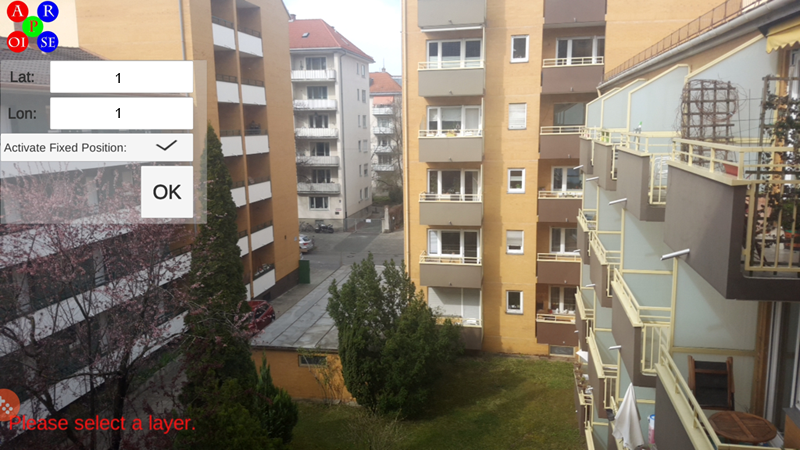

#  Hidden Histories Artists' Overview:

## Using the ARpoise Augmented Reality App 

This tutorial shows you how to use the ARpoise Augmented Reality App to view geolocative augmented reality, computer graphic artworks positioned at specific physical locations via their GPS coordinates. ARpoise should work on most iOS and Android smartphones. (At this time ARpoise has a sister app, AR-vos, that can view both geolocative AR and image trigger AR, but only on newer, higher end smartphones.)

. 
### Download and install the ARpoise AR app

- Download the ARpoise AR app from the http://arpoise.com/, which links to both iOS and Android stores.

- Install the app, and **accept all permissions!**

- You might need to go into your Settings/Privacy settings  and allow ARpoise to use your location data.

. 
### Viewing augments depends on where you are physically located:

Start the app ...

**If there are layers located near you**

- If there is only one layer located near you, it will **automatically appear in your smartphone display.**

- Look around, up and down - there may be augments all around you, as well as above and below.

**If there two or more layers located near you**

- If there are two or more layers located near you, you will see a **list of available layers.**

- Select one of them, and look around you.

**Default layer: If there are NO layers located near you**

- If there are NO layers near you, ARpoise will automatically start the **default ARpoise layers list.** Right now, (April 2020), these are the following AR layers. Click on the links to read what each one is about, and how to interact with it.
  - [Evolution of Fish](http://www.tamikothiel.com/evolutionoffish/), by Tamiko Thiel and /p. 
  - [Lotus Meditation](http://tamikothiel.com/AR/lotus-meditation.html), by Tamiko Thiel and /p. 
  - [Suspended Spring](https://youtu.be/4a4afq_DzE0), by Tamiko Thiel, 2020.

. 
### Exercise: Remote Viewing with ARpoise’s Fixed Position feature

If you want to look at AR layers that are far away from your current position, you can use the **Fixed Position** feature of the ARpoise app to view them. This is also very useful for testing changes you make to your own layers, even if their final location is far away from your home.

To practice this quickly, we have set a couple of AR layers at the GPS position Latitude 1, Longitude 1 (which is in the Gulf of Guinea, West Africa!)

#### Enter the GPS coodinates 1, 1 in the Fixed Position menu:

- Start the ARpoise app.
- **Double click** on the **ARpoise logo menu button**  to get the Fixed Position menu:

- Tap the **Lat** and the **Lon** fields, enter the decimal values you found in Google Maps, then click OK or the check mark to save.

- Click **Activate Fixed Position.**

- Click **OK.**

**But remember to turn off Fixed Position after viewing!** Otherwise, no matter where you are standing, your smartphone will think you are always at the same location!

### Exercise: Remote Viewing of Brush the Sky in San Jose Japantown

As a more useful example, we will show you how to view Tamiko Thiel’s and Midori Kono Thiel’s **Brush the Sky** calligraphic AR artworks, which are located in San Jose Japantown. You can use the same technique to view your own AR artworks once you have moved them to Japantown.

Download the [AR tour of the artworks](http://tamikothiel.com/brushthesky/PR/BrushTheSky_AR-tourSanJoseJapantown.pdf).

If you do not live near to the artwork locations in San Jose Japantown, and cannot physically go there, you can still use ARpoise’s Fixed Position feature to view augments remotely. It will make ARpoise think that you are stannding at that remote location, and you will see the augments overlaying your own immediate environment. This is of course not the same experience as seeing them at the “real” sites in Japantown, but it is a handy feature that you can also use to test out changes to your own artworks even if they are positioned somewhere in the world far away from you.

#### Viewing Brush the Sky augments at home: first get GPS coordinates

- Find an artwork you wish to view in the [AR tour of the artworks](http://tamikothiel.com/brushthesky/PR/BrushTheSky_AR-tourSanJoseJapantown.pdf).

- Search for the address of that location in [Google Maps](https://www.google.com/maps/).

- Then get the decimal coordinates for that [GPS latitude and longitude](https://www.businessinsider.de/international/how-to-find-coordinates-on-google-maps/).

#### Enter the GPS coodinates in the Fixed Position menu:

- Start the ARpoise app.

- **Double click** on the **ARpoise logo menu button.**

- Tap the **Lat** and the **Lon** fields, enter the decimal values you found in Google Maps, then click OK or the check mark to save.

- Click **Activate Fixed Position.**

- Click **OK.**

#### This layer should appear in the available layers list - with other nearby layers too

The layers should then appear in your list of nearby augment layers, even though you are not really standing there. Since GPS is only accurate to about +/- 20 meters, you will see other layers that are nearby as well.

- Select one of the layers ...

- ... and you should see the augments layered over your own surroundings!

- To see a different layer, click the **ARpoise logo menu button** ONCE and you will get the layer list again. Select another one.

**REMEMBER to uncheck Activate Fixed Position** when you are done, otherwise you will not see any local augments, for instance if you create ones yourself in your own home!

