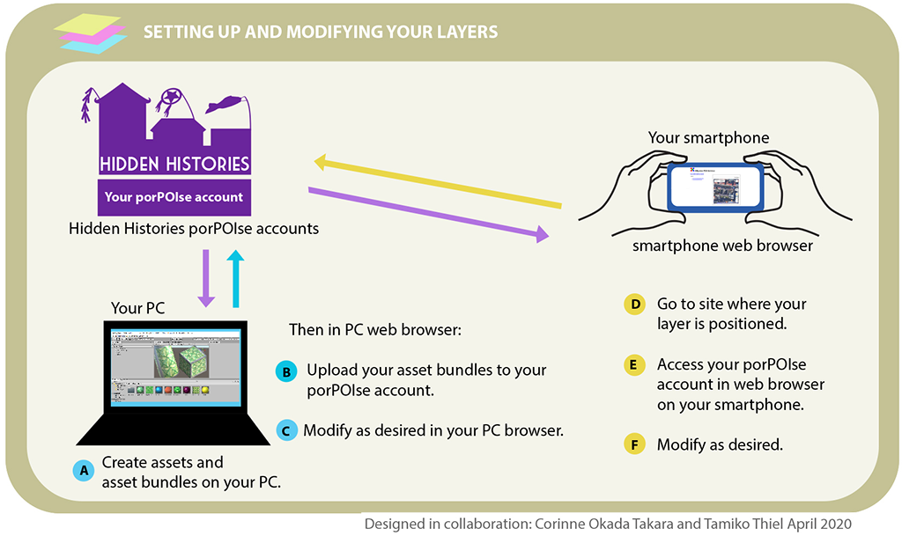

#  Hidden Histories
<< Need an overview? Go to the [Hidden Histories Artist Documentation Overview](http://hiddenhistoriesjtown.org/documentation).

Or puzzled by the lingo? See the [Glossary of Terms >>>](https://github.com/Hidden-Histories/Public-Resources/blob/master/documentation/ARpoiseGlossary.md#-hidden-histories-artists).

.

# ARpoise PorPOISe User Interface tutorial

## Overview

Whether you create your own digital assets for your AR artwork, or work together with a helper to turn your drawings, sculptures or videos into digital assets, it is easy to "choreograph" them together into your AR experience in porPOIse. This is a web-based interface that allows you to edit and adjust your own AR experience either while working from your home base, or standing at your artwork site in Japantown.

This tutorial gives you the basics for working with **geolocative AR,** which works on both the **ARpoise app** and the **AR-vos app** in exactly the same way. A subsequent tutorial will cover the image trigger and SLAM AR that can only be done by the AR-vos app.

### Some terminology ([See also Glossary of Terms >>>](https://github.com/Hidden-Histories/Public-Resources/blob/master/documentation/ARpoiseGlossary.md#-hidden-histories-artists)):

- **Layer:** An ARpoise "layer" is an individual AR experience or project. A single location in the real world can have multiple layers at exactly the same site, each of them a separate AR layer. (This is like a channel on your TV or YouTube - you look at them in the same place, but they are completely separate programs.) When you stand at that site, the ARpoise and AR-vos apps will show you a list of layers available for you there.

- **POI:** A layer consists of one or more "POIs" (Point Of Interest), the **prefabs** (prefabricated objects) and their settings that all together make up your AR experience. The prefabs can be 3D models, images, sounds etc. and their settings, such as location, scale, animations, etc.

- **Geofencing:** This term means to restrict the physical part of the world in which a layer can be viewed in the ARpoise app. Right now this is about 200 meters (1/2 city block) around your "home base." For the final project, the admin will move this area to a location in San Jose Japantown.

.

### Workflow (see below for details on how to do all of this!):

#### Initial work at home:

- Due to the coronavirus lockdown, we have positioned and geofenced your layers **at your home base,** so you can do the main work of **setting up, modifying and testing** your layer in porPOIse there on your PC. 

- Once you understand this tutorial on how to use porPOIse to set up and modify your layer, go to the [**Next Steps**](#next-steps) section at the bottom of this page. to learn how to add new **assets** (2d images, 3D models, sounds, etc.) to your layer.

#### Refining your layers once they are moved to Japantown:

- When your layer is ready for testing, both you and the admin will need to move it to the desired location in Japantown: first they have to change the position in the ARpoise directory registry, and then you need to change the position in your own porPOIse account. 

- Once your layer is positioned in Japantown, you can still change and test it from home using [remote testing with Fixed Location](UsingARpoiseApp.md#exercise2-remote-viewing-of-brush-the-sky-in-san-jose-japantown), as you already learned in the [Using ARpoise App: Remote Viewing with Fixed Position](UsingARpoiseApp.md#-hidden-histories) tutorial.

- For the real testing, **go to the site** where your layer is positioned and view it on your smartphone. (If you have been using Fixed Position to test from home, don't forget to **unclick** Fixed Position first! Otherwise you might think you're seeing your layer properly, but if you want to go to view another Hidden Histories site, you will not see any new layers because your app sees only the Fixed Position!) 

- But **before you leave your house, make sure you can access your porPOIse account on a browser in your smartphone!** The easiest way to do this is to mail yourself the link to your porPOIse account login page (you'll learn about this below), and then you can just click the link when you are standing on site in Japantown. Then you can make changes to your layer while standing on site, and see the changes immediately. (Remember to save the changes, then **close and reopen the ARpoise app** - otherwise you will NOT see the changes in your layer!

#### Visualization of how you work in porPOIse - at home and on site



. 

## Remember: Force close - restart app to see changes!
In the exercises below, remember that in order to see any changes you make in porPOIse, you have to force close and restart the app.
  - How to [force close iPhone/iPad apps](https://support.apple.com/en-us/HT201330)
  - How to [force close Android apps](https://www.tomsguide.com/us/close-android-apps,news-21281.html).
  - If you have successfully force closed the app, when you start it again the Unity start screen appears: 
  
  - 
  

. 
## Log in to your porPOIse account

Log in to your porPOIse account in a web browser on your PC. The URL to access it has the form below, but replace ExampleArtist with the porPOIse account name that the admin created for you. (no blanks!):

https://hiddenhistoriesjtown.org/artists/ExampleArtist/php/web/dashboard/

## porPOIse Layers List

Once you log in to your porPOIse account, you will see a list of the layers that the Hidden Histories admin has set up for you. (If you ever need more layers, please ask your admin to add them for you.) Here we  use the fictitous artist Bruce Lee for the example images. Your own pages will show your assigned nickname.

- The **ExampleLayer** is meant as a test layer where you can play around and try out new features. 
- The **ArtistLayer** is where you should slowly build up the final artwork, as you find assets and functionality to your liking.

Click on the name of your example layer to open it for editing.


. 
## porPOIse Layer Configuration

The layer configuration holds settings that apply to the entire layer. Please leave these settings at the default values [(as described in the layer configuration reference)](UsingPorPOIse_REF-Layer-POI-Properties.md#-hidden-histories). Yes, we know the map covers some settings, but they shouldn't be changed anyway! ;-)

Beneath the settings menu is a list of all the POIs that make up the AR experience of that layer. 

Let's modify our existing POIs:
- Select the **StripesCube** POI.
- Then go to the next section, where you will change the POI's settings.

. 


. 
## porPOIse POI Configuration

We will now practice changing the configuration of the POIs, and view the layer in the ARpoise app to see what effect they have. (Remember: you have to force close and restart your app to see any changes!)

**FOR A DESCRIPTION OF ALL THE POI PROPERTIES see [porPOIse_Reference: POI Configuration](UsingPorPOIse_REF-Layer-POI-Properties.md#porpoise-poi-configuration)**

. 


### Location settings of POI:

There are two ways you can place POIs in the real world:

- **Lat/Lon fields:** This uses an "absolute" location, theoretically at the specified fixed GPS position, but the inaccuracy of GPS means that the POI's actual location can vary from time to time. It does two things:
  1. **Geofencing: is the POI visible in the app at all?** The ARpoise server looks at this value, plus the "Visibility in meters" value (see below), to decide whether or not it should even show this POI to you. If you are standing in Japantown and the GPS value + Visibility value means the POI is in Cupertino, it is too far away to be seen and the app will not show it to you at all.
  2. **The app draws the POI in perspective:** Once the server decides you should be able to see the POI, it compares this value to the GPS value at which you are standing to figure out how to depict the POI in your app display, using the rules of perspective to draw it just like you would: how large should it be, and  how should it look in perspective if it were really there in real life? 

- **Relative location (x,y,z):** 
  - If you set values here, the GPS is still needed and used to do **geofencing.**
  - But Relative location (x,y,z)  **overrules the Lat/Lon** in deciding where the POI should be depicted   relative to where you are standing. 
  - The x, y and z values are the distances in meters relative to your body position (or actually to your smartphone position). If you use Relative location, the POI will always be at the same distance from the user. 
    - Ostensibly x values should be +x = east and -x = west, with 0 at your body, but the technology is simply too inaccurate to really control this, and you might find the POI you place at x = -5 is not 5 meters west of your position, but somewhere else in a 5 meter circle around you. 
    - The same applies to z, which should be +z = north and -z = south with 0 at your body, but can also vary wildly. If it's any consolation, at least the POIs will keep their positions relative to each other!
    - The y value is +y = up and -y = down, **with y = 0 always at your eye level!**
  - **If you go for a walk with the ARpoise app on, the POIs go along with you!** At some point when the app refreshes, they might disappear, if you're far enough away. If you're standing at a location where you know there are other layers, but still see the original one, you need to restart the app to update your location with the server and see the layers that are available at that new location.

**NOTE:** We have placed all the POIs in the ExampleLayer using Relative location, so that you are certain to see them. In Japantown, since the layers are often located very, very close together, [Brush the Sky](http://tamikothiel.com/brushthesky/PR/BrushTheSky_AR-tourSanJoseJapantown.pdf) also uses Relative location to put the augments directly around you, and relies on you to select the correct layer for where you are standing.

### POI location: change these values **one after another**, testing in between:

If you want more information on the settings, see the [porPOIse_Reference: POI Configuration](UsingPorPOIse_REF-Layer-POI-Properties.md#porpoise-poi-configuration).

NOTES: 
- If you can't find any of the cubes after changing any of the values, reset them by looking at the original values in the image above - except the Lat/Lon values, which need to be the values that correspond to your "home base."


- **Seeming solid forms in computer graphics usually have outsides but no insides!** If you make the cube so big that you are inside it, you will not see it anymore, as it is invisible from the inside!
- When you make any changes in porPOIse, then **close and restart the ARpoise app** to see the changes you have made in your layer.

#### EXERCISES:

1. **Relative location:** 
   - You yourself (or rather your smartphone) are at 0,0,0. 
   - The y value is + up / - down. 
   - Theoretically the x value is + east / - west, and z is + north / - south, but since the POIs will appear at different rotations around you, this will actually seem to vary when you view the layer in the app. 
   - Therefore when you want to modify these values, it is very helpful to:
    - note which POI is theoretically north of you (x=0, z is a positive value), 
    - sketch a graph (by hand on notepaper!) with x and Z axes and then only change one value of any POI at a time, viewing the layer after each change in the app to see if your change made the desired effect.

2. **BEFORE YOU DO THE NEXT EXERCISE: if you want to come back to these values, write them down, because in the next step you will delete them all!**

3. **Google Map:** *After* testing your changes in Relative location, now delete the Relative locations of all the POIs completely.
   - All POIs will now be placed using *only* the absolute locations in the Lat/Lon fields. Unless you changed the Lat/Lon yourself, we set them up to be all on top of each other at exactly the same value.
   - In porPOIse, click **Back to your ExampleLayer page:** the Google Map on that page should show only one marker, because all POIs in the list are on top of each other.
   - Now mouse over the marker: a pop up window tells you the name of the POI, which should be the Stripes Cube because it is the first one in the POI list.
   - Drag the marker, and note that the Lat/Lon values for the Stripes Cube change too. CLICK SAVE, otherwise when you leave this page, it'll jump back to the original value! 
   - Zoom out a bit and you should see two markers now. Before, they were all on top of each other.
   - Drag all the markers around. **Don't forget to save the changed position before going to the next POI!**
   - Remember however if you moved the marker of a POI that had a Relative location set, that overrules the Lat/Lon and even though the marker is at a new position, the POI will not have changed when you view it in the ARpoise app!
   - Take a look at the layer now in the ARpoise app. If you can go outside, try walking around and see if you can actually walk up to a POI (it will disappear if you are inside of it, but then reappear behind you if you keep on going.

4. **Relative altitude:** 
   - This only works if you are using absolute location as well, otherwise it is overruled by the y value in Relative location.   
   - Zero is at wherever your smartphone is - usually at your eye level! 
   - Plus values are above and minus values are below eye level.

#### EXERCISE: Change other properties:

1. **Prefab:** This is the name of the asset or group of assets used in this POI. 
   - Try replacing a Prefab name with one from another POIs. You will then have two of the same color, but of course one will have the properties of this POI.
   - To avoid confusion from having two POIs that look exactly the same, we recommend setting the Prefab name (and Save!) back to the original before you go on to try other properties.

2. **Scaling factor:** try 0.5, and view the layer to see how that looks. Then try 2.

3. **Vertical rotation:** try 30° (since they are cubes, 90° and 180° will look the same!)

4. **Animation properties:** 
   - Read the properties description at [porPOIse_Reference: POI Configuration](UsingPorPOIse_REF-Layer-POI-Properties.md#porpoise-poi-configuration) and play around with the animation values.
   - Sound: Right now there is no audio file in the example asset bundle, but if you add one when you create your own asset bundle, it is treated as a Prefab just like any other asset. If it is including in a POI that has an animation, it will start when the first animation starts. More on this later.

5. **Add Animation to a static POI:** Once you understand the animation properties, select a different POI, click **New animation** and fill out the fields to animate it as well.

**Remember to Save / close ARpoise app / restart ARpoise app after every change!**

. 
## Create a new POI

Now create a new POI, reusing a Prefab name from one of the POIs.

1. Go **Back to the ExampleLayer.**
2. Click the **New POI** link above the POI list.
3. In the next screen, ignore the warning and click **Create.**

. 


. 
A new, blank POI will be created at the end of the list.

. 


. 
1. Leave the Title at **notitle** for now.

2. Move the POI to the same GPS as the other POIs, otherwise it will not be visible:
   - Click on the Lat field of the POI above it, copy the entire value and paste into the empty Lat field.
   - Repeat for the Lon. **Click Save**
  
3. Now click on **notitle** ...

. 


**Enter the required values for your new POI:**

1. **URL for asset bundle** must be exactly the same as in the other POIs: 
   - ```hiddenhistoriesjtown.org/artists/ExampleArtist/AssetBundles/hh_examples.ace```
   - (NOTE there is NO https://)
   - ... but **replace "ExampleArtist" with your own porPOIse account name.**
   
2. **Prefab name:** choose one of the names from one of the other POIs.

3. Play around with its properties, placing it where there are no other POIs - otherwise you might not see it! 

. 

## Review of how ARpoise positions layers and POIs

The **GPS Latitude and Longitude positions** and the **Visibility in meters** are REQUIRED for ALL layers and POIs, whether they use an absolute GPS position, or Relative position with respect to the user. 

**These properties are used by ARpoise in two steps:**

1. **Geofencing:** Where is the user standing? Is there anything near them to show to the user at all?

2. **Drawing the POI:** IF (and only IF) there is something to see nearby, then the ARpoise system goes into the details needed for each case: where is it exactly, does it use absolute or relative position, etc., and then draws it using rules of perspective so it looks like a real object with the same properties would look at that distance and orientation.

In the **ARpoiseDirectory,** the **admin** has set **geofencing** for each of your layers:

- The "Lat/Lon" GPS position that is the **center** for that layer. This is why we asked for the street address of your "home base." Later, the admin will move it to its proper "home" in Japantown.

- The "Visibility in meters," that defines an **area around this center.** If the user is not standing in this area, they will not see the layer in the list of the ARpoise app.

- For Hidden Histories, the visibility range is set at 200 Meters from the layer center position. This is only about half a block, so when it is in Japantown you don‘t get confused by seeing too many layers in the list all at once.


The **artist** then defines in **porPOIse**:

- **At the layer level:** the "Visibility in meters" for the **POIs in that layer**. This we suggest leaving at 1500 meters, about a mile, so that it can be found even if the GPS signal is way off.

- **At the POI level** (for both absolute and relative positioning):

  - **Geofencing:** The GPS position and "Visibility in meters" of a POI is used to geofence that specific POI.
  - We suggest leaving Visibility at the default value of 1500 meters, about a mile, so that it can be found even if the GPS signal is way off.
  - Then depending on whether you use "Relative location (x,y,z)" to position the POI, or leave it blank so the GPS position is used to determine its absolute position to the viewer, the app draws the POI at the correct perspective and size.

- So if for instance an artist lives in Oakland and wants to move their POIs to Japantown, they have to ask the admin to move the entire layer to Japantown first. Otherwise, ARpoise thinks:
  - The layer is in Oakland.
  - The POIs are all in Japantown.
  - Japantown is over 200 meters away from Oakland, and would be too small to see, so I won't show anything at all!

.

## Next Steps

### Creating new content for your layers:

- Unity tutorials: see "How to create your own AR artworks" on the main Hidden Histories documentation page
http://hiddenhistoriesjtown.org/documentation/

- [**Creating AssetBundles for porPOIse**](CreatingAssetBundles.md) tutorial:
  - If you already know how to use create assets (3D models, images, sounds etc.) and how to use the Unity Editor, go through this tutorial to create your own AssetBundle.
  - You will need to use a Mac to make the iOS AssetBundle, and an iOS smartphone to test it.
  - You will need a Windows PC to make the Android AssetBundle, and an Android smartphone to test it.
  - If you only have one type of PC, you will need to send your assets to the admin or team up with another artist to get the other asset bundle.

. 
## Original Documentation - ONLY to set up your own porPOIse!!!

===PorPOISe for Layar===
Portable Point-of-Interest Server for Layar

===Administrative contact===
Jens de Smit, jens@layar.com

===Introduction===
PorPOISe is a server for Layar clients. It converts your data sets of POIs
(Points of Interest) into responses to the Layar client. Things like JSON
formatting and distance calculation are all done for you. PorPOISe supports
XML files as data stores.

===Getting started===
Read INSTALL for installation instructions. Once properly installed, you can
use the dashboard to create your first POIs. The interface is pretty spartan
but this will generate correct output format. Study the format if you intend to
generate your own XML files.

From here on you're on your own. Build a better interface for the dashboard or
expand PorPOISe to have more features if you need more.

===History===
PorPOISe originated at SURFnet in 2009 as a spin-off from a small layer-
building experiment. Over 2010 functionality expanded and feature support
grew with Layar's feature support. In 2011, PorPOISe's primary author moved
from SURFnet to Layar and took the project with him.

===More information===
  * http://www.surfnet.nl/en The home of the creator of PorPOISe
  * http://teknograd.wordpress.com/2009/10/19/augmented-reality-create-your-own-layar-layer/ An explanation on how to build the most minimal of Layar servers. Very useful to get started
  * http://layar.com/ is, of course, the reason this project exists
  
