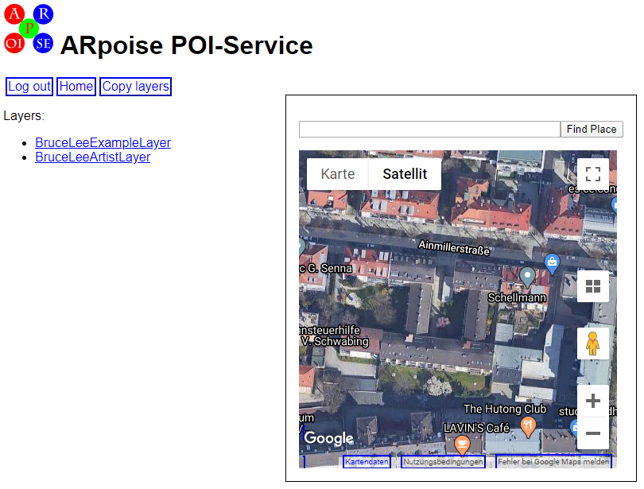
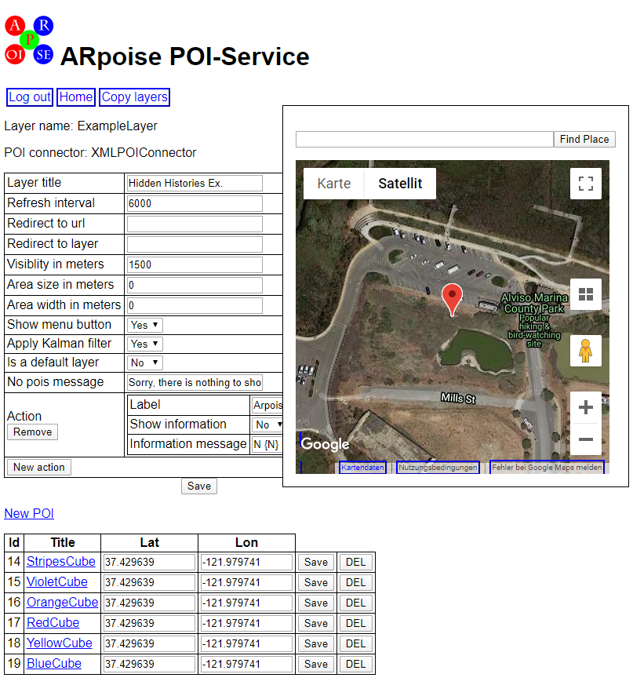
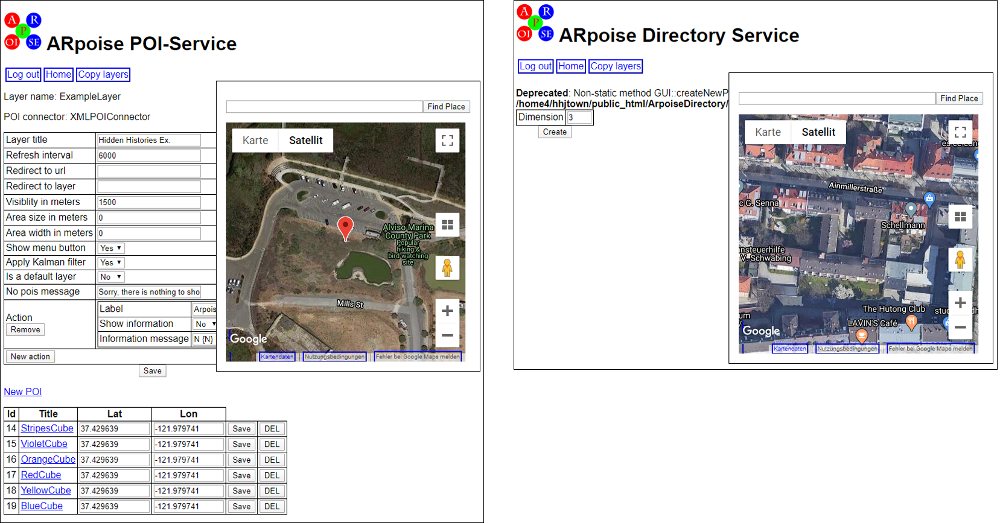
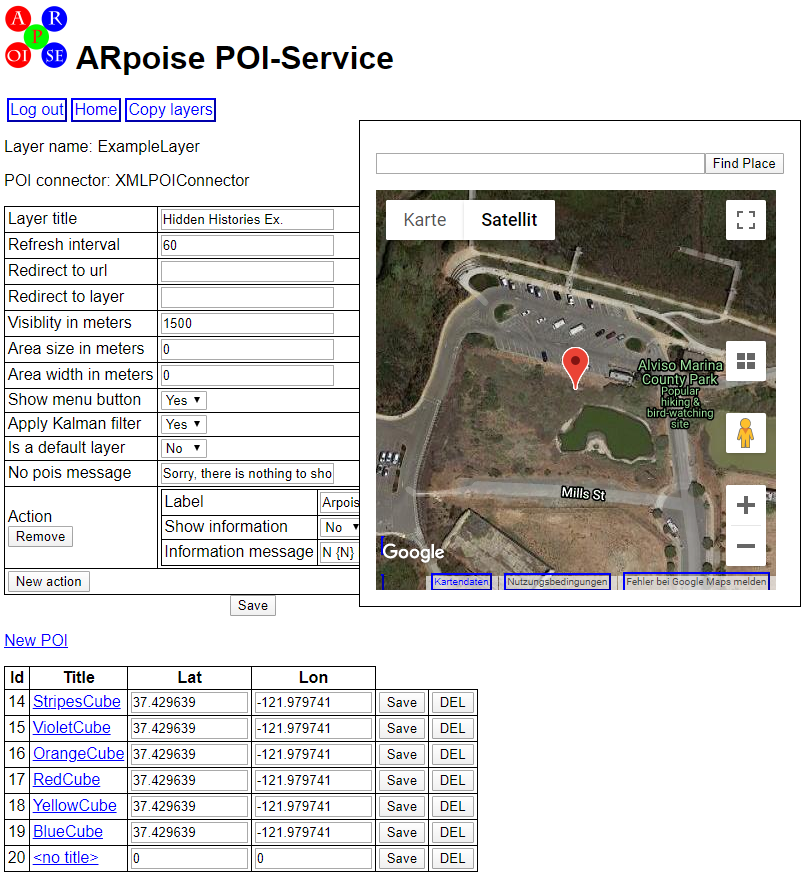
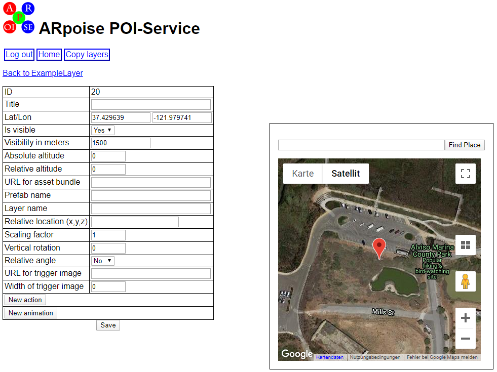

#  Hidden Histories Artists

# ARpoise PorPOISe User Interface tutorial

## Overview


In this tutorial learn how to use porPOIse with your own AR **layers** to place and adjust the **POI**s making up the AR experience.

- **Layer:** An ARpoise "layer" is an individual AR experience or project. A single location in the real world can have multiple layers at exactly the same site, each of them a separate AR experience. When you stand at that site, the ARpoise app will show you a list of layers available for you there.

- **POI:** A "POI" (Point Of Interest) is an asset or a group of assets (such as 3D models, images, sounds etc.), that all together make up your AR experience.

### Workflow (see below for details on how to do all of this!):

Initial work at home:

- Due to the coronavirus lockdown, we have positioned your layers **at your home,** so you can do the main work of **setting up, modifying and testing** your layer in porPOIse at home on your PC. 

- Once you understand this tutorial on how to use porPOIse to set up and modify your layer, go to the [**Next Steps**](#next-steps) section at the bottom of this page. to learn how to add new **assets** (2d images, 3D models, sounds, etc.) to your layer.

Refining your layers once they are moved to Japantown:

- When your layer is ready for testing, both you and the admin will need to move it to the desired position: first they have to change the position in the ARpoise directory registry, and then you need to change the position in your own porPOIse account. 

- Once your layer is positioned in Japantown, you can still change and test it from home using [remote testing with Fixed Location](UsingARpoiseApp.md#remote-viewing-arpoises-fixed-position-feature). You should have already learned this in the [Using ARpoise App: Remote Viewing with Fixed Position](UsingARpoiseApp.md#remote-viewing-arpoises-fixed-position-feature) tutorial.

- For the real testing, **go to the site** where your layer is positioned and view it on your smartphone. (If you have been using Fixed Position to test from home, don't forget to **unclick** it first!). 

- But **before you leave your house, make sure you can access your porPOIse account on your smartphone!** Then you can make changes on site. Remember to save the changes, then **close and reopen the ARpoise app** in order to immediately see the effects of the changes in your layer.

. 
## porPOIse Layers List

Log in  to your porPOIse account. The URL to access it has the form below, but replace ExampleArtist with the porPOIse account name that the admin created for you. (no blanks!):

https://hiddenhistoriesjtown.org/artists/ExampleArtist/php/web/dashboard/

When you log in to your porPOIse account, you will see a list of the layers that the Hidden Histories admin has set up for you. (If you ever need more layers, please ask your admin to add them for you.) Here we  use the fictitous artist Bruce Lee for the example images. Your own pages will show your assigned nickname.

- The **ExampleLayer** is meant as a test layer where you can play around and try out new features. 
- The **ArtistLayer** is where you should slowly build up the final artwork, as you find assets and functionality to your liking.

Click on the name of your example layer to open it for editing.



. 
## porPOIse Layer Configuration

The layer configuration holds properties that apply to the entire layer. 

**FOR A DESCRIPTION OF ALL THE PROPERTIES SEE [porPOIse_Reference: Layer Properties](UsingPorPOIse_REF-Layer-POI-Properties.md#-hidden-histories-artists)**

- Feel free to change the **Layer title**, which is shown in the ARpoise app (don't forget to click "Save" to save your changes!) It is displayed by the ARpoise app on a white background in the top center of the screen. The white background is very short however!
- Otherwise please leave these properties at the default values [(as described in the layer properties reference)](UsingPorPOIse_REF-Layer-POI-Properties.md#-hidden-histories-artists), or discuss with the admin before you change them. 

Beneath the properties menu is a list of all the POIs that make up the AR experience of your layer. If you have created new assets for a completely new POI, you add it with the New POI link.

**For now however, let's modify our existing POIs:**

- Select the **StripesCube** POI.
- Then go to the next section, where you will change the POI's properties.

. 


. 
## porPOIse POI Configuration

We will now practice changing the configuration of the POIs, and view the layer in the ARpoise app to see what effect they have. 

**FOR A DESCRIPTION OF ALL THE POI PROPERTIES see [porPOIse_Reference: POI Properties](UsingPorPOIse_REF-Layer-POI-Properties.md#porpoise-poi-configuration)**

. 


### Location properties of POI:

There are two ways you can place POIs in the real world:

- **Lat/Lon fields:** This uses an "absolute" location, theoretically at a fixed GPS position, but the inaccuracy of GPS means that this can vary from time to time.
- **Relative location (x,y,z):** 
  - This is relative to where the viewer is standing, and **overrules the Lat/Lon** (unless you put it too far away from the GPS position of the layer, in which case ARpoise will not be able to see it at all!) 
  - If you use Relative location, the assets will always be at the same distance from the user. (Note that the orientation around the user can change - the technology has no real control over this).
- With Relative location, **if the viewer goes for a walk with the ARpoise app on, the POIs go with them!** The viewer has to refresh or restart the app to have the locations and availablity of the layer updated to their changed location.

**NOTE:** We have placed all the POIs in the ExampleLayer using Relative location, so that you are certain to see them. In Japantown, since the layers are often located very, very close together, [Brush the Sky](http://tamikothiel.com/brushthesky/PR/BrushTheSky_AR-tourSanJoseJapantown.pdf) also uses Relative location to put the augments directly around you, and relies on you to select the correct layer for where you are standing.

### POI location: change these values **one after another**, testing in between:

If you want more information on the properties, see the [porPOIse_Reference: POI Properties](UsingPorPOIse_REF-Layer-POI-Properties.md#porpoise-poi-configuration).

NOTES: 
- If you can't find the StripesCube after changing values, change them back to the values in the image above, and try again!
- Solid forms in computer graphics have outsides but no insides! If you make the cube so big that you are inside it, you will not see it anymore, as it is invisible from the inside!
- **Save the changes in porPOIse, then close and restart the ARpoise app** to see the changes you have made in your layer.

#### EXERCISES:

1. **Relative location:** 
   - You yourself (or rather your smartphone) are at 0,0,0. 
   - The x value is side to side, y is + up/- down, z is closer/further away.

2. **Google Map:** *After* testing your changes in Relative location, now delete the Relative location completely.
   - Your layer will now be placed using the absolute location in the Lat/Lon fields. 
   - Change them by clicking and dragging on the marker. 
   - Note that when you mouse over the marker, a pop up window tells you the name of the POI, and that as you drag the marker, the Lat/Lon values in the form change too. 
   - In porPOIse, click **Back to your ExampleLayer page:** the Google Map on that page will be the same as  the StripesCube, because the first POI in the list defines what is shown on that map.
   - Zoom out a bit and you should see two markers now. Before, they were all on top of each other.
   - Drag the markers around and note that the Lat and Lon in the POI list change as you drag. If you reposition a POI here, you MUST click Save for that POI, otherwise the change will be lost.
   - Remember however if you moved the marker of another POI that had a Relative location set, that overrules the Lat/Lon and it will not have changed in the ARpoise app!

3. **Relative altitude:** 
   - This only works if you are using absolute location as well, otherwise it is overruled by the y value in Relative location.   
   - Zero is at wherever your smartphone is - usually at your eye level! 
   - Plus values are above and minus values are below eye level.

#### EXERCISE: Change other properties:

1. **Prefab:** This is the name of the asset used in this POI. 
   - Try replacing this Prefab name with one from another POIs. You will then have two of the same color, but of course one will have the properties of this POI.
   - To avoid confusion, please replace the StripesCube Prefab name (and Save!) before you go on to the other properties.

2. **Scaling factor:** try 0.5 and then try 2.

3. **Vertical rotation:** try 30° (since they are cubes, 90° and 180° will look the same!)

4. **Animation properties:** 
   - Read the properties description at [porPOIse_Reference: POI Properties](UsingPorPOIse_REF-Layer-POI-Properties.md#porpoise-poi-configuration) and play around with the animation values.
   - Sound: Right now there is no audio file in the example asset bundle, but you add one when you create your own asset bundle, it is treated as a Prefab just like any other asset. If it is including in a POI that has an animation, it will start when the first animation starts. More on this later.

5. **Add Animation to a static POI:** Once you understand the animation properties, select a different POI, click **New animation** and fill out the fields to animate it as well.

**Remember to Save / close ARpoise app / restart ARpoise app after every change!**

. 
## Create a new POI

Now create a new POI, reusing a Prefab name from one of the POIs.

1. Go **Back to the ExampleLayer.**
2. Click the **New POI** link above the POI list.
3. In the next screen, ignore the warning and click **Create.**

. 


. 
A new, blank POI will be created at the end of the list.

. 



. 
1. Leave the Title at **notitle** for now.

2. Move the POI to the same GPS as the other POIs, otherwise it will not be visible:
   - Click on the Lat field of the POI above it, copy the entire value and paste into the empty Lat field.
   - Repeat for the Lon. **Click Save**
  
3. Now click on **notitle** ...

. 


**Enter the required values for your new POI:**

1. **URL for asset bundle** must be exactly the same as in the other POIs: 
   - ```hiddenhistoriesjtown.org/artists/ExampleArtist/AssetBundles/hh_examples.ace```
   - (NOTE there is NO https://)
   - ... but **replace "ExampleArtist" with your own porPOIse account name.**
   
2. **Prefab name:** choose one of the names from one of the other POIs.

3. Play around with its properties, placing it where there are no other POIs - otherwise you might not see it! 


## Next Steps

### Creating new content for your layers:

- Unity tutorials: UNDER CONSTRUCTION

- [**Creating AssetBundles for porPOIse**](CreatingAssetBundles.md) tutorial:
  - If you already know how to use create assets (3D models, images, sounds etc.) and how to use the Unity Editor, go through this tutorial to create your own AssetBundle.
  - You will need to use a Mac to make the iOS AssetBundle, and an iOS smartphone to test it.
  - You will need a Windows PC to make the Android AssetBundle, and an Android smartphone to test it.
  - If you only have one type of PC, you will need to send your assets to the admin or team up with another artist to get the other asset bundle.

. 
## Original Documentation - ONLY to set up your own porPOIse!!!

===PorPOISe for Layar===
Portable Point-of-Interest Server for Layar

===Administrative contact===
Jens de Smit, jens@layar.com

===Introduction===
PorPOISe is a server for Layar clients. It converts your data sets of POIs
(Points of Interest) into responses to the Layar client. Things like JSON
formatting and distance calculation are all done for you. PorPOISe supports
XML files as data stores.

===Getting started===
Read INSTALL for installation instructions. Once properly installed, you can
use the dashboard to create your first POIs. The interface is pretty spartan
but this will generate correct output format. Study the format if you intend to
generate your own XML files.

From here on you're on your own. Build a better interface for the dashboard or
expand PorPOISe to have more features if you need more.

===History===
PorPOISe originated at SURFnet in 2009 as a spin-off from a small layer-
building experiment. Over 2010 functionality expanded and feature support
grew with Layar's feature support. In 2011, PorPOISe's primary author moved
from SURFnet to Layar and took the project with him.

===More information===
  * http://www.surfnet.nl/en The home of the creator of PorPOISe
  * http://teknograd.wordpress.com/2009/10/19/augmented-reality-create-your-own-layar-layer/ An explanation on how to build the most minimal of Layar servers. Very useful to get started
  * http://layar.com/ is, of course, the reason this project exists
  
