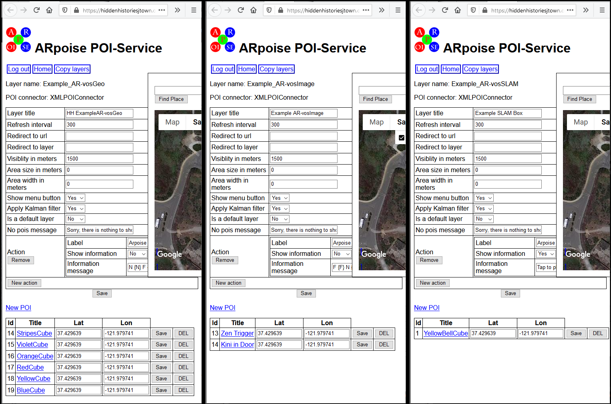

#  Hidden Histories
<< Need an overview? Go to the [Hidden Histories Artist Documentation Overview](http://hiddenhistoriesjtown.org/documentation).

Or puzzled by the lingo? See the [Glossary of Terms >>>](https://github.com/Hidden-Histories/Public-Resources/blob/master/documentation/ARpoiseGlossary.md#-hidden-histories-artists).

.

# PorPOISe - create AR-vos image trigger and SLAM

## Overview

This tutorial shows how to create image trigger and SLAM layers for the AR-vos app. **AR-vos** is an open source app that can do **geolocative**, **SLAM** and **image trigger** AR. It is part of the [**ARpoise** (**A**ugmented **R**eality **p**oint **o**f **i**nterest **s**ervice **e**nvironment)](http://arpoise.com/) open-source Augmented Reality platform.

You can **download the AR-vos app** from the [Google Play](https://play.google.com/store/apps/details?id=com.arpoise.ARvos) Store and the Apple [App Store](https://apps.apple.com/us/app/ar-vos/id1483218444). 

If you haven't recently **viewed image trigger and SLAM in AR-vos, PLEASE go through the tutorial** [Using the AR-vos App to view image trigger and SLAM based AR artworks](https://github.com/Hidden-Histories/Public-Resources/blob/master/documentation/UsingAR-vosApp.md#-hidden-histories), so you understand how to use both types of AR.

**NOTE:** 

Additionally, this tutorial assumes you are already comfortable **creating - not just viewing! - geolocative AR,** using the **porPOIse user interface** with either the ARpoise app or the AR-vos app. **You create geolocative AR content for the AR-vos app in exactly the same way you do for the ARpoise app.**

This is covered by the tutorials on the [Hidden Histories documentation page](http://hiddenhistoriesjtown.org/documentation/), including:
- All the tutorials under "Viewing augments on your smartphone in the ARpoise and AR-vos apps." 
- All the other, preceding tutorials under the same heading as this one, "Editing augments with the ARpoise porPOIse interface."

## Review: image trigger AR and SLAM AR

**The AR-vos app *only* run on newer models,** as it requires Apple's ARKit and Google Android's ARCore technologies.
  - For iPhones, it works on the iPhone SE or iPhone **6s** (NOT on iPhone 6) and higher. See [ARKit supporting iOS devices](https://developer.apple.com/library/archive/documentation/DeviceInformation/Reference/iOSDeviceCompatibility/DeviceCompatibilityMatrix/DeviceCompatibilityMatrix.html).
  - For Android, it is harder to say, please see [ARCore supporting Android devices](https://developers.google.com/ar/discover/supported-devices). In general, a device needs at least Android version 7.0, see [Android Versions](https://source.android.com/setup/start/build-numbers).
  
**Image trigger AR** uses A.I. computer vision technology to recognize trigger images - posters, postcards, or even photos of the inside or outside of a building - that you assign to a POI.
- Your POI prefab is then placed relative to those images, and will (pretty much) stick to those images. 
- Note that if lighting conditions vary, for instance cast shadows on outdoor trigger images, you might have to set up multiple POIs with different trigger images for the different lighting conditions.

**SLAM AR** uses the newest form of A.I. computer vision technology, [Simultaneous localization and mapping](https://en.wikipedia.org/wiki/Simultaneous_localization_and_mapping), to discover planes in the physical space around the user, and then place augments on these planes. The augments will (pretty much) stay in place, and the user can then walk around them in 3D space.
- Right now the planes always stay visible, and each time you touch any of them, another copy of your POI is placed at that location.
- We will be expanding your control of both the visibility of the planes and how often users can place copies of your POIs, but these updates will probably not come until February 2021 at the earliest.
   
**Geofencing:** all these forms of AR are restricted to a certain area. Just like the ARpoise app, the AR-vos app always checks your device's GPS coordinates and sends a request to the **ARpoise** back end server to see whether there are specific art works at your location. If there are you will see them; if there are none, a default layer will be shown to you. (Note that we will change this default layer periodically.)

## AR-vos layers in your porPOIse acccount

We have now added three AR-vos layers to your porPOIse account. If you log in as you always have done to work on your ARpoise layers, you will see them immediately: the three new layers with ".. AR-vos.." in their names.
- **These new layers are **only** visible in the AR-vos app!**
- The older layers - without "AR-vos" in the name - are only visible in the ARpoise app.

.

Please open each layer in a separate window and arrange them side by side, as in the image below.
- Note that the **form** for the three layers looks exactly alike (they just vary in the content and the POIs listed).

.

- Now just click on a POI in each layer to open it in the same window.

The only substantial difference is in the field **URL for trigger image.**
- If it is **empty, AR-vos treats this as a geolocative layer.** If you open it in the AR-vos app, you will be surrounded by all the POIs in that layer.
- If that field contains the **URL of a png or jpg** that is viewable on the Internet, the layer is treated as **image trigger AR,** and that **image will be the trigger** for this POI.
- If the field contains the word **SLAM,** the layer is treated as a SLAM layer.

So actually, you could use any of the AR-vos layers to do any type of AR. We just named them differently so you can keep an example of each different type! That said, there are some small details you should observe.

**Geolocative AR in AR-vos is done exactly the same as in ARpoise, we will not cover that at all here.** If you need to review it, please read all the other tutorials on the [Hidden Histories documentation page](http://hiddenhistoriesjtown.org/documentation/) under the heading "Editing augments with the ARpoise porPOIse interface."

## Creating an image trigger layer

If you're not sure which image you entered:
  - Click in the field, select all, copy, and then paste into a browser URL field. You'll see the image and can use it to test that layer.
