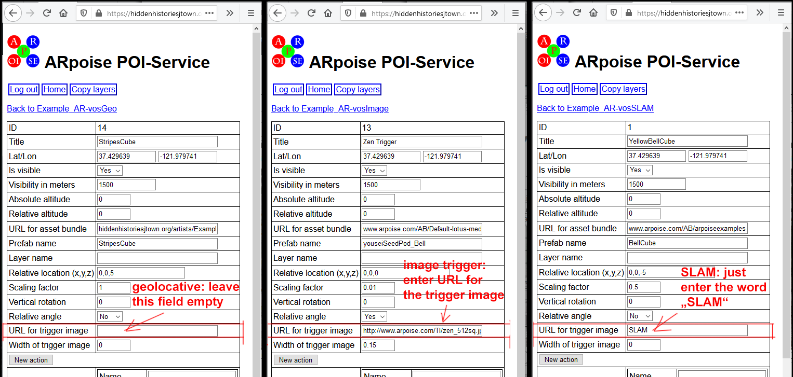
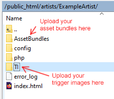

#  Hidden Histories
<< Need an overview? Go to the [Hidden Histories Artist Documentation Overview](http://hiddenhistoriesjtown.org/documentation).

Or puzzled by the lingo? See the [Glossary of Terms >>>](https://github.com/Hidden-Histories/Public-Resources/blob/master/documentation/ARpoiseGlossary.md#-hidden-histories-artists).

.

# PorPOISe - create AR-vos image trigger and SLAM

## Overview

This tutorial shows how to create image trigger and SLAM layers for the AR-vos app. **AR-vos** is an open source app that can do **geolocative**, **SLAM** and **image trigger** AR. It is part of the [**ARpoise** (**A**ugmented **R**eality **p**oint **o**f **i**nterest **s**ervice **e**nvironment)](http://arpoise.com/) open-source Augmented Reality platform.

You can **download the AR-vos app** from the [Google Play](https://play.google.com/store/apps/details?id=com.arpoise.ARvos) Store and the Apple [App Store](https://apps.apple.com/us/app/ar-vos/id1483218444). 

If you haven't done it recently **PLEASE go through the tutorial** [Using the AR-vos App to view image trigger and SLAM based AR artworks](https://github.com/Hidden-Histories/Public-Resources/blob/master/documentation/UsingAR-vosApp.md#-hidden-histories), so you understand how to *use* AR-vos to view both types of AR.

### NOTE: You MUST already know how to create new content for geolocative AR 

This tutorial assumes you are already comfortable **creating - not just viewing! - geolocative AR,** using the **porPOIse user interface** with either the ARpoise app or the AR-vos app. 

To do this tutorial you will need to:
- Access your porPOIse account in a web browser and use it to set up POIs.
- Use an **FTP client** to upload new content to your porPOIse account. (If you do not know how to do this, contact the Hidden Histories system administrator.)

**You create geolocative AR content for the AR-vos app in exactly the same way you do for the ARpoise app.** This is covered by the tutorials on the [Hidden Histories documentation page](http://hiddenhistoriesjtown.org/documentation/), including:
- All the tutorials under **Viewing augments on your smartphone in the ARpoise and AR-vos apps.** 
- All the other, preceding tutorials under the same heading as this one, **Editing augments with the ARpoise porPOIse interface.**

.

## Review: image trigger AR and SLAM AR

**The AR-vos app *only* run on newer models,** as it requires Apple's ARKit and Google Android's ARCore technologies.
  - For iPhones, it works on the iPhone SE or iPhone **6s** (NOT on iPhone 6) and higher. See [ARKit supporting iOS devices](https://developer.apple.com/library/archive/documentation/DeviceInformation/Reference/iOSDeviceCompatibility/DeviceCompatibilityMatrix/DeviceCompatibilityMatrix.html).
  - For Android, it is harder to say, please see [ARCore supporting Android devices](https://developers.google.com/ar/discover/supported-devices). In general, a device needs at least Android version 7.0, see [Android Versions](https://source.android.com/setup/start/build-numbers).
  
**Image trigger AR** uses A.I. computer vision technology to recognize trigger images - posters, postcards, or even photos of the inside or outside of a building - that you assign to a POI.
- Your POI prefab is then placed relative to those images, and will (pretty much) stick to those images. 
- Note that if lighting conditions vary, for instance cast shadows on outdoor trigger images, you might have to set up multiple POIs with different trigger images for the different lighting conditions.

**SLAM AR** uses the newest form of A.I. computer vision technology, [Simultaneous localization and mapping](https://en.wikipedia.org/wiki/Simultaneous_localization_and_mapping), to discover planes in the physical space around the user, and then place augments on these planes. The augments will pretty much stay in place, and the user can then walk around them in 3D space.
- Right now the planes always stay visible, and each time you touch any of them, another copy of your POI is placed at that location.
- We will be expanding your control of both the visibility of the planes and how often users can place copies of your POIs, but these updates will probably not come until February 2021 or so.
   
**Geofencing:** all these forms of AR can be restricted to a certain area. Just like the ARpoise app, the AR-vos app always checks your device's GPS coordinates and sends a request to the **ARpoise** back end server to see whether there are specific art works at your location. If there are, you will see them; if there are none, a default layer will be shown to you. (Note that we will change this default layer periodically.)

. 

## AR-vos layers in your porPOIse acccount

We have now added three AR-vos layers to your porPOIse account. If you log in as you always have done to work on your ARpoise layers, you will see them immediately: the three new layers with ".. AR-vos.." in their names.
- **These new layers are **only** visible in the AR-vos app!**
- The older layers - without "AR-vos" in the name - are only visible in the ARpoise app.

.
### How does AR-vos know what sort of AR each layer will provide?

Please open each layer in a separate window and arrange them side by side, as in the image below.
- Note that the **form** for the three layers looks exactly alike (they just vary in the content and the POIs listed).

.

- Now just click on the **first POI in each layer** to open it in the same window.

.

The field **URL for trigger image** tells the AR-vos app how to treat this entire layer:
- If it is **empty, AR-vos treats this as a geolocative layer.** If you open it in the AR-vos app, you will be surrounded by all the POIs in that layer.
- If that field contains the **URL of a png or jpg** that is viewable on the Internet, the layer is treated as **image trigger AR,** and that **image will be the trigger** for this POI.
- If the field contains the word **SLAM,** the layer is treated as a SLAM layer.

So actually, you could use any of the AR-vos layers to do any type of AR. We just named them differently so you can keep an example of each different type! That said, there are some small details you should observe.

**Remember, geolocative AR in AR-vos is done exactly the same as in ARpoise.** So we will not cover that at all here. If you need to review it, please read all the other tutorials on the [Hidden Histories documentation page](http://hiddenhistoriesjtown.org/documentation/) under the heading **Editing augments with the ARpoise porPOIse interface.**

.

## Setting up an image trigger layer

Go to the layer page for your own AR-vosImage layer. Note that it has two POIs in the POI list right now. (You can of course add and delete and modify them as you wish.)

.

Theoretically, you should be able to (for instance) have an exhibition of your paintings, and use each painting as a trigger for a different AR experience. That is: 
- In each POI you would have linked a photograph of a different painting as a trigger in the field **URL for trigger image.**
- Each **Prefab name** field would reference an AR experience specific to that corresponding painting. So each POI represents a different painting, and a different AR experience connected to that painting.
- Then you should be able to keep the layer open as you go from one painting to another, and get the appropriate AR experience for each painting.

**Right now however, we have a bug:**
- If you trigger one prefab AR experience from one trigger image, and then scan a different trigger image without closing the app in between, sometimes you get both the prefab for the first POI you scanned, as well as the second one you are scanning now. :-(
- We hope to get rid of this bug, but it might not happen until February or so. :-(

So if this happens to you and you find it annoying, please just work on one POI at a time, and **turn off the other ones by setting Is visible to No.**

. 

.

### Settings that behave a bit differently in image trigger versus in geolocative AR.

(For a description of all the settings, please see the [PorPOISe Reference: Layer and POI Properties]( https://github.com/Hidden-Histories/Public-Resources/blob/master/documentation/UsingPorPOIse_REF-Layer-POI-Properties.md#-hidden-histories).)

- **Lat/Lon:** 
  - In image trigger AR, the latitude and longitude GPS values are *not* used to position the POI - it will always be placed centered on the trigger image. 
  - However, the Lat/Lon *is* used to tell the AR-vos app whether to show the POI at all. If it is too far away from where the user is standing, it will not be shown.

- **Relative location (x,y,z):** This does **not** work in image trigger! The origin (0,0,0) of your prefab will be centered in the middle of the image. If you want to adjust so it is NOT centered:
  - In Unity, set up the trigger image as a GameObject Quad (with a zeroed transform!), and use this to position the prefab as desired with respect to the trigger image. This is what we did with the cutout image of King Ludwig II standing in a doorway, in the "Kini" POI. (How to do this in Unity is beyond the scope of this tutorial!)
  - OR: in porPOIse, add a **dummy transform animation** that moves it with respect to the center of the image, by using the same values in both From and To fields. See the exercise below for more details.

- **Scaling factor:** This should often be in the range of the value **Width of trigger image** below. Remember that 3D objects are only visible if you see them from outside. So if a 3D object is too big, and you are inside of it, it will be invisible!

- **URL for trigger image:** This is a jpg or png that you upload to the new **TI** (Trigger Images) folder we added to your porPOIse account. See below for more details.

- **Width of trigger image:** This doesn't have to be exact, but is a rough guide for the size of your trigger image. This would be around 0.1m = 10cm for a postcard, 1m for a poster, and perhaps 10m for a house facade.

.

## Exercise 1: Trigger Images

What does the trigger image have to look like? See Wikitude's [Best Practices for trigger images](https://www.wikitude.com/blog-image-recognition-tracking-best-practices-and-target-guidelines/) for visual examples of dos and don'ts.

There are two aspects of any trigger image:
- How does it look in the real world? 
  - It should **not** have any reflections or shadows that make it look different at different times. Glass and metal are bad, it should be matt, opaque, non-reflective and evenly lit.
  - It should be **large and clear** enough to be recognizable. If you can't recognize it, neither will AR-vos!
- What sort of file should the trigger image be? 
  - It has to be a **jpg or png,** and should be **RGB,** *not* CYMK.
  - It should be only about **1 MB,** as it will be downloaded and analyzed on the user's smartphone.
  - A good size is between **500 - 1050 pixels on a side.**

Additionally, the AR-vos app needs to be able to identify your trigger image to decide how to depict your AR content:
- If the trigger image is for instance a small section of a large mural, facade or poster, it has to be able to **identify** it - it should be a **unique** part of the larger image.
- **Orientation:** it has to be able to tell which direction is up - remember, it doesn't feel gravity! If it is symmetrical, it can't tell which direction is up or down.

This means the trigger image should be:
- **Asymmetrical** - otherwise it doesn't know which way is up.
- **High contrast** - otherwise it'll all look like a blur.
- **Lots of detail** - otherwise it'll be hard to identify uniquely.

### How does AR-vos access your trigger image?

As mentioned above, the POI setting **URL for trigger image** is where you tell AR-vos what image to look for as a trigger for this POI. Let's take a look at an existing trigger image:

- In your porPOIse account, open one of the image trigger POIs, copy the URL in this field, paste it into the search field of a web brower and press the Enter key. You should see the trigger image in the browser. 
- In AR-vos, select that layer and scan the image - you should get the POI that links to that trigger image.

### Upload your own trigger image

We have added a folder **TI** in your porPOIse account to hold your trigger images.
- Use your FTP client to go to your porPOIse account. 
- Notice that besides the AssetBundles folder to which you have uploaded your own asset bundles, there is now a TI folder.
- Open the TI folder (usually you can double click on it), and then drag an image (that fits the criteria mentioned above) into that folder.

.

Now link that image from one of your image trigger POIs:

 

    - NOTE: on the surface of the trigger image, the +y axis goes up, but the +x axes is to the left.
    - Try it: That is: , e. g. From 0.5 To 0.5).
    
    
If you're not sure which image you entered:
  - Click in the field, select all, copy, and then paste into a browser URL field. You'll see the image and can use it to test that layer.
