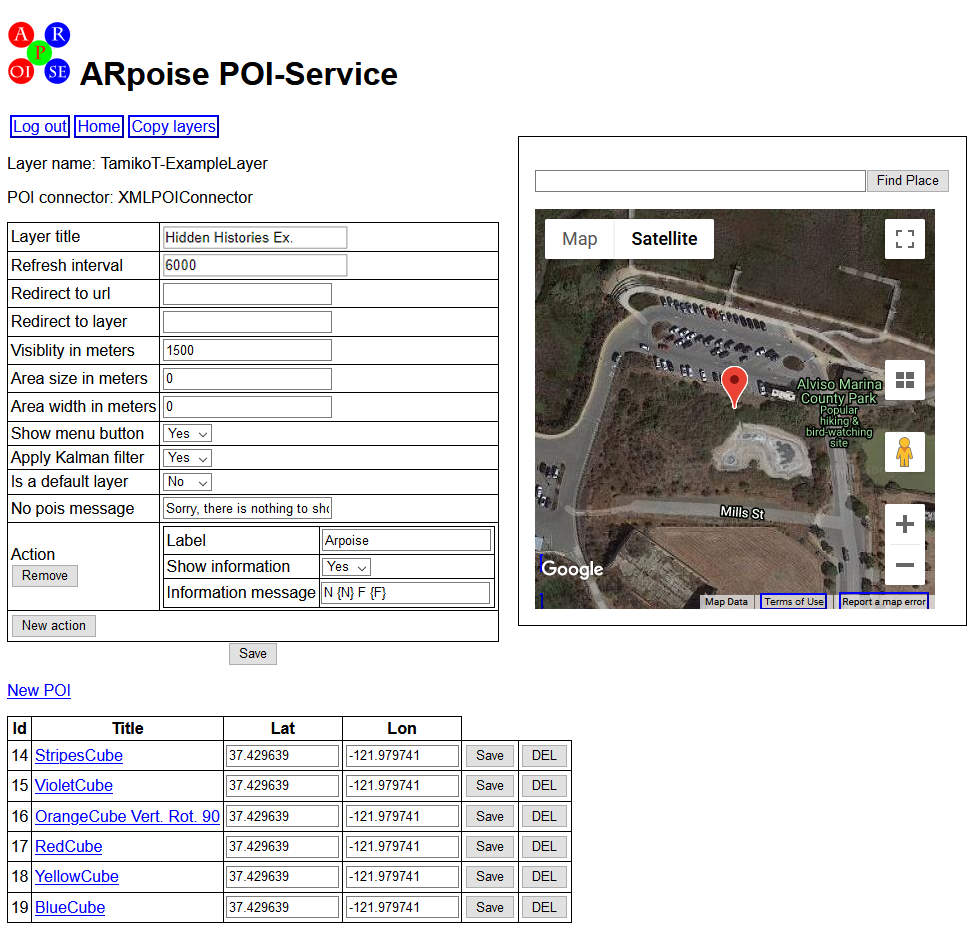
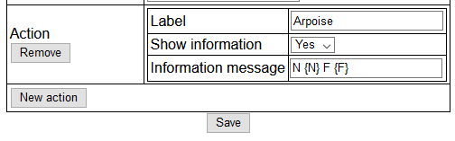
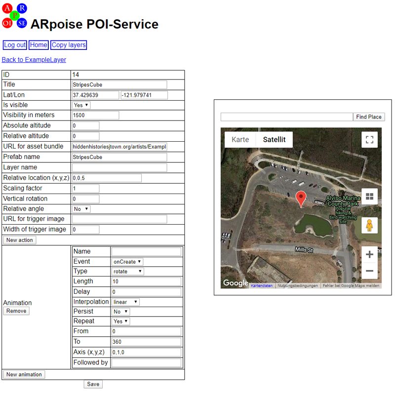
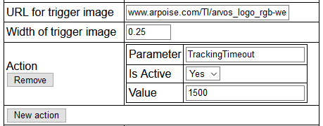
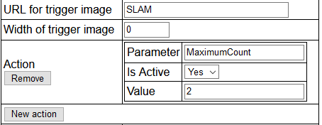
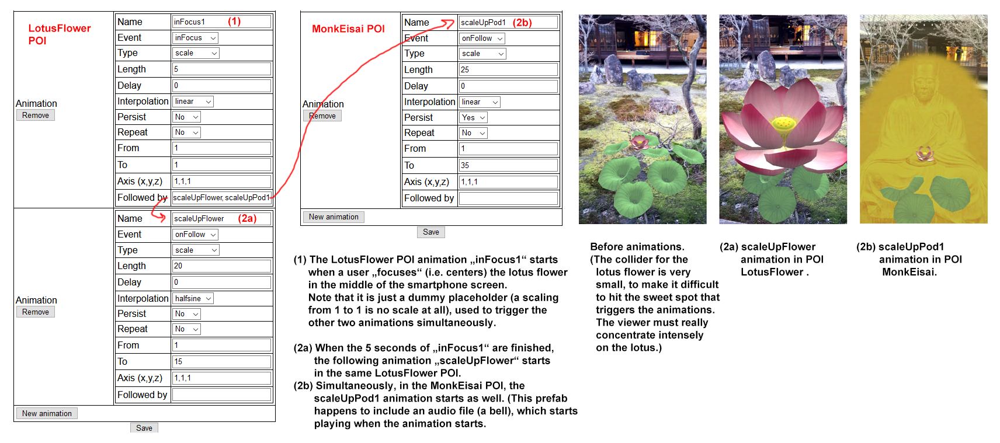
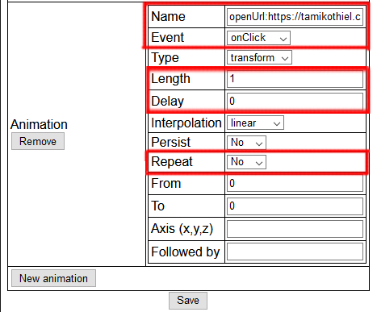
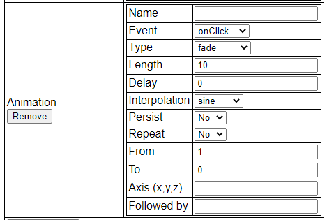
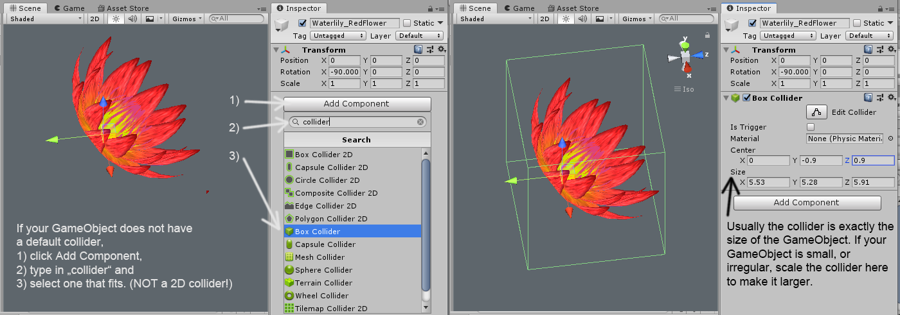
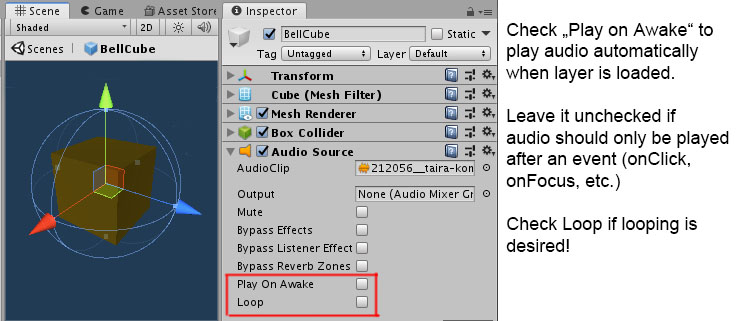

#  Hidden Histories

# PorPOISe Reference: Layer and POI Properties
<< Go back to [Hidden Histories Artist Documentation Overview](http://hiddenhistoriesjtown.org/documentation).

For the tutorial on how to use these settings to edit your layers, please see the [ARpoise PorPOISe User Interface tutorial](UsingPorPOIse.md)

For each layer you have one webpage with the layer configuration, and then a further webpage for each POI defined on the layer page.

. 
## porPOIse Layer Configuration

.  

### Explanation:

**Layer configuration:**

* **Layer title**: The layer title is optional (default is no title). If given, the title is displayed by the ARpoise app on a white background in the top center of the screen. The white background is very short, so keep your layer title short as well.
* **Refresh interval**: The refresh interval is optional (default is no refresh). If given, it defines the seconds after which the ARpoise app will update the layer. NOTE: when you make a change in your layer with porPOIse, you MUST force close the ARpoise app completely by [swiping it out of the recent apps list](https://support.apple.com/en-us/HT201330) and restart ARpoise. Otherwise the change will not show!
* **Redirect to layer**: Currently not used. The redirection layer is optional (default is no redirect). if given, the layer will redirected to a different layer. 
* **Visibility in meters**: Please leave at 1500. The admin has probably set the visibility of your layer itself in the ARpoise directory to a distance of about 200-250 meters, or about 1/2 block. This value here does not have much of an effect, but if you set it to be small, the ARpoise app might not find it at all.
* **Area size in meters**: Optional, please do not set without conferring with the admin. If the POIs are set at absolute GPS coordinates (see below), this value confines them to a north-south area around the viewer to which the POIs should be constrained if the viewer is walking around. If this is given, and the POIs are given an absolute geo-location in the POI settings, then as the viewer is moving the POIs are automatically reshuffled to fit inside the moving boundaries. If it is not set, the POIs stay at (more or less) at their set positions.
* **Area width in meters**: Optional, please do not set without conferring with the admin. If the POIs are set at absolute GPS coordinates (see below), this value confines them to an east-west area around the viewer to which the POIs should be constrained if the viewer is walking around. If this is given, and the POIs are given an absolute geo-location in the POI settings, then as the viewer is moving the POIs are automatically reshuffled to fit inside the moving boundaries. If it is not set, the POIs stay more or less at their set positions.
* **Show menu button**: Please leave on. This combo box defines whether the ARpoise logo menu button is shown in the app. If the logo menu button is on, the viewer can click on it to get out of a layer and back to the list of available layers, or click twice to enter a Fixed Position when they want to view a layer that is far away from them.
* **Apply Kalman filter**: Currently not used.
* **Is a default layer** Currently not used.
* **No pois message**: Please leave on. This message is shown by the ARpoise app if there are no POIs within the range given by "Visibility in meters."

#### Action: additional functions that can be controlled by users.

* **Remove button** - please do NOT remove these actions!
* **Action: Label**: Currently not used.
* **Action: Show information**: Set to Yes to show information messages at the bottom of the app display.
* **Action: Information message**: This is the information message to be displayed.
  * You see this message in red letters at the bottom of the app display. For instance when you first start a layer you often see the message "Loading data, please wait ..." 
  * You can write a short text here, and it will always be displayed while your layer is active.
  * Enter these values to get debugging information that tells you what the app actually sees or thinks it sees, which may be different from real life! 
     * N {N} is the number of POIs the app sees.
     * F {F} is your current frames/second. If lower than 12 f/s you have too many POIs with too many megabytes!
     * H {H} is which direction the app thinks you are looking, with H=0/360° due north, H=90° due east, etc. You will notice that this is not very accurate, and can vary depending on what smartphone you have!
     * LAT {LAT} and LON {LON} tell you the GPS that the app thinks you are at. If there is a tall building next to you, this could be very wrong.
     * LAT1 {LAT1} and LON1 {LON1} - If you make a layer with only one POI, you can use this value to understand where the app thinks that POI is located. Use this to understand the difference between what you think and what the app sees. ;-)
     * D1 {D1} - If you make a layer with only one POI, you can use this value to understand how far away the POI is from your GPS position (or rather the GPS position the app thinks you are at).
* **New action button**: Currently not used.
 
#### SAVE button: If you make changes to these properties, you MUST save them!

**Google map box:** (Note: "Find place" field is defunct)

- Each marker represents one POI. 
- Mouse over a marker to see the Title of the POI it represents. Watch out: there may be several on top of each other!
- Click and drag on a marker to change that POI's GPS position in the map. As you drag it, you will see the latitude and longitute (Lat/Lon) of that POI changing in the list as well. 
- Note which POI was changing: if you move a marker, you MUST click **Save** in the POI list next to the POI you have moved, otherwise it will revert to its previous position!
- If you move a marker but still see a marker in that location, there were more than one markers at the exact same locations.

**POIs list:**

* **New POI** link: Click to add a new POI to the layer.
* **Id**: Internal number to identify the POI. 
* **Title**: Name of the POI - click to open the POI and edit its properties. 
* **Lat**: Allows you to change the latitude of the POI. 
* **Lon**: Allows you to change the longitude of the POI. 
* **Save**: Save changes to the POI's location to the layer's xml file.
* **DEL**: Delete the POI from the layer.

. 
## porPOIse POI Configuration

Clicking on a POI Title opens up that POI in its configuration page.

. 

### Explanation:
You can edit the following properties of a POI:
* **Title**: Give the POI a title that will be shown in the layer's POI list.
* **Lat/Lon**: You can change the absolute latitude and longitude of the POI here, or click and drag the POI's marker in the Google Map. Notice that mousing over the marker shows you its name in a pop-up window.
* **Is visible**: This combo box defines whether the POI is visible. If you have a lot of POIs and want to turn off some of them to make it easier to work on the others. Just remember to turn it back on!
* **Absolute altitude**: Doesn't really work. It should set the absolute altitude of the POI in meters above sea level, but smartphone GPS does not give good altitude values. This will be overruled anyway if Relative location is set.
* **Relative altitude**: Sets the absolute altitude of the POI relative to the viewer's device. Use this if you are using absolute latitude and longitude. It is overruled if you use Relative location.
* **URL of asset bundle**: The assets that make up the POI will be taken from the Unity asset bundle at this web location.
  * **Please see the tutorial [Creating AssetBundles](CreatingAssetBundles.md) for detailed instructions on how to make asset bundles.**
  * The URL needs to have the form:  **hiddenhistoriesjtown.org/artists/ExampleArtist/AssetBundles/hh_examples.ace,** where "ExampleArtist" is replaced with your porPOIse account name and "hh_examples.ace" is replaced with the name of your asset bundle. (Note: NO "http://" please!) 
  * **NOTE:** Currently it is not possible for Androids and iOS devices to use the same asset bundle. Therefore you need to create and upload two asset bundles, one created for Android and one created for iOS. 
    * The iOS asset bundle should have exactly the same name as the Android asset bundle WITH THE ADDITION OF AN "i" at the end of the name and before the ".ace" file extension. 
    * Example: the Android asset bundle is hh_examples.ace and the iOS asset bundle is hh_examplesi.ace.
    * Enter the name of the *Android* asset bundle url here, i.e. the name WITHOUT the "i" at the end. Do this even if you are testing just on iOS and haven't made the Android asset bundle yet!
* **Prefab name**: The POI's assets are loaded from the asset bundle with this prefab name. Please see the tutorial [Creating AssetBundles](CreatingAssetBundles.md) for more information. 
  * Tip: if you've forgotten the names of the prefabs in your asset bundle, you can view its manifest file simply by pasting the name of the asset bundle into a web brower and **replacing .ace with .manifest**
  * **Sound:** An audio file can be a prefab by itself, or be packaged together with other assets, such as a 3D model, as part of a larger prefab. For more details on how to use sound in ARpoise, see the [Notes on Sound](https://github.com/Hidden-Histories/Public-Resources/blob/master/documentation/UsingPorPOIse_REF-Layer-POI-Properties.md#notes-on-sound-in-porpoise-and-unity) at the end of this document.

* **Layer name**: If you type in the name of another layer of yours here, that entire layer will become a **sub-layer** to this POI. 
  * That is, **all the POIs of that sub-layer will be shown centered at the prefab you specified in this POI.** This enables you to create more complex POIs more easily.
  * The sub-layer will inherit settings of the parent POI (scale, animations, etc.), and needs some special settings to work properly.
  * See the tutorial [Using PorPOIse SubLayers](https://github.com/Hidden-Histories/Public-Resources/blob/master/documentation/UsingPorPOIseSubLayers.md#-hidden-histories) for details.

* **Relative location**: The location of the POI relative to your body. This is a comma separated list of the x =east-west, y = up-down, z = north-south values. 
  * Your body's position is at 0,0,0 with y=0 being your eye level. 
  * **These values override the Lat/Lon values and the Absolute altitude and Relative altitude values.** 
  * Note however that although the distance from your body is stable, and the orientation of POIs in a layer are stable *with respect to each other*, the **orientation of all the POIs with respect to the cardinal directions is *not* stable and can appear anywhere in a circle around you.**
  * Say for instance you place POI_a at 0,0,5 and POI_b at 0,0,-5. Then POI_a *should* be 5 meters due north of you, and POI_b *should* be due south of you. They will always be 180° away from *each other,* but may be anywhere in a circle of 5 meters radius around you.
* **Scaling factor**: This value scales the POI's geometry in all three dimensions.
* **Vertical rotation**: This value allows you to rotate the POI's geometry around its vertical Y axis.
* **Relative angle**: If this value is set to Yes, the POI's geometry will always be turned so that the front side always faces the user. This is useful if you have images that should always face the viewer no matter where they are, for instance a cut-out figure of a person.

#### IMAGE TRIGGER and SLAM PROPERTIES (only in AR-vos):

To understand how image trigger and SLAM work, see also [Using the AR-vos App to view image trigger and SLAM based AR artwork](UsingAR-vosApp.md#-hidden-histories).

* **URL for trigger image:** This field is used *only* in the AR-vos app - but it is used to define this POI as *either* an **image trigger POI** *or* as a **SLAM POI.** 
  * **Do NOT mix image trigger POIs and SLAM POIs in the same layer!**
  * You can however mix geolocative POIs with either image trigger POIs or SLAM POIs.
  * **Image trigger AR:** To make this POI an image trigger POI, enter the URL of any image that is accessible on your web account, for instance in your asset bundle folder, something like https://hiddenhistoriesjtown.org/artists/TamikoThiel/AssetBundles/mytrigger.jpg, where your own name replaces TamikoThiel in the URL.
    * To test this, you can use our example AR-vos logo as a trigger by entering this URL into the field: "www.arpoise.com/TI/arvos_logo_rgb-weiss1024.jpg".
    * When you start the layer, it will show a frame in the display and ask you to frame the trigger image. 
    * The POI will be shown once the trigger image is detected in the display of the AR-vos app on your smartphone. The frame will then disappear.
    * If there are other image trigger POIs in your layer, you can view their trigger images and their prefabs will appear on top of those other images.
    * If the trigger images are separated in space, for instance on different buildings on a street tour, or as pictures in a gallery space, you can walk from one trigger image to another and view their augments in this way.
    * If however the trigger images are located at the same physical place - for instance on the right hand page in a book - the POIs will all appear on top of each other. To prevent this, create an Action with the **Tracking Timeout** described below.

  * **SLAM AR:** To make this a SLAM POI, enter the word **SLAM** in this field.
    * When you start this layer, you will be asked to scan your environment to detect planar surfaces.
    * Then you will be asked to tap one of the planes to set the POI at that spot.
    * By default, with each successive tap, the app will go through the POI list for the layer and place the next SLAM POI in the list on the plane you tapped.
    * You can keep on tapping to set more POIs, and the plane grids will also stay forever.
    * To restrict the number of POIs you can place, create an Action with a **Maximum Count** as described below. The plane grids will disappear once you have set that number of POIs

* **Width of trigger image:** 
  * Leave blank for SLAM POIs and geolocative POIs.
  * This is used *only* in the AR-vos app when an URL for a trigger image is entered above. 
    * This is the approximate width of your trigger image in real life. This helps the app to scale your prefab correctly.
    * A flyer is roughly 0.2 meters = 8.5" wide, a doorway might be 1 meter = 3 feet wide, a house facade might be 10 meters = 30 feet wide.

#### POI ACTIONS: Control how AR-vos deals with Image Trigger or SLAM POIs.

* **New action:** Add a new action.

**Image trigger POI:** 
* Once the app detects a trigger image, the POI is shown **positioned relative to that image.** 
* By default the POI will **persist on the image forever,** as long as that layer is open. If you look away from the trigger image and then look back, it will still be there. 
* This is useful if you have an **exhibition in a gallery or on the street** with different trigger images physically spaced apart. You have one POI for each trigger image and can go back and forth between all the images without having to close the layer.
* If however you have a **book** of trigger images or a **slide show on a monitor,** the trigger images are all at the same physical location. You want to turn the pages or switch between images in the slide show, and the POIs should change everytime the image changes.
* **ImageTrigger: TrackingTimeout**
  * With the **TrackingTimeout,** you can set the number of milliseconds a POI will persist after you no longer see the trigger image.
  * **To set a TrackingTimeout:** 
     * Click the **New action** button.
     * Type **TrackingTimeout** into the **Parameter** field.
     * Set **IsActive to Yes** 
     * **Information message/Value:** Enter the length of the timeout in **milliseconds.** In the example below it is 1500 milliseconds = 1.5 seconds. (This Action field might say "Information message" at first, but when you enter a number it will change to "Value." This is a bug and will be fixed in the next update.)

. 

   * **SLAM: Maximum Count** For each SLAM POI in your layer, you can add a new action that limits the number of times a copy of that POI will be placed into the environment.
     * Click the **New action** button. 
     * Type **MaximumCount** into the **Parameter** field.
     * Set **IsActive to Yes** 
     * **Information message/Value:** Type in the number of POIs you want the app to place. In the example below, the layer will then set only two POIs. (This Action field might say "Information message" at first, but when you enter a number it will change to "Value." This is a bug and will be fixed in the next update.)
     * When you start the layer and tap on a plane grid, AR-vos then again goes through the list of POIs, placing one after the other as you tap - but only up to the maximum value for each POI. 
     * After it reaches the maximum values *for all of the POIs,* the "All Augments placed" message appears, and the plane grids disappear.

. 

### **Animation settings**
You can have multiple animations that run simultaneously, for instance you can scale the POI while rotating it as well.

**For Sound:** See [Notes on Sound in porPOIse and Unity](#notes-on-sound-in-porpoise-and-unity) at the bottom of this document.

* **New animation:** Create a new animation.
* **Remove:** Delete the animtion from the POI.

* **Name**: The name is used for one of two purposes: chained animations and opening websites.
  * **Chained animations:** Give your animation a name if you want it to be a **following animation,** i.e. it should start when a preceding animation ends. This way you can make a chained series of animations. 
    * You also need to enter that same following animation's name in the **Followed by** field of the preceding animation. 
    * **The named following animations can even be in other POIs in the same layer!"**

(Click on the image below to see a larger version.)

   * **Websites:** If the name is of the form **openUrl:https://www.mywebsite.com/** that website will open up in a new, separate web browser window when the animation starts.
     * **NOTE: The new browser window will be in the foreground, covering up the AR app running in the background!** You need to close the browser window or bring the AR app to the foreground to continue looking at AR content. This might be difficult for inexperienced users!
     * Alternatively, you can enter this openUrl call in the **Followed by** field (see below), so that the website will be opened after a preceding animation ends.
     * **Settings for openUrl:** (See below for descriptions of these properties!)
       * Settings like Type, Interpolation, Persist have no effect, but the following are crucial. 
       * **Event:** Do NOT use onCreate, as this means the user will never see the app at all, being immediately redirected to the website. We recommend using onClick.
       * **Length:** Set this to some value, otherwise it will not run at all. The actual value has no meaning, but must be > 0.
       * **Delay:** You can set a delay, but use very carefully - otherwise the user will not realize the cause and effect between their click and the website opening, and will get confused!
       * **Repeat:** Set this to No, otherwise when you try to go back to the app, it will immediately redirect you to the website again.
       * **Followed by:** This does work, but use with care, as the user experience of the artwork will be interrupted by looking at the website.

* **Event** - User interactions with the POIs:
  * **onCreate** - the animation is started when the POI is loaded;
  * **onFocus** - the animation is started when the viewer focuses (centers) the POI in the middle of the aRpoise app screen. (Unity Collider component required - see the explanation in [Unity collider components for ARpoise animations events](#unity-collider-components-for-arpoise-animations-events) below.)
  * **inFocus** - the animation starts when the POI is centered in the ARpoise display and stops once the POI loses focus. (Unity Collider component required - see the explanation in [Unity collider components for ARpoise animations events](#unity-collider-components-for-arpoise-animations-events) below.)
  * **onClick** - the animation is started when the POI is clicked by the user. (Unity Collider component required - see the explanation in [Unity collider components for ARpoise animations events](#unity-collider-components-for-arpoise-animations-events) below.)
  * **onFollow** - This is for the chains of animations described above: When the preceeding animation is finished, this animation will start.
    * Give your following animation a name in its **Name** field.
    * Then enter this name also in the **Followed by** field of your preceding animation. 
    * **Start more than one following animation at the same time:** just insert all their names **separated with commas.**
    
* **Type**: 
  * **rotate**, animate the rotatation of the POI around an axis.
  * **transform**, animate the POI in the x, y or z direction.
  * **scale**, animate the size of the POI.
  * **destroy**, delete the POI entirely. Don't worry, when you force close the app and then restart it, it will be there again!
  * **fade**, fade the POI anywhere between full visibility and invisibility. For example, the animation shown below fades a POI within 10 seconds from 1 (full visibility) to 0 (invisible) and back again.
    * 
    * **Note:** In order for a fade animation to work, the Unity Material Rendering Mode of the prefab needs to be set to 'Fade' or 'Transparent'. (A [Tutorial: Transparent materials in Unity and porPOIse](https://github.com/Hidden-Histories/Public-Resources/blob/master/documentation/Tutorial_UnityTransparency.md#-hidden-histories) is UNDER CONSTRUCTION. For all Unity tutorials, see "How to create your own AR artworks" section of the [Hidden Histories Artist Documentation Overview Page](http://hiddenhistoriesjtown.org/documentation).)
* **Length**: Length of the animation in seconds.
* **Delay**: Delay of the animation in seconds. onCreate-animations will only start after this delay.
* **Interpolation**:
  * **linear** - the value changes linearly from **From** to **To**;
  * **cyclic** - the value changes linearly from **From** to **To** and then back to **From**;
  * **sine** - the value swings between **From** and **To** like a pendulum;
  * **halfsine** - the value is changed from **From** to **To** and then back to **From,** but with a slowdown before changing.
* **Persist**:
  * **Yes** - at the end of the animation the POI will remain at the final value of the animation;
  * **No** - at the end of the animation the POI will snap back to its original state.
* **Repeat**:
  * **Yes** - the animation is repeated forever;
  * **No** - the animation is only run once.
* **From**: Start value of the animation.
* **To**: End or middle value of the animation, depending on the **Interpolation**.
* **Axis (x,y,z)**: Axis to apply the animation to, e.g.: A rotation with Axis 1,0,0 is only around the X axis.
* **Followed by**: If one or more comma separated animation names are given in this field, the animations mentioned are started once this animation ends. 
   * **Animation names are global for all POIs of a layer.** So the end of an animation of one POI can start an animation of the same POI or of another POI in the layer!
   * **Sound:** If an animation is started and the Unity Prefab of the POI contains an AudioSource component, the audio file is played.
   * **Websites:** If the value in this field is of the form **openUrl:https://www.mywebsite.com/** that website will be opened in a new, separate web browser after the preceding animation ends. Note that the web browser will cover the AR app, which will continue running in the background. Close the web browser or bring the AR app to the foreground to continue looking at AR. See above under "Name" for a full description of openUrl.

* **Save** button: Saves any changes you made to the POI properties. NOTE: to see the changes in your layer, you MUST close the ARpoise app and restart it!

.
### Unity Collider components for ARpoise animations events:

(If you don't know Unity yet, please go through Prof. Rhonda's "Introduction to Unity3D Editor" on the main Hidden History documentation page http://hiddenhistoriesjtown.org/documentation/.)

- The animation events onClick, onFocus and inFocus require the prefab to include a Unity Collider component. 
- The GameObject primitives (Cube, Sphere, Quad, etc.) already include Collider components. 
- If you create your own geometry, however, you will have to add a Collider to it, as shown in the image below. Click on the image to see a larger version. 

.
### Notes on Sound in porPOIse and Unity 

**(Sound tutorial UNDER CONSTRUCTION)**

(If you don't know Unity yet, please go through Prof. Rhonda's "Introduction to Unity3D Editor" on the main Hidden History documentation page http://hiddenhistoriesjtown.org/documentation/.)

An audio file can be a Unity prefab by itself, or be packaged together with other assets, such as a 3D model, as part of a larger prefab composed of several different types of assets.

If the audio should play automatically as soon as the POI is loaded: 
* In the Unity component Audio Source, check on Play On Awake. 
* If the audio should loop, check Loop here as well.

  
If the audio should play after a delay, or as the result of a user interaction: 
* In Unity *uncheck* Play On Awake, and add an animation node (see Animation settings above). 
* If the prefab includes geometry, but you do not actually want to animate the geometry in any way, enter a "dummy" animation, such as scaling it from 1 to 1.

