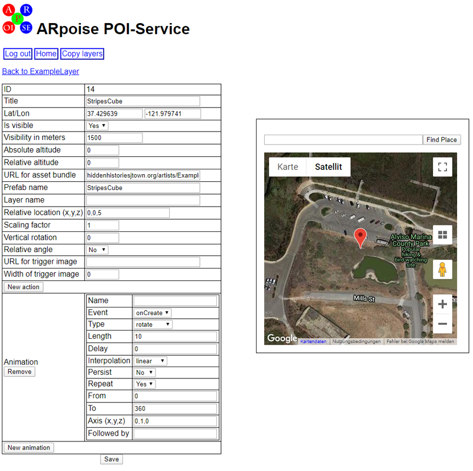

#  Hidden Histories

# PorPOISe Reference: Layer and POI Properties
<< Go back to [Hidden Histories Artist Documentation Overview](http://hiddenhistoriesjtown.org/documentation).

For the tutorial on how to use these settings to edit your layers, please see the [ARpoise PorPOISe User Interface tutorial](UsingPorPOIse.md)

For each layer you have one webpage with the layer configuration, and then a further webpage for each POI defined on the layer page.

. 
## porPOIse Layer Configuration

.  

### Explanation:

**Layer configuration:**

* **Layer title**: The layer title is optional (default is no title). If given, the title is displayed by the ARpoise app on a white background in the top center of the screen. The white background is very short, so keep your layer title short as well.
* **Refresh interval**: The refresh interval is optional (default is no refresh). If given, it defines the seconds after which the ARpoise app will update the layer. NOTE: when you make a change in your layer with porPOIse, you MUST force close the ARpoise app completely by [swiping it out of the recent apps list](https://support.apple.com/en-us/HT201330) and restart ARpoise. Otherwise the change will not show!
* **Redirect to layer**: Currently not used. The redirection layer is optional (default is no redirect). if given, the layer will redirected to a different layer. 
* **Visibility in meters**: Please leave at 1500. The admin has probably set the visibility of your layer itself in the ARpoise directory to a distance of about 200-250 meters, or about 1/2 block. This value here does not have much of an effect, but if you set it to be small, the ARpoise app might not find it at all.
* **Area size in meters**: Optional, please do not set without conferring with the admin. If the POIs are set at absolute GPS coordinates (see below), this value confines them to a north-south area around the viewer to which the POIs should be constrained if the viewer is walking around. If this is given, and the POIs are given an absolute geo-location in the POI settings, then as the viewer is moving the POIs are automatically reshuffled to fit inside the moving boundaries. If it is not set, the POIs stay at (more or less) at their set positions.
* **Area width in meters**: Optional, please do not set without conferring with the admin. If the POIs are set at absolute GPS coordinates (see below), this value confines them to an east-west area around the viewer to which the POIs should be constrained if the viewer is walking around. If this is given, and the POIs are given an absolute geo-location in the POI settings, then as the viewer is moving the POIs are automatically reshuffled to fit inside the moving boundaries. If it is not set, the POIs stay more or less at their set positions.
* **Show menu button**: Please leave on. This combo box defines whether the ARpoise logo menu button is shown in the app. If the logo menu button is on, the viewer can click on it to get out of a layer and back to the list of available layers, or click twice to enter a Fixed Position when they want to view a layer that is far away from them.
* **Apply Kalman filter**: Currently not used.
* **Is a default layer** Currently not used.
* **No pois message**: Please leave on. This message is shown by the ARpoise app if there are no POIs within the range given by "Visibility in meters."
* **Action: Label**: Currently not used.
* **Action: Show information**: Currently not used.
* **Action: Information message**: Currently not used.
* **Save** button: If you make changes to these properties, you MUST save them!

**Google map box:** (Note: "Find place" field is defunct)

- Each marker represents one POI. 
- Mouse over a marker to see the Title of the POI it represents. Watch out: there may be several on top of each other!
- Click and drag on a marker to change that POI's GPS position in the map. As you drag it, you will see the latitude and longitute (Lat/Lon) of that POI changing in the list as well. 
- Note which POI was changing: if you move a marker, you MUST click **Save** in the POI list next to the POI you have moved, otherwise it will revert to its previous position!
- If you move a marker but still see a marker in that location, there were more than one markers at the exact same locations.

**POIs list:**

* **New POI** link: Click to add a new POI to the layer.
* **Id**: Internal number to identify the POI. 
* **Title**: Name of the POI - click to open the POI and edit its properties. 
* **Lat**: Allows you to change the latitude of the POI. 
* **Lon**: Allows you to change the longitude of the POI. 
* **Save**: Save changes to the POI's location to the layer's xml file.
* **DEL**: Delete the POI from the layer.

. 
## porPOIse POI Configuration

Clicking on a POI Title opens up that POI in its configuration page.

. 

### Explanation:
You can edit the following properties of a POI:
* **Title**: Give the POI a title that will be shown in the layer's POI list.
* **Lat/Lon**: You can change the absolute latitude and longitude of the POI here, or click and drag the POI's marker in the Google Map. Notice that mousing over the marker shows you its name in a pop-up window.
* **Is visible**: This combo box defines whether the POI is visible. If you have a lot of POIs and want to turn off some of them to make it easier to work on the others. Just remember to turn it back on!
* **Absolute altitude**: Doesn't really work. It should set the absolute altitude of the POI in meters above sea level, but smartphone GPS does not give good altitude values. This will be overruled anyway if Relative location is set.
* **Relative altitude**: Sets the absolute altitude of the POI relative to the viewer's device. Use this if you are using absolute latitude and longitude. It is overruled if you use Relative location.
* **URL of asset bundle**: The assets that make up the POI will be taken from the Unity asset bundle at this web location. It needs to have the form:  **hiddenhistoriesjtown.org/artists/ExampleArtist/AssetBundles/hh_examples.ace,** where "ExampleArtist" is replaced with your porPOIse account name and "hh_examples.ace" is replaced with the name of your asset bundle. (Note: NO "http://" please!) Please see the tutorial [Creating AssetBundles](CreatingAssetBundles.md) for more information.
* **Prefab name**: The POI's assets are loaded from the asset bundle with this prefab name. Please see the tutorial [Creating AssetBundles](CreatingAssetBundles.md) for more information. 
  * Tip: if you've forgotten the names of the prefabs in your asset bundle, you can view its manifest file simply by pasting the name of the asset bundle into a web brower and **replacing .ace with .manifest**
  * **Sound:** An audio file can be a prefab by itself, or be packaged together with other assets, such as a 3D model, as part of a larger prefab. For more details on how to use sound in ARpoise, see the [Notes on Sound](https://github.com/Hidden-Histories/Public-Resources/blob/master/documentation/UsingPorPOIse_REF-Layer-POI-Properties.md#notes-on-sound-in-porpoise-and-unity) at the end of this document.

* **Layer name**: If you type in the name of another layer of yours here, that entire layer will become a **sub-layer** to this POI. That is, **all the POIs of that layer will be shown centered at the prefab you specified in this POI.** This enables you to create more complex POIs more easily. (Tutorial under construction.)
  * The POIs of the sub-layer should have the same GPS Lat/Lon as this POI (so the server can find them here), but **should be placed within that sub-layer via Relative location.** The Relative locations will be of course from the center of this POI's prefab. 
  * That layer will also be subject to the settings of this POI (scale, animations, etc.) 
* **Relative location**: The location of the POI relative to your body. This is a comma separated list of the x =east-west, y = up-down, z = north-south values. 
  * Your body's position is at 0,0,0 with y=0 being your eye level. 
  * **These values override the Lat/Lon values and the Absolute altitude and Relative altitude values.** 
  * Note however that although the distance from your body is stable, and the orientation of POIs in a layer are stable *with respect to each other*, the **orientation of all the POIs with respect to the cardinal directions is *not* stable and can appear anywhere in a circle around you.**
  * Say for instance you place POI_a at 0,0,5 and POI_b at 0,0,-5. Then POI_a *should* be 5 meters due north of you, and POI_b *should* be due south of you. They will always be 180° away from *each other,* but may be anywhere in a circle of 5 meters radius around you.
* **Scaling factor**: This value scales the POI's geometry in all three dimensions.
* **Vertical rotation**: This value allows you to rotate the POI's geometry around its vertical Y axis.
* **Relative angle**: If this value is set to Yes, the POI's geometry will always be turned so that the front side always faces the user. This is useful if you have images that should always face the viewer no matter where they are, for instance a cut-out figure of a person.

**Image trigger properties (works only in AR-vos only, and is used for SLAM as well):** tutorial under construction

See [Using the AR-vos App to view image trigger and SLAM based AR artwork](UsingAR-vosApp.md#-hidden-histories)

* **URL for trigger image:** This field is used only in the AR-vos app - but for both image trigger and for SLAM.
  * If you enter the **URL of a trigger image file** into this field, the POI will be treated as an image trigger POI. The POI will be shown once the trigger image is detected in the display of the AR-vos app on your smartphone. 
  * If this field contains only the word **SLAM**, the POI is treated as a SLAM object and will be shown once you tap on one of the vertical or horizontal planes detected by the AR-vos app when you scan your enviroment with it.
* **Width of trigger image:** Used only in the AR-vos app when a trigger image is entered above. This is the approximate width of your trigger image in real life (e.g. a flyer is roughly 0.2 meters = 8.5" wide, a doorway might be 1 meter = 3 feet wide, a house facade might be 10 meters = 30 feet wide.) This helps the app to scale your prefab correctly.

* **New action:** Currently not in use.

### **Animation settings**
You can have multiple animations that run simultaneously, for instance you can scale the POI while rotating it as well.

**For Sound:** See [Notes on Sound in porPOIse and Unity](#notes-on-sound-in-porpoise-and-unity) at the bottom of this document.

* **New animation:** Create a new animation.
* **Remove:** Delete the animtion from the POI.

* **Name**: The name is only needed for a chained series of animations, e.g. when one animation finishes, a following animation should start. 
    * Give the following animation a name, and also enter that name in the **Followed by** field of the preceding animation. 
    * **The named following animations can even be in other POIs in the same layer!"**
    
(You can click on the image below to see a larger version.)

* **Event** - User interactions with the POIs:
  * **onCreate** - the animation is started when the POI is loaded;
  * **onFocus** - the animation is started when the viewer focuses (centers) the POI in the middle of the aRpoise app screen. (Unity Collider component required - see the explanation in [Unity collider components for ARpoise animations events](#unity-collider-components-for-arpoise-animations-events) below.)
  * **inFocus** - the animation starts when the POI is centered in the ARpoise display and stops once the POI loses focus. (Unity Collider component required - see the explanation in [Unity collider components for ARpoise animations events](#unity-collider-components-for-arpoise-animations-events) below.)
  * **onClick** - the animation is started when the POI is clicked by the user. (Unity Collider component required - see the explanation in [Unity collider components for ARpoise animations events](#unity-collider-components-for-arpoise-animations-events) below.)
  * **onFollow** - This is for the chains of animations described above: When the preceeding animation is finished, the following animation will start.
    * Give your following animation a name in its **Name** field.
    * Then enter the name of the following animation in the **Followed by** field of your preceeding animation. 
    * If you want to have more than one following animation, **separate their names with commas.**
    
* **Type**: 
  * **rotate**, animate the rotatation of the POI around an axis.
  * **transform**, animate the POI in the x, y or z direction.
  * **scale**, animate the size of the POI.
  * **destroy**, delete the POI entirely. Don't worry, when you force close the app and then restart it, it will be there again!
  * **fade**, fade the POI anywhere between full visibility and invisibility. For example, the animation shown below fades a POI within 10 seconds from 1 (full visibility) to 0 (invisible) and back again.
    * 
    * **Note:** In order for a fade animation to work, the Unity Material Rendering Mode of the prefab needs to be set to 'Fade' or 'Transparent'. (A [Tutorial: Transparent materials in Unity and porPOIse](https://github.com/Hidden-Histories/Public-Resources/blob/master/documentation/Tutorial_UnityTransparency.md#-hidden-histories) is UNDER CONSTRUCTION. For all Unity tutorials, see "How to create your own AR artworks" section of the [Hidden Histories Artist Documentation Overview Page](http://hiddenhistoriesjtown.org/documentation).)
* **Length**: Length of the animation in seconds.
* **Delay**: Delay of the animation in seconds. onCreate-animations will only start after this delay.
* **Interpolation**:
  * **linear** - the value changes linearly from **From** to **To**;
  * **cyclic** - the value changes linearly from **From** to **To** and then back to **From**;
  * **sine** - the value swings between **From** and **To** like a pendulum;
  * **halfsine** - the value is changed from **From** to **To** and then back to **From,** but with a slowdown before changing.
* **Persist**:
  * **Yes** - at the end of the animation the POI will remain at the final value of the animation;
  * **No** - at the end of the animation the POI will snap back to its original state.
* **Repeat**:
  * **Yes** - the animation is repeated forever;
  * **No** - the animation is only run once.
* **From**: Start value of the animation.
* **To**: End or middle value of the animation, depending on the **Interpolation**.
* **Axis (x,y,z)**: Axis to apply the animation to, e.g.: A rotation with Axis 1,0,0 is only around the X axis.
* **Followed by**: If one or more comma separated animation names are given in this field, the animations mentioned are started once this animation ends. 
   * **Animation names are global for all POIs of a layer.** So the end of an animation of one POI can start an animation of the same POI or of another POI in the layer!
   * **Sound:** If an animation is started and the Unity Prefab of the POI contains an AudioSource component, the audio file is played.

* **Save** button: Saves any changes you made to the POI properties. NOTE: to see the changes in your layer, you MUST close the ARpoise app and restart it!

.
### Unity Collider components for ARpoise animations events:

(If you don't know Unity yet, please go through Prof. Rhonda's "Introduction to Unity3D Editor" on the main Hidden History documentation page http://hiddenhistoriesjtown.org/documentation/.)

- The animation events onClick, onFocus and inFocus require the prefab to include a Unity Collider component. 
- The GameObject primitives (Cube, Sphere, Quad, etc.) already include Collider components. 
- If you create your own geometry, however, you will have to add a Collider to it, as shown in the image below. Click on the image to see a larger version. 

.
### Notes on Sound in porPOIse and Unity 

**(Sound tutorial UNDER CONSTRUCTION)**

(If you don't know Unity yet, please go through Prof. Rhonda's "Introduction to Unity3D Editor" on the main Hidden History documentation page http://hiddenhistoriesjtown.org/documentation/.)

An audio file can be a Unity prefab by itself, or be packaged together with other assets, such as a 3D model, as part of a larger prefab composed of several different types of assets.

If the audio should play automatically as soon as the POI is loaded: 
* In the Unity component Audio Source, check on Play On Awake. 
* If the audio should loop, check Loop here as well.

  
If the audio should play after a delay, or as the result of a user interaction: 
* In Unity *uncheck* Play On Awake, and add an animation node (see Animation settings above). 
* If the prefab includes geometry, but you do not actually want to animate the geometry in any way, enter a "dummy" animation, such as scaling it from 1 to 1.

